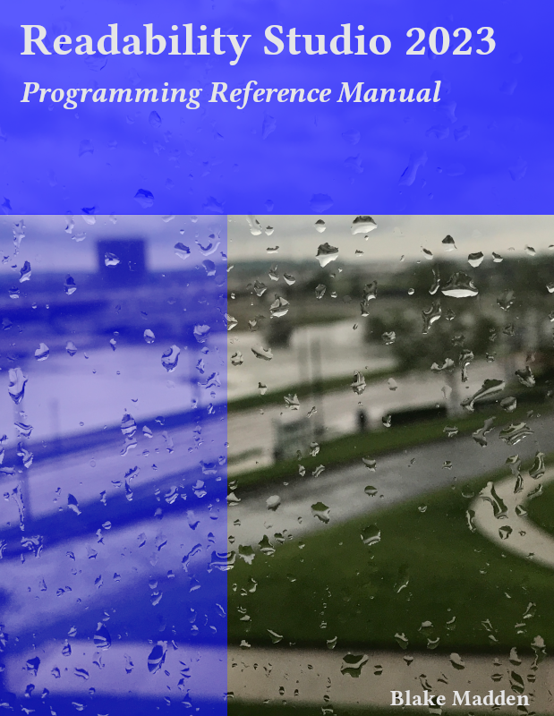

--- 
title: "Readability Studio 2023 API Reference"
description: "Readability Studio 2023 API Reference"
author: "Blake Madden"
site: bookdown::bookdown_site
output: bookdown::gitbook
documentclass: book
biblio-style: mla
nocite: '@*'
csl: modern-language-association.csl
cover-image: "images/cover-programming.png"
pdf-cover: "images/cover-programming.pdf"
---

```{r, include=FALSE}
knitr::opts_chunk$set(message=F, warning=F, dev='svg', eval=F, echo=T)
```

# Preface {#cover .unnumbered}

::: {.note}

This is preliminary documentation for an upcoming release of Readability Studio. If you have any feedback, please feel free to file an issue on [Github](https://github.com/Blake-Madden/ReadabilityStudioDocs). Thank you.
:::

```{asis, echo=!knitr::is_latex_output()}
<p style="text-align: center; padding: 10px;"></p>
```


This book is licensed under the [Creative Commons Attribution-NonCommercial-NoDerivs 4.0 International License](https://creativecommons.org/licenses/by-nc-nd/4.0/).
