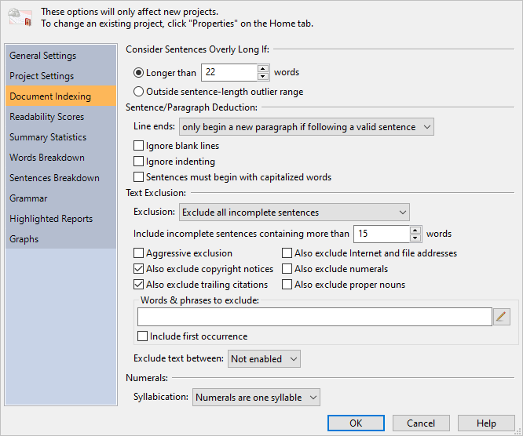
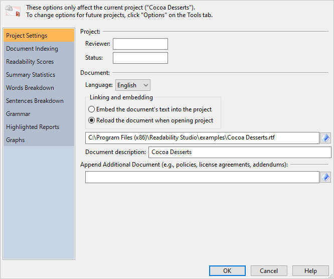

# Program & Project Options {#options-overview}

*Readability Studio* offers many customizable features, including:

- How documents are parsed and analyzed.
- How results (e.g., statistics and graphs) are displayed.
- How projects connect to the documents they are analyzing.

These options can be configured both globally and for individual projects. Note that changing options globally will affect all future projects, but will not affect currently existing projects.

To set these options globally, click the `r keys("Options")` button on the **Tools** tab to open the **Options** dialog:

If you wish to change options for an individual project, then click the `r keys("Properties")` button on the **Home** tab to open the **Project Properties** dialog:

## General Settings {#options-general-settings}

The options on this page manage the program's general settings.

### Settings {-}

**Import**: Click this button to import program settings and defaults from a file.

**Export**: Click this button to export the current program settings to a file. This includes all your settings on the [**Options**](#options-overview) dialog, your defaults for the [**New Project**](#creating-standard-project) wizard, and your printer headers & footers.

**Reset**: Click this button to reset the program settings to the defaults.

### Themes {-}

Select a theme from this list to apply custom colors to the program. Themes can affect the colors for the ribbon, sidebars, the start page, lists, and reports.

::: {.notesection data-latex=""}
This option is only available in the Windows edition. Under macOS, the system's theme will be applied.
:::

### Internet {-}

**User agent**: Enter into this field your user agent. The user agent is the name of the client program that is sent to websites when you try to read and download pages from them.

### Warnings & Prompts {-}

**Customize**: Click this button to display the **Warnings & Prompts Display** dialog. This dialog enables you to display or suppress various warnings and prompts, including:

- **Warn about projects being opened as read-only.** This warning is shown when a project will be opened as read-only. If a project is read-only, then you cannot save any changes to it.
- **Prompt when removing a test from a project.** When removing a readability test from a project, a prompt will be shown to confirm this action.
- **Prompt about documents containing less than 20 words.** If you attempt to analyze a document containing less than 20 valid words, then you will be prompted whether you wish to continue. If a document contains such a low amount of text, then most tests will produce questionable results.
- **Warn about documents containing less than 100 words.** This warning is shown when a document being analyzed contains less than 100 valid words. If a document contains a low amount of text, then some factors (e.g., word and syllable counts) will be standardized for some tests.
- **Warn about documents that contain sentences split by paragraph breaks.** This warning is shown when a document being analyzed contains what appears to be sentences with paragraph breaks in them. In this situation, the sentences will not be indexed properly, and it is recommended to fix to the document.
- **Warn about documents that contain long incomplete sentences that will be included in the analysis.** This warning is shown when a document being analyzed contains sentences that, although missing terminating punctuation, will be included in the analysis because of their length. To change this behavior, adjust the option [**Include incomplete sentences containing more than [15] words**](#options-text-exclusion).
- **Prompt if a document should switch to include sentences in the analysis.** If a document is excluding a high volume of incomplete sentences, then you will be prompted about switching to include those sentences in the analysis.
- **Prompt if a custom NDC test's proper noun settings differ from the standard NDC test.** By default, [New Dale-Chall](#dale-chall-test) requires that the first instance of each proper noun be seen as unfamiliar. If you are creating a custom New Dale-Chall test which uses different proper-noun logic, then you will be prompted whether this is your intent.
- **Prompt about New Dale-Chall using a different text exclusion method from the system default.** By default, New Dale-Chall uses its own method for excluding text, which may differ from the system default's method. This message will be shown to warn about this.
- **Prompt about Harris-Jacobson using a different text exclusion method from the system default.** By default, Harris-Jacobson uses its own method for excluding text, which may differ from the system default's method. This message will be shown to warn about this.
- **Warn when a custom test's numeral settings will be adjusted.** Some tests (e.g., [Harris-Jacobson](#harris-jacobson)) require numerals to be excluded from the analysis. This warning will be shown if a custom test needs its numeral settings adjusted to take such rules into account.
- **Warn about German stemming not supporting proper noun detection.** This warning is shown when creating a custom test that uses German stemming and treats proper nouns as familiar.
- **Warn about unique-value histograms requiring midpoint axis labels.** If you specify unique values as your histogram [bin sorting](#options-histograms) method, then midpoint interval display will need to be used. Because each bin (i.e., bar) will represent only one value, the histograms will not have ranges of values for its intervals. Therefore, cutpoints will not be applicable and midpoint axis labels will be used instead. If you have cutpoints as the interval type and choose unique-value bin sorting, then this warning will be shown before adjusting the interval display.
- **Prompt about auto-searching for missing files.** By default, projects link to the documents that they analyze. When you open a project, the document will be reanalyzed to include any recent changes. If the document cannot be found, then the program will ask if it should search for a document by the same name. This search will be relative to the project file's location. Unchecking this option will suppress this prompt and the program will automatically search for and load the document.
- **Prompt about re-linking to a document that has been embedded.** By default, a project will link to the document it is analyzing. When you click the `r keys("Edit Document")` button (on the **Home** tab), the document will be opened in its default editor. However, if you have chosen to embed the document into the project, then this prompt will appear. It will ask you whether you want to change this setting to link to the document and then edit it, or it continue embedding the document and then edit the embedded text. Note that if you continue to embed the document and edit the embedded text, then your changes will only be reflected in your project—your changes will not appear in the original document.
- **Prompt about failing to load a project that is missing its embedded text.** When opening a project which embeds the document's text, then an error message will be shown if the embedded text is not found within the project.
- **Check if ClearType is turned on.** If ClearType is turned off, then the program will ask you about enabling it. ClearType makes fonts smoother and easier to read. This applies to the Windows^®^ edition of *Readability Studio* only.
- **Prompt for labels when adding documents to a batch project.** When creating a batch project, you have the option of applying either a custom label or the documents' descriptions to a set of files. If this prompt is disabled, then the documents' descriptions will always be used.
- **Prompt about whether to set the application's word exclusion list from a project.** When adding a word exclusion list from the ribbon for the first time, you will be prompted about setting this list to be included in all future projects. 

The following are informational messages shown interactively in the program:

- Prompt about how windows can be exported from the `r keys("Save")` button.
- Prompt about how double-clicking a test can show its help.
- Prompt about how background images will not be upscaled beyond their original size when zooming into a graph.
- Prompt about how settings are embedded in projects and how to edit them.

\newpage

## Project {#project-settings}

The options on this page customize your general project settings.

### Project {-}

**Reviewer**: Enter in this field your name as it should appear in exported reports.

**Status**: Enter in this field the status of the document(s) that this project is reviewing (e.g., *DRAFT*). This information will appear in reports when you [export all](#export-all-options).

**Batch options**

**Minimum document word count**: Enter in this field the minimum number of words a document must have to be included in a batch. Any document which does not meet this threshold will be removed from a batch during the analysis.

**File path display**:

**Partially truncate the file path**: Select this option to display the longer file paths with their folder names replaced by ellipses in all of the lists.

**Show only the file name**: Select this option to just display the file names in all of the lists.

**Show the full file path**: Select this option to display the full paths of the files in all of the lists.

### Document {-#options-document}

**Language**: Select from here the language of the document(s) that you will be analyzing. The language selected here will affect how syllables are counted and control which tests, word lists, and grammar features will be made available. For example, if Spanish is selected, then only Spanish tests will be available and the document will be analyzed using the Spanish syllable counter.

::: {.notesection data-latex=""}
This feature is only available if either *Professional* or *Language Pack* features are licensed.
:::

:::: {.optionssection data-latex=""}
::: {.optionssectiontitle data-latex=""}
Linking and embedding
:::

**Embed the document's text into the project**: Select this option to save the source document's text directly into the project. When you open this project, it will not reanalyze your document. If your document has been edited, then those changes will not be reflected in this project.

This is useful for analyzing a snapshot of your work. For example, you could analyze an early draft of your work and have it embedded in the project. As you edit your work, opening this project will still show the results from the original draft. From here, you can create a new project for your revised work and compare its results against your early draft.

**Reload the document when opening project**: Select this option to reload and reanalyze the source document the next time you open the project. Note that the source document's content will not be stored in the project. If the document cannot be found, then only the results from the previous analysis will be shown.
::::

**Document description**: Enter into this field a description of the document. Note that for some file formats, the program will pre-fill this field with the document's subject or title information.

### Append Additional Document (e.g., policies, license agreements, addendums) {-#additional-document}

Enter into this field an additional document to append to the regular document. This document will be appended to the original document's text (or embedded text) during the project's analysis. This is useful if your project is analyzing a document, but also needs to include a generic template (e.g., license agreement). For example, you could specify a generic insurance policy in this field, and a customized entitlement as the main document. When the project analyzes the entitlement, the policy will be appended to the entitlement (in memory) and both will be analyzed as one document.

Note that for batch projects, this document will be appended to each document in the batch.

Also note that your original document is not affected by this process. The original and additional documents are only combined within *Readability Studio* while it analyzes them.

\newpage

## Document Indexing {#document-analysis}

The options here specify how your documents should be parsed and analyzed.

### Consider Sentences Overly Long If\index{sentences!customizing!overly long detection} {-}

**Longer than [22] words**: Select this option to consider sentences overly long if they exceed the word count specified in this field. The default word count is 22, but can be changed as needed.

Considering sentences with more than 22 words to be overly long is based on research from Kincaid (*Development*, 19).

**Outside sentence outlier range**: Select this option to consider sentences overly long if they are comparatively longer than other sentences in the document. This option is only recommended for situations where most of the sentences have an acceptable length, but a few (very) long sentences skew the average. This option is useful for finding these extreme sentences.

These sentences can be viewed in the [**Grammar**](#reviewing-standard-grammar) and [**Long Sentences**](#reviewing-sentences-breakdown) windows in the **Grammar** section.

### Sentence/Paragraph Deduction\index{sentences!customizing!deduction} {-#options-sentence-deduction}

:::: {.optionssection data-latex=""}
::: {.optionssectiontitle data-latex=""}
Line ends
:::

The following options control how line ends affect how paragraphs are counted.

**only begin a new paragraph if following a valid sentence**: Select this option to only consider a line feed as the end of the current sentence and paragraph if it follows a valid sentence. This option is recommended for text that is formatted to a specific width (e.g., scanned documents).

Two exceptions are made here. The first exception is for consecutive line feeds–these will be considered the start of a new paragraph. Consecutive line feeds normally indicate a title or chapter header that should be separated from the following paragraph.

The second exception is if the line following a line feed is tabbed or bulleted–this will also indicate the start of a new paragraph. In narrative text, the first sentence of a paragraph is usually tabbed or spaced over. Also, items in a list are usually tabbed or bulleted. In both cases, the program will recognize these as new paragraphs.

Both of these exceptions can be overridden by the options [**Ignore blank lines**](#options-sentence-deduction) and **Ignore indenting**.

**always begin a new paragraph**: Select this option to always consider line feeds in the text as the end of the current sentence and paragraph. This should only be used for special cases where a document does not have paragraph indenting and contains numerous lists or headers that are not followed by blank lines.

Refer to \@ref(line-chaining) for more information about these options.
::::

**Ignore blank lines**: Select this option to not consider [incomplete sentences](#how-text-is-excluded) followed by blank lines as the end of the current sentence and paragraph. If an incomplete sentence is encountered, any blank lines after it will be skipped and the sentence will be merged with the following sentence.

This option is not recommended for documents that contain headers or lists that rely on blank lines to separate them from the narrative text. Refer to \@ref(line-chaining) for more information.

**Ignore indenting**: Select this option to not consider indented lines following incomplete sentences as the start of a new paragraph. This option is recommended for documents that center or left align their text.

::: {.notesection data-latex=""}
The options **Ignore blank lines** and **Ignore indenting** are disabled if **Line ends always begin a new paragraph** is selected. In this case, line feeds will always indicate the end of a paragraph, whether or not it is followed by blank or indented lines.
:::

**Sentences must begin with capitalized words**: Select this option to have sentence deduction assume that all sentences begin with capitalized words. By default, *Readability Studio* takes into consideration writing that does not capitalize the first word of every sentence. To change this behavior, select this option and the program will be more grammatically strict when deducing sentences.

### Text Exclusion\index{text exclusion!options} {-#options-text-exclusion}

:::: {.optionssection data-latex=""}
::: {.optionssectiontitle data-latex=""}
Exclusion
:::

These options control how text is excluded from your documents.

**Do not exclude any text**: Select this option to treat all incomplete sentences as regular sentences when calculating statistics. This is only recommended for forms that may contain numerous titles and lists items and little narrative text. Refer to \@ref(fragmented-text) for more information.

**Exclude all incomplete sentences**: Select this option to ignore all incomplete sentences when calculating statistics. This option is recommended by most tests.

**Exclude all incomplete sentences, except headings**: Select this option to ignore all tables and list items, but include headers and subheaders as full sentences.
::::

**Include incomplete sentences containing more than [15] words**: If a sentence is missing terminating punctuation (e.g., *.* or *?*) then it will be considered [incomplete](#how-text-is-excluded). Lines of text missing this punctuation are generally headers or list items that should be excluded from the analysis. However, there are times when a legitimate sentence is simply missing this punctuation (due to writer or formatting error) and should be included in the analysis. To override this, enter into this field the maximum words that an incomplete sentence can have. Any sentence containing more than this number of words will be considered complete, even if its terminating punctuation is absent.

::: {.notesection data-latex=""}
Lines of text that resemble equations will continue to be marked as incomplete. Also, if **Aggressively exclude** is enabled, then list items with more words than this threshold will also continue to be excluded.
:::

Note that if you are not excluding any text, this option will still take effect for tests which explicitly exclude headers (e.g., Harris-Jacobson\index{Harris-Jacobson Wide Range!customizing!header exclusion}).

**Aggressively exclude**: Select this option to mark any valid sentence as incomplete if a). it is between at least two incomplete sentences and b). is less than 10 words. For example:

::: {.fancyquotes data-latex=''}
- Products by Industry
- Which Product is Right for You?
- Products Reviews
:::

By default, the question mark would cause the second sentence to be included in an analysis. Checking this checkbox will instruct the program to consider this sentence as part of the surrounding list items and exclude it.

If **Also exclude trailing citations** is enabled, then checking this option will also cause citation deduction to be more aggressive. By default, only citation blocks in the lower half of the document are excluded. Enabling this option will tell the program to search for citations in the lower three-fourth of the document.

If **Also exclude copyright notices** is enabled, then checking this option will also cause that feature to include larger paragraphs in its analysis.

**Also exclude copyright notices**: Select this option to ignore copyright and trademark notices when calculating statistics. Throughout the document, any paragraph consisting of one or two sentences which has a *©* symbol near the beginning is considered a copyright notice. (Three-sentence paragraphs will also be examined if **Aggressively exclude** is enabled.)

Near the end of the document, the final paragraphs will be more aggressively reviewed. If the last two paragraphs contain one or two sentences and contain phrases such as *All rights reserved* or *copyright* or symbols such as *©* or *®*, then they will be considered copyright notices.

**Also exclude trailing citations**: Select this option to ignore a citation section at the end of the document when calculating statistics. If this option is selected, then the program will search for a citation header near the end of the document and exclude any paragraphs after it. A citation header will be any header which contains 5 (or less) words and any of the following labels:

- *Anmerkungen*
- *Bibliographie*
- Bibliography
- *Bibliografía*
- Citations
- *Einzelnachweise*
- For More Information
- *Literatur*
- *Literaturverzeichnis*
- *Para Mas Informacion*
- Reference
- *References*
- *Referencias*
- Related Publications
- *Relación de los Trabajos Publicados*
- Sources
- Textbooks and Cirricula
- Works Cited

::: {.notesection data-latex=""}
The program will stop excluding text after a *References* header if it detects a paragraph that does not appear to be a citation. This is useful for when a references section is in the middle of a document, followed by other content.
:::

**Also exclude Internet and file addresses**: Select this option to ignore URLs (i.e., Internet addresses) and filepaths. Note that this applies to words inside of complete sentences, not just incomplete. For example:

::: {.fancyquotes data-latex=''}
Readability Studio is available from *www.oleandersoftware.com*.
:::

If this option is selected, then *www.oleandersoftware.com* will be excluded from every analysis. This includes sentence-length, word-length, and syllable-count calculations.

**Also exclude numerals**\index{numerals!excluding}: Select this option to ignore all numbers. For example:

::: {.fancyquotes data-latex=''}
Upon arrival at *5:30PM*, please be ready to cover the *$75* boarding fee.
:::

would be analyzed as this:

::: {.fancyquotes data-latex=''}
Upon arrival at _____, please be ready to cover the _____ boarding fee.
:::

This option may be recommended for mathematical works which contain equations and numbers that may skew the results.

**Also exclude proper nouns**\index{proper nouns!excluding}: Select this option to ignore all proper names of people, places, and things. A useful example would be medical documents that contain drug names that the readers will be familiar with. Rather than penalizing the document for containing these complex product names (that cannot be substituted with simpler words), this option will entirely remove them from the analysis.

**Words & phrases to exclude**: Enter the path to a text file containing words and phrases to ignore into this field. Any words or phrases from this file will be excluded from all calculations. The format for this text file is a single column, where each line is a separate word or phrase. For example:

> `ex nihilo`\
> `quantum fluctuations`\
> `particles`

With the above exclusion list, this text:

::: {.fancyquotes data-latex=''}
*Quantum Fluctuations* are fluctuations of *particles* within the quantum foam that appear *ex nihilo* and annihilate each other.
:::

would be analyzed as this:

::: {.fancyquotes data-latex=''}
_____ are fluctuations of _____ within the quantum foam that appear _____ and annihilate each other.
:::

This would be seen as a 13-word sentence, with all the phrases from the exclusion list removed. Note that the first instance of *fluctuations* is removed from the analysis because it is part of the phrase *Quantum Fluctuations* (which is on the exclusion list). However, the second instance of *fluctuations* will be included because it is not part of the phrase that we requested to ignore. To exclude all instances of *fluctuations*, include in the list on a separate line.

This phrase list can be edited by clicking the button next to this field, which will open the [**Edit Word/Phrase List**](#edit-word-list-dialog) dialog.

**Include first occurrence**: Select this option to not exclude the first occurrence of any word or phrase from your exclusion list. All remaining occurrences of these words in the document will be excluded. This is useful if you wish to only analyze the first instance of certain difficult words.

<!-- *[* and *]* fails with markdown parser, so it has to be written out more verbosely -->
**Exclude text between**: Selects whether to exclude all text in between a certain pair of tags. For example, select **[ and ]** and any text inside a pair of left and right square brackets will be ignored in the analysis. Along with excluding the bracketed words, any full paragraphs and sentences wrapped inside of these tags will also be excluded (which will be reflected in the statistics). Refer to \@ref(excluding-placeholders) for an example.

::: {.warningsection data-latex=""}
These options are not available if **Do not exclude any text** is selected.
:::

### Numerals\index{numerals!syllable counting} {-#numsyllable}

:::: {.optionssection data-latex=""}
::: {.optionssectiontitle data-latex=""}
Syllabication
:::

The following options control how numeric words are syllabized\index{syllables!numerals}.

**Numerals are one syllable**: Select this option to have the program consider numeric words (e.g., numbers, dates, phone numbers) as monosyllabic.

**Sound out each digit**: Select this option to have the program sound out each digit when counting the syllables of numeric words. For example, the word *555-4778* will be considered nine syllables–read as *five-five-five-four-sev-en-sev-en-eight*. As another example, *$52* will be considered four syllables (read as *five-two-doll-ars*).
::::

::: {.notesection data-latex=""}
These options are not applicable if **Also exclude numerals** is checked.
:::

### Edit Word/Phrase List {-#edit-word-list-dialog}

This dialog can edit either a word or phrase list.

**File containing list**: Enter the path to the list into this field.

::: {.minipage data-latex="{\textwidth}"}
After selecting your list file, its words/phrases will be displayed in the grid below the file-path field. In this grid, you can edit your list with the following keyboard commands:

- `r keys('Del')` (`r os_logo('windows')`) or `r keys('\\backdel')` (`r os_logo('apple')`)—removes the selected item(s) from the list.
- `r keys("Ins")`—edits the selected item in the list. Double-clicking an item with the mouse will also edit it.
- `r keys(c('Ctrl','Ins'))` (`r os_logo('windows')`) or `r keys(c('\\cmd','Ins'))` (`r os_logo('apple')`)—adds a new item to the list.

Buttons to add, edit, and remove items are also available above the grid.
:::

\newpage

## Readability Scores {#readability-test-options}

### Test Options {-#options-test-options}

The options on this page customize the behavior of certain tests.

#### Gunning Fog {-#options-gunning-fog}

**Count independent clauses**: Check this option to count independent clauses as separate sentences when calculating a [Gunning Fog](#gunning-fog-test) score. Independent clauses are detected by dashes, colons, and semicolons within a sentence.

Although this behavior is recommended in *The Technique of Clear Writing*, it will produce lower scores than counting sentences with the [traditional method](#how-sentences-are-counted). This is especially true if your document contains run-on sentences. For example, if this option is checked, then an 80-word sentence with four clauses will be counted as four smaller sentences and will not adversely affect the score. If this option is unchecked, then this same sentence will be counted as a single 80-word sentence and will adversely affect the score. If you prefer to penalize run-on sentences, then leave this option unchecked.

This option affects the Gunning Fog\index{Gunning Fog!customizing}, (PSK) Gunning Fog, and New Fog Count\index{New Fog Count!customizing} tests.

#### Flesch {-#options-flesch}

:::: {.optionssection data-latex=""}
::: {.optionssectiontitle data-latex=""}
Numeral syllabication
:::

Select one of the following options to control how numerals\index{numerals!Flesch Reading Ease} are syllabized for Flesch\index{Flesch Reading Ease!customizing} related tests.

**Count numerals as one syllable**: Select this option to consider all numerals as monosyllabic.

**System default**: Select this option to use the system default [numeral syllabication](#numsyllable) method.

This option affects the Flesch, PSK Flesch, and Amstad\index{Amstad} tests.

Note that these options are not applicable if [**Also exclude numerals**](#options-text-exclusion) is checked.
::::

#### Flesch-Kincaid {-#options-flesch-kincaid}

:::: {.optionssection data-latex=""}
::: {.optionssectiontitle data-latex=""}
Numeral syllabication
:::

Select from the following options to control how numerals\index{numerals!Flesch-Kincaid} are syllabized for Flesch-Kincaid\index{Flesch-Kincaid!customizing!syllabication}.

**Sound out each digit**: Select this option to have the program sound out each digit when counting the syllables of numeric words. For example, the word *555-4778* will be considered nine syllables–read as *five-five-five-four-seven-seven-eight*.

**System default**: Select this option to use the system default [numeral syllabication](#numsyllable) method.

Note that these options are not applicable if [**Also exclude numerals**](#options-text-exclusion) is checked.
::::

#### Dale-Chall {-#options-dale-chall}

**Include Catholic Supplement**: Check this option to include [Stocker's supplementary word list](#stocker-catholic-supplement)\index{Stocker's Catholic Supplement!including with New Dale-Chall} for Catholic\index{New Dale-Chall!including Catholic words} students.

:::: {.optionssection data-latex=""}
::: {.optionssectiontitle data-latex=""}
Proper nouns\index{proper nouns!New Dale-Chall}
:::

Select one of the following options to control how proper nouns are treated by Dale-Chall\index{New Dale-Chall!customizing!proper noun classification} related tests:

**Count as unfamiliar**: Select this option to consider all proper nouns (that do not appear on the familiar-word list) as unfamiliar.

**Count as familiar**: Select this option to consider all proper nouns as familiar.

**First occurrence of each is unfamiliar**: Select this option to consider only the first occurrence of each proper noun (that does not appear on the familiar-word list) as unfamiliar.
::::

:::: {.optionssection data-latex=""}
::: {.optionssectiontitle data-latex=""}
Text exclusion
:::

Select one of the following options to control how text is excluded in Dale-Chall\index{New Dale-Chall!customizing!text exclusion} related tests:

**Exclude incomplete sentences, except headings**: Select this option to have New Dale-Chall include headers and subheaders in its analysis, but exclude lists and tables.

**Use system default**: Select this option to have New Dale-Chall use the [default text exclusion](#options-text-exclusion) method used by other tests.
::::

::: {.notesection data-latex=""}
These options affect both the New Dale-Chall and PSK Dale-Chall tests. The **Text exclusion** option will also affect any custom test using the following functions:

- `CustomNewDaleChall()`\index{CustomNewDaleChall()@\texttt{CustomNewDaleChall()}!text exclusion options}
- `UnfamiliarDaleChallWordCount()`
- `UniqueUnfamiliarDaleChallWordCount()`
- `FamiliarDaleChallWordCount()`
:::

#### Harris-Jacobson {-#options-harris-jacobson}

:::: {.optionssection data-latex=""}
::: {.optionssectiontitle data-latex=""}
Text exclusion
:::

Select one of the following options to control how text is excluded in Harris-Jacobson:

**Exclude incomplete sentences, except headings**: Select this option to have Harris-Jacobson\index{Harris-Jacobson Wide Range!customizing!text exclusion} include headers and subheaders in its analysis, but exclude lists and tables.

**Use system default**: Select this option to have Harris-Jacobson use the [default text exclusion](#options-text-exclusion) method used by other tests.
::::

::: {.notesection data-latex=""}
The **text exclusion** option will affect any custom test using the following functions:

- `CustomHarrisJacobson()`\index{CustomHarrisJacobson()@\texttt{CustomHarrisJacobson()}!text exclusion options}
- `UnfamiliarHarrisJacobsonWordCount()`
- `UniqueUnfamiliarHarrisJacobsonWordCount()`
- `FamiliarHarrisJacobsonWordCount()`
:::

### Scores {-#options-scores}

The options on this page customize which results to include in the **Readability Scores** section and how grade-level scores and reading ages are displayed. Most readability tests use U.S. K-12 (+college) grade levels to represent their scores; however, *Readability Studio* can display these scores in other formats as well. For example, a score of 4 could be shown as *Key stage 2 (year 5)* if using the Key Stages grade scale.

#### Results {-#options-results-options}

**Include test-summary report**: Check this option to include a summary report of the test scores in the results.

#### Grade Display {-#grade-display}

**Grade scale**: Select from this list the grade scale that you wish to use. This will affect:

- The score explanations shown in the [**Readability Scores**](#reviewing-test-scores) window.
- The score display shown in the **Readability Scores** window (if **long format** is selected).
- Selection labels on the Fry\index{Fry!customizing!grade labels}, Raygor\index{Raygor Estimate!customizing!grade labels}, and Gilliam-Peña-Mountain\index{Gilliam-Peña-Mountain!customizing!grade labels} graphs.
- The [raw and aggregated score](#reviewing-batch-scores) display in batch projects (if **long format** is selected).
- The labels on the grade-level [box plot](#reviewing-batch-box-plots).
- The bin labels on the grade-level [histograms](#reviewing-batch-histograms).

Refer to \@ref(grade-scales) for a list of available scales.

**Display scores in long format**: Check this to display readability scores in long format (e.g., *2^nd^ grade*) within the score grid.

#### Reading Age Display {-#reading-age}

:::: {.optionssection data-latex=""}
::: {.optionssectiontitle data-latex=""}
Calculation
:::

Reading ages are included in the [**Readability Scores**](#reviewing-test-scores) section within **Standard** projects next to each grade level score. Although most tests do not include reading ages, the program can calculate them from the grade-level scores. The following options are available for customizing how these ages are calculated from their respective grade-level score:

**School-year range**: Select this option to display the full age range from a given grade level. For example, if a test scores at *5.3* (fifth grade), then the age range for fifth graders (i.e., *10–11*) will be used.

Note that when calculating the reading-age aggregate statistics (e.g., the average reading age), the middle point of each range is used. For example, the average for two ranges such as *10–11* and *11–12* would be 11. The middle point of *10–11* is 10.5, the middle point of *11-12* is 11.5; therefore, (10.5+11.5)/2 = 11.

**Round to semester**: Select this option to calculate a reading age from a grade level by rounding the grade level. For example, a grade level score of *5.3* will be seen as the first semester of fifth grade and the starting age of most fifth graders (i.e., *10*) will be used as the reading age. As another example, a grade level score of *5.6* will be seen as the second semester of fifth grade and the graduating age of most fifth graders (i.e., *11*) will be used as the reading age.

Note that reading ages do not contain floating-point precision, even if their respective grade-level scores do. This is because students' ages within the same grade can widely vary; therefore, a grade-level score's [mantissa](#grade-level-results) cannot accurately be carried over to a group's reading age. A grade-level score can homogeneously represent a group of students in the same grade; however, a reading age must be more generalized to accurately apply to the same group (whose ages differ).
::::

### Readability Graphs {-#options-readability-graphs}

The options on this page customize various readability graph settings.

#### Fry/GPM/Raygor/Schwartz Invalid Regions {-}

**Color**: Selects the color for the invalid sentence/word regions.

:::: {.optionssection data-latex=""}
::: {.optionssectiontitle data-latex=""}
Raygor style
:::

Selects the layout style of the Raygor graph. These options include:

- **Original**: As the graph appeared in the original presentation [@{raygor}261]. This will show grade labels being closer together, abbreviated, and with a san-serif font. Also, invalid region polygons are not included.
- **Baldwin-Kaufman**: As the graph appeared in the Baldwin-Kaufman article [-@{baldwin-kaufman}149]. This is the same as the original, except that it includes invalid region polygons.
- **Modern**: This is a modernized version of Baldwin-Kaufman, where the labels are serif, not abbreviated, and spread out further. The axis labels and titles are also more descriptive.
::::

#### Flesch Chart {-#options-flesch-chart}

**Connect points**: Check this to connect the factor and score points on the [Flesch](#flesch-test)\index{Flesch Reading Ease!customizing} chart.

**Display grouped documents on syllable ruler**: Check this to display document names grouped along the syllable ruler.

This will display brackets along the right-most ruler, divided into ranges of twenty. Next to these brackets, the documents that fall into them (based on syllables per hundred words) will be shown. The documents in the upper brackets will be easier, the lower ones more difficult.

This option only applies to batch projects, and only for batches containing fifty or less documents. Also, this feature will remove the legend (if grouping is in use).

#### Lix Gauge {-#options-lix-gauge}

**Use English translations for German Lix gauge**: Check this to display Schulz’s [-@{schulz}53] English translated bracket labels on the [German Lix](#lix-german-technical) gauge.

\newpage

## Statistics {#options-statistics}

The options on this page customize which statistics to include in your reports and results.

### Results {-}

**Formatted Report**: Check this to include the statistics report in the results.

**Tabular Report**: Check this to include the statistics (tabular format) in the results.

### Summary Report {-#options-summary-report}

**Paragraphs**: Check this to include the paragraph statistics in the report.

**Sentences**: Check this to include the sentence statistics in the report.

**Words**: Check this to include the word statistics in the report.

**Extended Words**: Check this to include extended word statistics (e.g., numerals) in the report.

**Grammar**: Check this to include grammar statistics in the report.

**Notes**: Check this to include the notes in the report.

**Extended Information**: Check this to include more verbose statistics and notes in the results. These additional results will appear in the summary report, the scores grid, and batch statistics.

### Dolch Report {-#options-dolch-report}

**Coverage**: Check this to include the word coverage statistics in the report.

**Words**: Check this to include the word statistics in the report.

**Explanation**: Check this to include an explanation of Dolch in the report.

\newpage

## Words Breakdown {#options-words-breakdown}

The options on this page customize which results are included in the [**Words Breakdown**](#reviewing-word-breakdowns) section.

### Results {-}

**Word Counts**: Check this to include the word barchart in the results.

**Syllable Counts**: Check this to include the syllable histogram in the results.

**3+ Syllables**: Check this to include the 3+ syllable words list in the results.

**6+ Characters**: Check this to include the 6+ character words in the results.

**Dale-Chall**: Check this to include the New Dale-Chall\index{New Dale-Chall!reviewing unfamiliar words} unfamiliar words list in the results. (If a Dale-Chall-based test is included in the project).

**Spache**: Check this to include the Spache\index{Spache Revised!reviewing unfamiliar words} unfamiliar words list in the results. (If Spache is included in the project).

**Harris-Jacobson**: Check this to include the Harris-Jacobson\index{Harris-Jacobson Wide Range!reviewing unfamiliar words} unfamiliar words list in the results. (If Harris-Jacobson\index{Harris-Jacobson Wide Range} is included in the project).

**Custom Tests**: Check this to include any custom tests' unfamiliar words lists in the results.

**All Words**: Check this to include a list of all words in the results.

**Key Words**: Check this to include a list of all uncommon and non-numeric words (in condensed form) in the results. Words with the same root (e.g., *run* and *running*) will be combined into one row.

\newpage

## Sentences Breakdown {#options-sentences-breakdown}

The options on this page customize which results are included in the [**Sentences Breakdown**](#reviewing-sentences-breakdown) section.

### Results {-}

**Long Sentences**: Check this to include the overly-long sentences list in the results.

**Lengths (Spread)**: Check this to include a sentence-lengths box plot in the results.

**Lengths (Distribution)**: Check this to include a sentence-lengths histogram in the results.

**Lengths (Density)**: Check this to include a sentence-lengths [heatmap](#reviewing-sentences-breakdown) in the results.

\newpage

## Grammar {#options-grammar}

The options on this page customize grammar analysis.

### Results {-}

The options in this section customize which features are included in the grammar analysis.

**Highlighted Report**: Check this to include the [highlighted grammar report](#reviewing-standard-grammar) in the results.

**Misspellings**: Check this to include [misspellings](#reviewing-misspellings) in the results.

**Repeated Words**: Check this to include [repeated words](#reviewing-repeated-words) in the results.

**Article Mismatches**: Check this to include [article mismatches](#reviewing-article-mismatches) in the results.

**Wording Errors**: Check this to include [wording errors](#reviewing-wording-errors) in the results.

**Redundant Phrases**: Check this to include [redundant phrases](#reviewing-redundant-phrases) in the results.

**Overused Words (by Sentence)**: Check this to include [overused words (by sentence)](#reviewing-overused-by-sentence) in the results.

**Wordy Items**: Check this to include [wordy phrases](#reviewing-wordy-items) in the results.

**Clichés**: Check this to include [clichés](#reviewing-cliches) in the results.

**Passive Voice**: Check this to include [passive voice](#reviewing-passive-voice) in the results.

**Conjunction-starting Sentences**: Check this to include [conjunction-starting sentences](#reviewing-conjunction-sentences) in the results.

**Lowercased Sentences**: Check this to include [lowercased sentences](#reviewing-lowercased-sentences) in the results.

### Spell Checker {-#options-spell-check}

The options in this section select what the spell checker should ignore.

**Ignore proper nouns**\index{proper nouns!ignoring in spell checker}: Check this to not spell check proper nouns. This is useful for excluding names and places that the spell checker may not recognize.

**Ignore UPPERCASED words**: Check this to not spell check uppercased words (e.g., *FORTRAN* or *S.C.U.B.A.*).

**Ignore numerals**\index{numerals!ignoring in spell checker}: Check this to not spell check numerals. Numerals are words that consist of 50% (or more) numbers.

**Ignore Internet and file addresses**: Check this to not spell check file paths and website addresses.

**Ignore programmer code**: Check this to not spell check words with mixed upper and lower case words. This is useful for excluding programming syntax which may appear in computer-related documents. For example:

:::: {.fancyquotes data-latex=''}
::: {.FlushLeft data-latex=''}
Projects can be exported via Lua like this:

a = StandardProject(`r verbatim_latex('"')`CrawfordValidation.rsp`r verbatim_latex('"')`)

a:ExportAll(`r verbatim_latex('"')`Results`r verbatim_latex('"')`)
:::
::::

Checking this option will instruct the program to not spell check words such as *StandardProject* and *ExportAll*.

**Allow colloquialisms**: Check this to allow colloquialisms, such as *ing* at the end of a word being replaced with *in'*. For example:

::: {.fancyquotes data-latex=''}
He's been takin' that test for five hours. He ain't never goin' to finish.
:::

Checking this option will instruct the program to not consider words such as *takin’* and *goin’* as misspellings.

**Ignore social media hashtags**: Check this to ignore hashtags, such as *#ReadabilityFormulasRock*.

\newpage

## Highlighted Reports {#options-highlighted-reports}

### General {-}

The options on this page customize the display of the text views.

#### Formatting {-}

**Font**: Click this button to select the font used in the document viewing area.

#### Highlighting {-}

**Excluded text color**: Click this button to select the color to highlight excluded text in the document viewing area. This is only applicable when [incomplete sentences](#how-text-is-excluded) are being ignored.

**Difficult words and sentences color**: Click this button to select the color to highlight words and sentences considered difficult in the document viewing area.

**Grammar errors color**: Click this button to select the color to highlight grammar errors (e.g., repeated words and misspellings). This highlighting will appear in the [**Grammar**](#reviewing-standard-grammar) document view.

**Wordy items color**: Click this button to select the color to highlight wordy phrases and difficult words. This highlighting will appear in the **Grammar** document view.

:::: {.optionssection data-latex=""}
::: {.optionssectiontitle data-latex=""}
Highlight text by changing its
:::

**Background color**: Select this option to highlight text by changing its background color.

**Font color**: Select this option to highlight text by changing its foreground (font) color.
::::

\newpage

### Dolch Sight Words {-#dolch-options}

The options on this page select which categories of [Dolch](#reviewing-dolch) words to highlight and how to highlight them.

#### Highlighting {-}

**Dolch conjunctions color**: Select this checkbox to highlight Dolch conjunctions in the text report. Click the adjacent button to select the color to highlight these words.

**Dolch prepositions color**: Select this checkbox to highlight Dolch prepositions in the text report. Click the adjacent button to select the color to highlight these words.

**Dolch pronouns color**: Select this checkbox to highlight Dolch pronouns in the text report. Click the adjacent button to select the color to highlight these words.

**Dolch adverbs color**: Select this checkbox to highlight Dolch adverbs in the text report. Click the adjacent button to select the color to highlight these words.

**Dolch adjectives color**: Select this checkbox to highlight Dolch adjectives in the text report. Click the adjacent button to select the color to highlight these words.

**Dolch verbs color**: Select this checkbox to highlight Dolch verbs in the text report. Click the adjacent button to select the color to highlight these words.

**Dolch nouns color**: Select this checkbox to highlight Dolch nouns in the text report. Click the adjacent button to select the color to highlight these words.

\newpage

## Graphs {#options-graphs}

### General {-}

The options on this page customize your graphs.

#### Background {-}

**Color**: Selects the color for the graphs' background. Note that if you are displaying an image, then the image will be shown on top of this color.

**Apply color fade**: Check this to apply a downward fade to the background color of your graphs. The background of your graphs will fade (top-to-bottom) starting with the color that you have selected into white.

**Image**: Selects the image for the graphs' background.

**Image opacity**: Sets the transparency of the background image. A value of 255 will set the background to be fully opaque, whereas 0 will set the background to be transparent.

#### Plot Area Background {-}

**Color**: Selects the color for the plot area background of the graphs.

**Opacity**: Sets the transparency of the plot background. A value of 255 will set the background to be fully opaque, whereas 0 will set the background to be transparent.

#### Watermarks & Logos {-#watermark-and-logo}

**Watermark**: Enter a label to be stamped across your graphs into this field. This label will be stamped diagonally across each graph, top left-hand corner to bottom right-hand corner.

This option is useful for stamping labels such as *CONFIDENTIAL* or your company name onto your graphs.

The tags `@DATETIME@`, `@DATE@`, and `@TIME@` can also be included in these labels. These tags expand to their literal values at the time of rendering the graph.

**Logo image**: Enter the path to the image file used as your graphs' logo into this field. The logo will be displayed in the lower right-hand corner of each graph.

The logo will also have a light transparency added so that the underlying graph slightly shows through it. If the image already has transparent pixels, then those pixels will remain transparent. For example, PNG files support transparency and can be used to create logos with rounded edges.

The logo will also be scaled down to a maximum width and height of 100x100 pixels.

Note that watermarks and logos will also appear when you [print](#printing) or [save](#exporting) a graph.

#### Effects {-}

**Custom image brush**: Enter into this field the file path to the image used for custom brushing. A custom-image brush can be used to draw stacked images across [bars](#options-bar-charts) and [boxes](#options-box-plots).

**Display drop shadows**: Check this to include shadows underneath items such as boxes, bars, and labels. Unchecking this option will give your graphs a flat look.

### Axes {-}

The options on this page customize the axis settings of your graphs.

#### Fonts {-}

**X axis**: Sets the font for the x axis labels in your graphs.

**Y axis**: Sets the font for the y axis labels in your graphs.

### Titles {-}

The options on this page customize the title fonts of your graphs.

#### Fonts {-}

**Top titles**: Click this button to select the font for the top title in your graphs.

**Bottom titles**: Click this button to select the font for the bottom title in your graphs.

**Left titles**: Click this button to select the font for the left title in your graphs.

**Right titles**: Click this button to select the font for the right title in your graphs.

### Bar Charts {-#options-bar-charts}

The options on this page customize your bar charts' settings.

#### Bar Appearance {-}

**Color**: Click this button to select the color used for your bars.

:::: {.optionssection data-latex=""}
::: {.optionssectiontitle data-latex=""}
Effect
:::

**Solid**: Select this option to use a solid color for your bars.

**Glass effect**: Select this option to add a glassy look to your bars.

**Color fade, bottom to top**: Select this option to apply a color fade across your bars (starting from the bottom).

**Color fade, top to bottom**: Select this option to apply a color fade across your bars (starting from the top).

**Custom image brush**: Select this option to draw a stack of images across your bars. The image for this brush is specified on the [**General**](#options-graphs) page.
::::

**Opacity**: Sets the transparency of the bars. A value of 255 will set the bars to be fully opaque, whereas 0 will set the bars to be transparent.

:::: {.optionssection data-latex=""}
::: {.optionssectiontitle data-latex=""}
Orientation
:::

**Horizontal**: Select this option to display the bars horizontally.

**Vertical**: Select this option to display the bars vertically.
::::

**Display labels on bars**: Check this to display labels on the bars.

### Histograms {-#options-histograms}

The options on this page customize the test score histograms included in [batch projects](#creating-batch-project) and the **Syllable Counts** in [standard projects](#creating-standard-project).

#### Bar Appearance {-}

**Color**: Click this button to select the color used for your bars.

:::: {.optionssection data-latex=""}
::: {.optionssectiontitle data-latex=""}
Effect
:::

**Solid**: Select this option to use a solid color for your bars.

**Glass effect**: Select this option to add a glassy look to your bars.

**Color fade, bottom to top**: Select this option to apply a color fade across your bars (starting from the bottom).

**Color fade, top to bottom**: Select this option to apply a color fade across your bars (starting from the top).

**Custom image brush**: Select this option to draw a stack of images across your bars. The image for this brush is specified on the [General](#options-graphs) page.
::::

**Opacity**: Sets the transparency of the bars. A value of 255 will set the bars to be fully opaque, whereas 0 will set the bars to be transparent.

#### Binning Options {-}

Bin sorting refers to how values (e.g., index and grade scores) are categorized into separate classes. Each class (or bin) is displayed on a histogram as a bar. The options listed here control how these bins are created and how your data are sorted into them.

:::: {.optionssection data-latex=""}
::: {.optionssectiontitle data-latex=""}
Sorting
:::

**Create a bin for each unique value**: Select this option to create a bin (i.e., a bar) for every unique value. If you have floating-point grade scores and are not rounding your values, then a bin for every unique floating-point value will be created. If you select this option, then it is recommended to set the rounding option to **Round down**.

**Sort by interval**: Select this option to have the program select the best bin sizes based on the range of your data. Rather than having a bin for each unique value, bins will be created for ranges of values. For example, you may have a bin representing values for grades 2–4, rather than having separate bins for 2, 3, and 4.

**Sort by neat interval**: Select this option to have the program select the best integral bin sizes based on the range of your data. This option is the same as **Sort by interval**, except that it will force the bin ranges and bin sizes to be integer values. This will prevent having ranges beginning at values such as 2.4 and will also force the bin widths into sizes such as 2 or 3 (rather than 3.2). By selecting this option, your intervals will precisely represent grade ranges (e.g., grades 2–4) and prevent any overlap between the grades in your bins (if rounding the values).

Note that if you are not rounding down your values, then scores with no mantissa (fractional part) may fall into a bin different from the same values with fractional parts. For example, if you have a bin ranging from 1–2 and another ranging from 2–3, then the first bin represents values > 1 and `r less_than_or_equal_to()` 2, and the second bin represents values > 2 and `r less_than_or_equal_to()` 3. If you are not rounding down your scores, then a score of 2 will fall into the 1–2 bin, whereas a score of 2.1 will fall into the 2–3 bin. If you select this option, then it is recommended to set the rounding option to **Round down**. This will ensure that values such as 2 and 2.1 fall into the same bin.

Also note that if data for a particular histogram contain four or less unique values, then unique value binning will be used.
::::

:::: {.optionssection data-latex=""}
::: {.optionssectiontitle data-latex=""}
Grade level/index value rounding
:::

This option controls how [floating-point](#grade-level-results) values are rounded when being sorted into bins. You may choose from the following options:

**Round**: Select this option to round grade-level scores up or down (based on their fractional part) when sorting them into the histogram's bins. Values such as 4 and 4.3 will be sorted as 4, whereas 4.5 and 4.9 will be sorted as 5.

**Round down**: Select this option to round grade-level scores down when sorting them into the histogram's bins. Values such as 4, 4.3, and 4.9 will be sorted as 4. This selection is recommended.

**Round up**: Select this option to round grade-level scores up when sorting them into the histogram's bins. Values such as 4 will be sorted as 4, whereas 4.1, 4.3, and 4.9 will be sorted as 5. This selection is not recommended and should only be used for special cases.

**Do not round**: Select this option to not round any grade-level scores. Scores will be sorted into the bins exactly as they appear with their fractional parts. This selection is not recommended and should only be used for special cases.
::::

#### Bin Display {-}

These options control the display of the axis labels, bar labels, and side title of the histogram.

:::: {.optionssection data-latex=""}
::: {.optionssectiontitle data-latex=""}
Interval Display
:::

**Cutpoints**: Select this option to display the axis bin intervals on the sides of the bars. The label on the left side of a bar will be the ending value of the previous bin. The label on the right side of the bar will be the end of the current bin.

**Midpoints**: Select this option to display the axis bin intervals centered under the bars. For neat intervals, the label will be the range of the bin; otherwise, it will be the midpoint. This option is recommended if using neat intervals because it may be easier to interpret.
::::

:::: {.optionssection data-latex=""}
::: {.optionssectiontitle data-latex=""}
Labels
:::

**Counts**: Select this option to display the number of items in the bin as its label. This label will appear at the top of each bar.

**Percentages**: Select this option to display the percentage of items that fall into the bin as its label. This label will appear at the top of each bar.

**Counts & percentages**: Select this option to display the number of items and percentage of items that fall into the bin as its label. This label will appear at the top of each bar.

**No labels**: Select this option to not display bin labels.
::::

### Box Plots\index{box plots!customizing} {-#options-box-plots}

The options on this page customize the test-score box plots included in [batch projects](#creating-batch-project) and the **Sentence Lengths** box plot in [standard projects](#creating-standard-project).

#### Box Appearance {-}

**Color**: Click this button to select the color used for the boxes.

:::: {.optionssection data-latex=""}
::: {.optionssectiontitle data-latex=""}
Effect
:::

**Solid**: Select this option to use a solid color for your boxes.

**Glass effect**: Select this option to add a glassy look to your boxes.

**Color fade, left to right**: Select this option to apply a color fade across your boxes (starting from the left).

**Color fade, right to left**: Select this option to apply a color fade across your boxes (starting from the right).

**Custom image brush**: Select this option to draw a stack of images across your boxes. The image for this brush is specified on the [**General**](#options-graphs) page.
::::

**Opacity**: Sets the transparency of the box. A value of 255 will set the box to be fully opaque, whereas 0 will set the box to be transparent.

#### Box Options: {-}

**Display box & whisker labels**: Check this to display labels on the middle points, upper/lower control limits, and whiskers.

**Connect middle points**: Check this to display a line connecting the middle points of each box. This only applies to plots with multiple boxes.

**Show all data points**: Check this to display all data points on the box and whiskers. If this is unchecked, then only outliers will be shown.

**Box coefficient**: Enter the coefficient here to specify the percentiles range used for the upper and lower control limits. For example, a coefficient of 25 will use the 25^th^ and 75^th^ percentiles range (i.e., the quartiles range).
