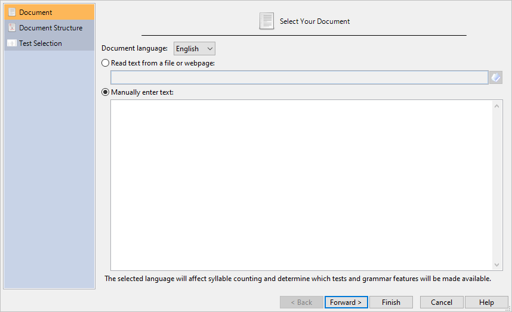
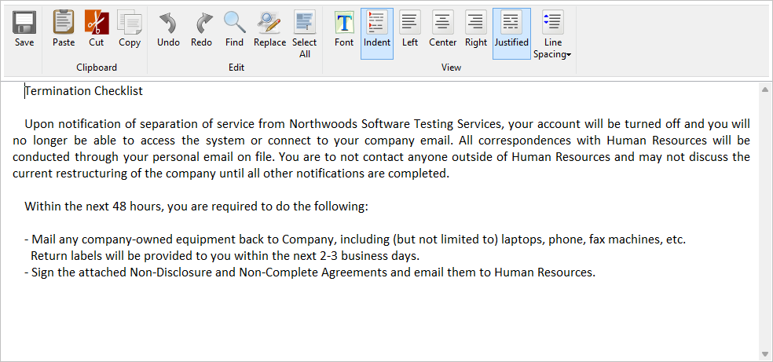
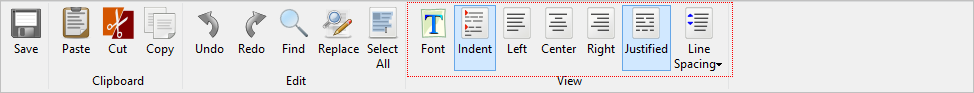

# Editing

## Editing within Readability Studio {#rs-as-an-editor}
In this example, we will write and edit a document from within *Readability Studio* itself. Click the `r keys("New")` button on the **Home** tab to open the **New Project** wizard. Next, select the **Manually enter text** option.

You can either type or paste text into this text box. For this example, we will leave it blank and edit it later. We will also use the defaults for document structure and test selections for brevity. (These can always be changed later from the **Document** and **Readability** tabs on the ribbon.) Finally, click the `r keys("Finish")` button to create the project.
Because the project does not have any content yet, only empty scores and statistics will be shown in the results. To add content to the project, select the **Document** tab on the ribbon and click the `r keys("Edit Document")` button. This will show the **Edit Embedded Document** dialog, where we will write our document.

Along the ribbon of this dialog are various editing features, such as find &amp; replace, clipboard operations, and undo/redo. In the **View** section of the ribbon are options for changing the appearance of the editor.

For example, we can toggle line spacing between new lines by selecting `r menu(c("Line Spacing", "Add space after paragraphs"))`.

As you edit the document, you can click the **Save** button at any time to send your edits back to the project. The project will then analyze your changes and refresh its results. As we edit, we can also change our parsing options or add tests to the project. With the project window selected, select the **Readability** tab on the ribbon and click `r menu(c("Secondary", "Flesch Reading Ease"))`. The Flesch test will now be added to the project and can be viewed by selecting **Readability Scores** on the project's sidebar. Likewise, various parsing features (e.g., line-end handling, text exclusion) can be changed on the **Document** tab on the ribbon.

You can also search for the project's findings by double clicking on items in the project's lists. Click **Words Breakdown** on the sidebar and select any list in this section (e.g., **3+ Syllable List**). Double click any word in this list and it will become selected in the editor. (Clicking `r keys("F3")` on the keyboard will search for the next instance.)

::: {.notesection data-latex=""}
If the editor is not open, then double clicking a list item will search for it in the respective text window within the project.
:::

Once you are finished editing your document, copy it from this editor and paste it into your publication program. For example, click `r keys("Select All")` and `r keys("Copy")`, then paste into *Word* and save as a *Word* file.
