# Customizing Graphs

## Customizing Bars {#customizing-bars}

In this example, we will discuss the various ways to change the appearance of bars in a bar chart or histogram.

The first step is to open the example file "Chocolate Eclairs." From the **Help** tab on the ribbon, click the `r keys("Example Documents")` button and then select "Chocolate Eclairs" from the menu.
(When prompted about how to open the document, select **Create a new project**.) When the **New Project** wizard appears, leave the defaults and click `r keys("Finish")`.

Once the project has finished loading, select **Words Breakdown** on the sidebar, then click **Word Counts** beneath that. A bar chart showing a breakdown of word categories will be displayed:

```{r echo=F, fig.align='center', out.width='75%'}
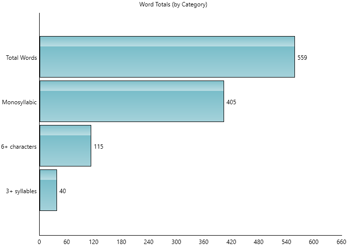
```

Now we will customize the appearance of this graph. One change that we can make is to reorder the columns in this bar chart. On the **Home** tab, click the `r keys("Sort")` button under the **Edit** section.
Select **Sort Descending** from the menu and note that the bars are now shown from largest to smallest from the origin:

```{r echo=F, fig.align='center', out.width='75%'}
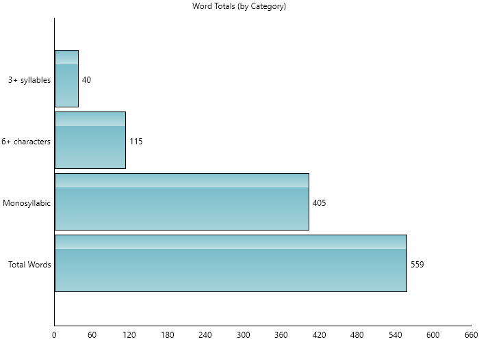
```

::: {.notesection data-latex=""}
When changing the order of the bars, any axis brackets surrounding them will be removed.
:::

Next, we can change the direction of the bars. Click the `r keys("Orientation")` button in the **Edit** section. Select **Vertical** from the menu.

Now the bars will be arranged vertically:

```{r echo=F, fig.align='center', out.width='75%'}
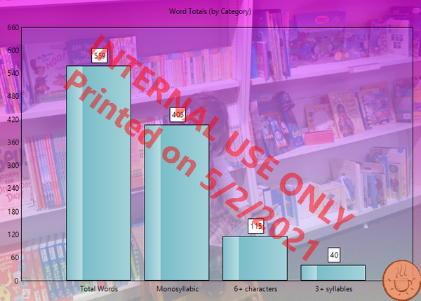
```

Finally, let's change how the bars are drawn. Click the `r keys("Bar Style")` button in the **Edit** section and select **Thick Watercolor**.

The bars will now have a watercolor paint effect, rather than the default glassy look:

```{r echo=F, fig.align='center', out.width='75%'}
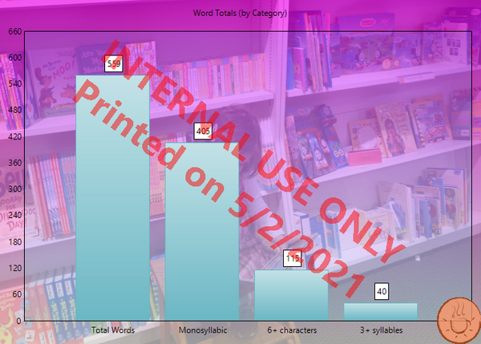
```

Images and shapes can also be used to draw our bars, as demonstrated in a [later example](#stipple-brush-example).

::: {.minipage data-latex="{\textwidth}"}
Finally, let's remove the labels to simplify the graph. Click the `r keys("Labels")` button on the ribbon so that is it unpressed.
Now the bars will be drawn without labels above them:

```{r echo=F, fig.align='center', out.width='75%'}
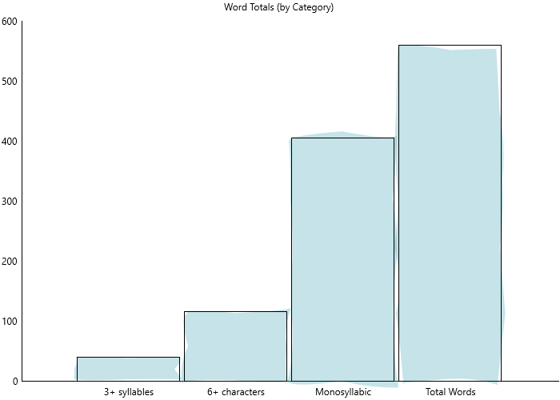
```
:::

\newpage

## Customizing Backgrounds {#graph-background-example}

Continuing from our previous [graph example](#customizing-bars), let's now change the background of the graph.
On the **Home** tab, click `r menu(c('Background', 'Background Color', 'Color...'))`.
When the color selection dialog appears, select a new color (e.g., antique white) and click `r keys("OK")`.
After selecting a color, check the option **Fade** from the same menu.

Now, the graph will have an antique white background with a gradient effect:

```{r echo=F, fig.align='center', out.width='75%'}
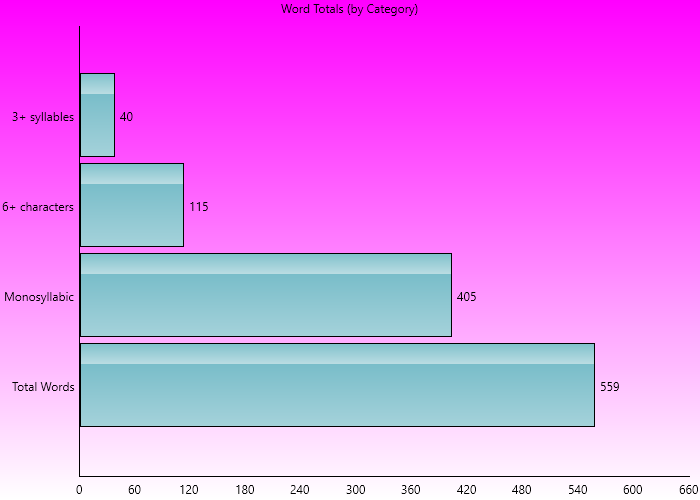
```

Next, click the `r keys("Background")` button again and select `r menu(c('Plot Image', 'Image...'))`. When the image selection dialog appears, choose an image and click `r keys("OK")`.

::: {.minipage data-latex="{\textwidth}"}
This image will now be shown as the background for your graphs:

```{r echo=F, fig.align='center', out.width='75%'}
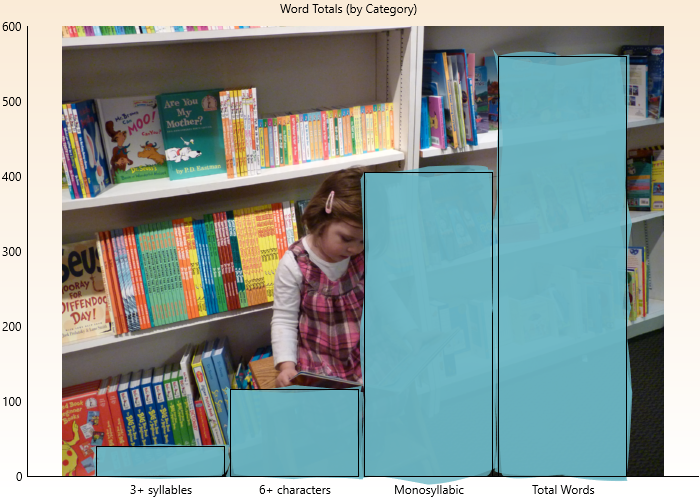
```
:::

To go along with the watercolor bars, we could also apply an oil painting effect to the image.
Click the `r keys("Background")` button and select `r menu(c('Plot Image', 'Effects', 'Oil Painting'))`.

```{r echo=F, fig.align='center', out.width='75%'}
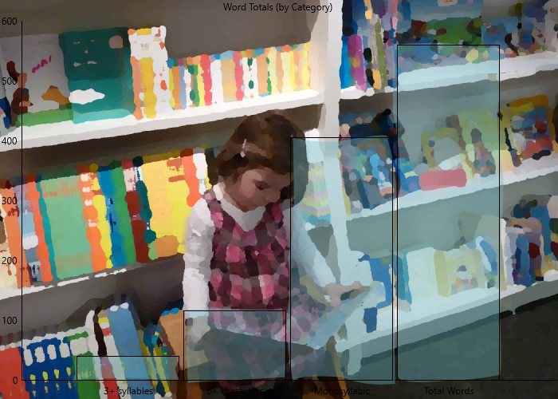
```

\newpage

## Adding Watermarks and Logos {#graph-watermark-example}

Next, let's put a [watermark](#watermark-and-logo) across our graph. Click the `r keys("Watermark")` button in the **Edit** section.
Enter the following into the **Watermark** dialog and click `r keys("OK")`:

> INTERNAL USE ONLY
>
> Processed on \@DATE\@

Note how this label is now lightly written across the graph:

```{r echo=F, fig.align='center', out.width='75%'}
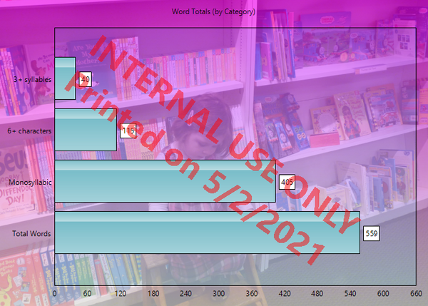
```

::: {.tipsection data-latex=""}
Entering `@DATE@` in the watermark field will show the current date when the graph is rendered. Refer to \@ref(options-graphs) for other watermark options.
:::

Now let's put a company logo on our graph. Click the `r keys("Logo")` button in the **Edit** section. Select an image and click `r keys("OK")`.

::: {.minipage data-latex="{\textwidth}"}
Now this image will be shown in the bottom right corner of the graph:

```{r echo=F, fig.align='center', out.width='75%'}
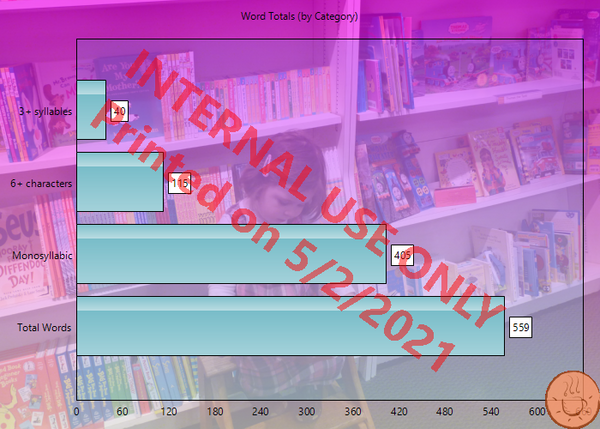
```
:::

\newpage

## Using Stipples {#stipple-brush-example}

In this example, we will use stipples for our bar charts. Basically, a stipple enables us to use stacked images or shapes to draw our bars.
First, create or open any standard project and select **Words Breakdown** on the sidebar. Next, select the **Word Counts** subitem and note how the bars will be filled rectangles:

```{r echo=F, fig.align='center', out.width='75%'}
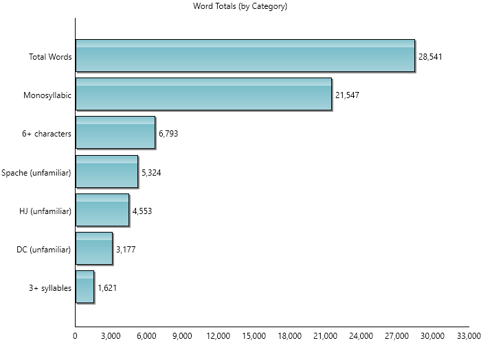
```

On the **Home** tab of the ribbon, click the `r keys('Bar Style')` button and select **Select stipple image...** from the menu:

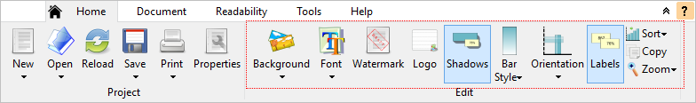

After selecting an image, the bars will be drawn as a repeating pattern of this image:

```{r echo=F, fig.align='center', out.width='75%'}
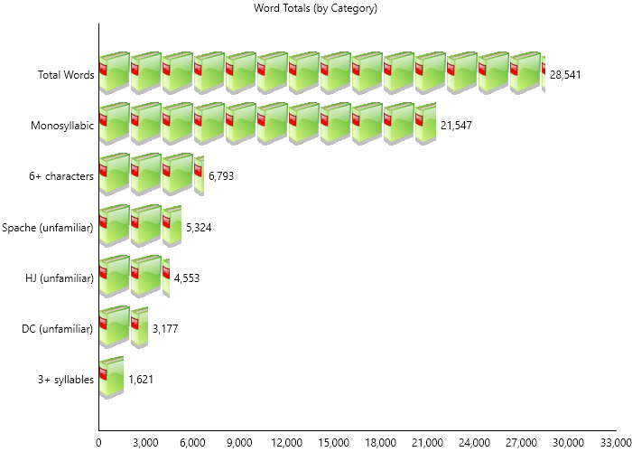
```

::: {.tipsection data-latex=""}
Enabling the **Shadows** option on the ribbon will draw a shadow under each image.
:::

Note that images of any size can be used. If the image is larger than the bars' width, then it will be scaled downed to fit. Images that are smaller will remain their original size (rather than being upscaled) to preserve their quality.

Along with images, a set of predefined shapes are also available to choose from. To select one, click the `r keys('Bar Style')` button again and select **Select stipple shape...** from the menu.
Select a shape from the list (e.g., **Newspaper**), and this shape will then be used for the bar pattern:

```{r echo=F, fig.align='center', out.width='75%'}
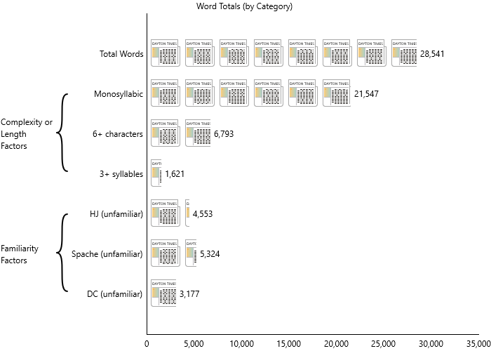
```

These features can also be applied to box plots and histograms. With any of these graph types selected, perform the same operation from the ribbon to draw with a stipple.

\newpage

## Selective Colorization {#graph-selective-color-example}

In this example, we will create a bar chart with a selective colorization effect. This technique is where the background is black & white and various focal points (i.e., the bars) are in color.

From the **Help** tab on the ribbon, click the `r keys("Example Documents")` button and then select "Chocolate Eclairs" from the menu.
(When prompted about how to open the document, select **Create a new project**.) When the **New Project** wizard appears, leave the defaults and click `r keys("Finish")`.

Once the project has finished loading, select **Words Breakdown** on the sidebar, then click **Word Counts** beneath that. A bar chart showing a breakdown of word categories will be displayed.
First, let's remove the labels to simplify the graph. On the **Home** tab of the ribbon, click the `r keys("Labels")` button so that is it unpressed.

Next, we will use an image to be displayed across all the bars. On the **Home** tab, click `r menu(c('Bar Style', 'Common Image'))`.
When the image selection dialog appears, select an image and click `r keys("OK")`.
Now, the bars will be filled with the image:

```{r echo=F, fig.align='center', out.width='75%'}
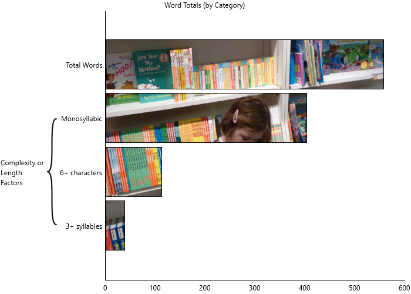
```

Next, click the `r keys("Background")` button and select `r menu(c('Plot Image', 'Image...'))`. When the image selection dialog appears, choose the same image and click `r keys("OK")`.
We will also need to adjust how this image fits into the plot area. Our goal is to have the background image line up with the same image drawn across the bars.
Click the `r keys("Background")` button and select `r menu(c('Plot Image', 'Fit', 'Crop & Center'))`.

::: {.minipage data-latex="{\textwidth}"}
This image will now be shown as the background for the graph and bars:

```{r echo=F, fig.align='center', out.width='75%'}
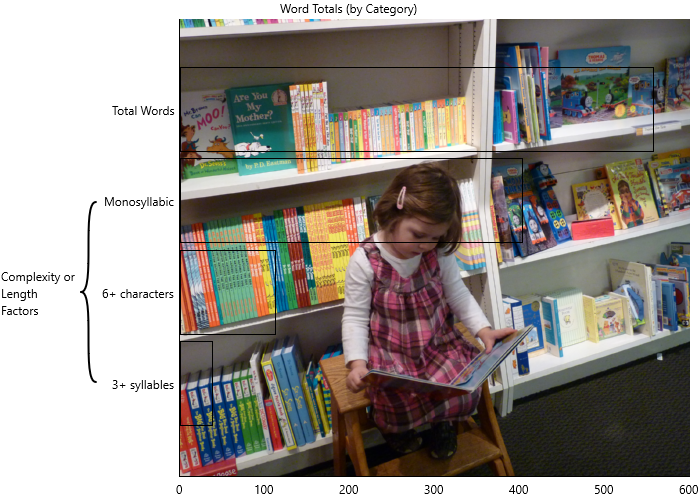
```
:::

As it is now, you can only see the bars' outlines. To make the bars pop, we will change the background to be black & white and faded.
First, click the `r keys("Background")` button and select `r menu(c('Plot Image', 'Opacity...'))`. On the **Set Opacity** dialog, select 100 and click `r keys("OK")`.
Next, click the `r keys("Background")` button again and select `r menu(c('Plot Image', 'Effect', 'Grayscale'))`.

::: {.minipage data-latex="{\textwidth}"}
Now, we should see a selective colorization effect on our bar chart:

```{r echo=F, fig.align='center', out.width='75%'}
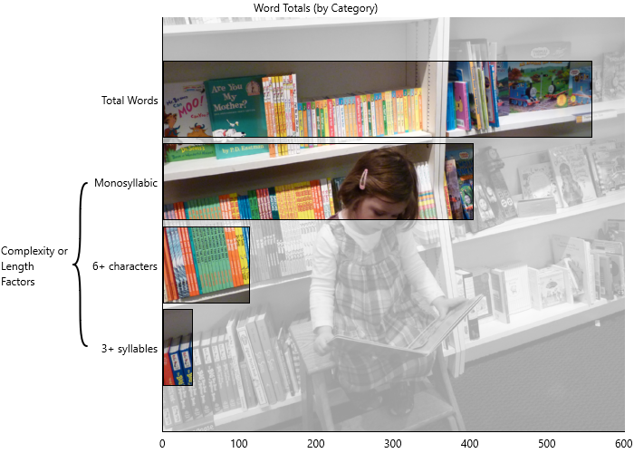
```
:::
