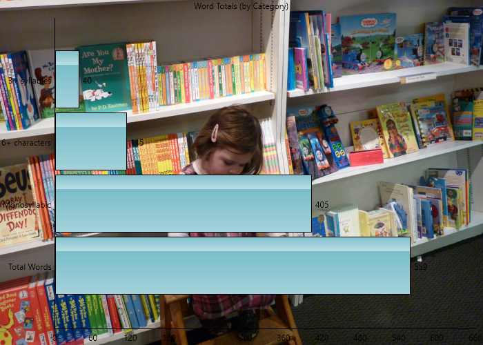
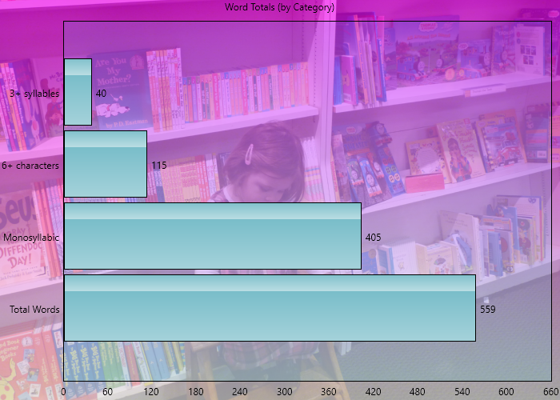

# Customizing Graphs

## Basic Customizing {#customizing-a-graph}

In this example, we will discuss the various ways to change the appearance of a graph.

The first step is to open the example file "Chocolate Eclairs." From the **Help** tab on the ribbon, click the `r keys("Example Documents")` button and then select "Chocolate Eclairs" from the menu. (When prompted about how to open the document, select **Create a new project**.) When the **New Project** wizard appears, leave the defaults and click `r keys("Finish")`.

Once the project has finished loading, select **Words Breakdown** on the sidebar, then click **Word Counts** beneath that. A bar chart showing a breakdown of word categories will be displayed:

```{r echo=F, fig.align='center', out.width='75%'}
knitr::include_graphics("images/ExampleGraphDefault.png")
```

Now we will customize the appearance of this graph. One change that we can make is to reorder the columns in this bar chart. On the **Home** tab, click the `r keys("Sort")` button under the **Edit** section. Select **Sort Descending** from the menu and note that the bars are now shown from largest to smallest from the origin:

```{r echo=F, fig.align='center', out.width='75%'}
knitr::include_graphics("images/ExampleGraphSorted.png")
```

::: {.notesection data-latex=""}
When changing the order of the bars, the axis brackets surrounding them will be removed.
:::

Next, let's change the background of the graph. On the **Home** tab, click the `r keys("Background")` button under the **Edit** section. Select **Color...** from the menu. When the color selection dialog appears, select a new color (e.g., purple) and click `r keys("OK")`. After selecting your new color, check the option **Apply Fade** from this menu.

Now the graph will have a purple background with a gradient effect:

```{r echo=F, fig.align='center', out.width='75%'}
knitr::include_graphics("images/ExampleGraphBackgroundColorChanged.png")
```

Next, click the `r keys("Background")` button again and select **Image** from the menu. When the image selection dialog appears, choose an image and click `r keys("OK")`.

Now this image will be shown as the background for your graphs:

```{r echo=F, fig.align='center', out.width='75%'}

```

By default, the image will be shown fully opaque. For lighter images this will look fine, but darker images (like the one shown above) will make it difficult to read the graph. Click the `r keys("Background")` button and select **Image Opacity...** from the menu. On the **Set Opacity** dialog, slide the opacity down to 100. Click `r keys("OK")`.

Now this image will be translucent and the graph labels will be much easier to read:

```{r echo=F, fig.align='center', out.width='75%'}
knitr::include_graphics("images/ExampleGraphBackgroundImageChanged.png")
```

Next, we will want to apply a light color to the plot area. Click the `r keys("Background")` button and select **Plot Area Color...** from the menu and select a new color. Then, select **Opacity...** from this menu and set it to 40. Click `r keys("OK")`.

Now the plot area of the graph will have a light blue applied to it:

```{r echo=F, fig.align='center', out.width='75%'}

```

Next, let's put a [watermark](#watermark-and-logo) across our graph. Click the `r keys("Watermark")` button in the **Edit** section. Enter the following into the **Watermark** dialog and click `r keys("OK")`:

> INTERNAL USE ONLY
>
> Printed on \@DATE\@

Note how this label is now lightly written across the graph:

```{r echo=F, fig.align='center', out.width='75%'}
knitr::include_graphics("images/ExampleWatermarkChanged.png")
```

::: {.tipsection data-latex=""}
Entering `@DATE@` in the watermark field will show the current date when the graph is rendered. Refer to \@ref(options-graphs) for other watermark options.
:::

Now let's put a company logo on our graph. Click the `r keys("Logo")` button in the **Edit** section. Select an image and click `r keys("OK")`.

Now this image will be shown in the bottom right corner of the graph:

```{r echo=F, fig.align='center', out.width='75%'}
knitr::include_graphics("images/ExampleLogoChanged.png")
```

Next, we can change the direction of the bars. Click the `r keys("Orientation")` button in the **Edit** section. Select **Vertical** from the menu.

Now the bars will be arranged vertically:

```{r echo=F, fig.align='center', out.width='75%'}
knitr::include_graphics("images/ExampleBarChartOrientationChanged.png")
```

Finally, let's change how the bars are drawn. Click the `r keys("Bar Style")` button in the **Edit** section and select **Color fade, bottom to top**.

The bars will now have a fading color painted across them, rather than the default glassy look:

```{r echo=F, fig.align='center', out.width='75%'}
knitr::include_graphics("images/ExampleBarChartEffectsChanged.png")
```

\newpage

## Using Stipples {#stipple-brush-example}

In this example, we will use stipples for our bar charts. Basically, a stipple enables us to use stacked images or shapes to draw our bars.
First, create or open any standard project and select **Words Breakdown** on the sidebar. Next, select the **Word Counts** subitem and note how the bars will be filled rectangles:

```{r echo=F, fig.align='center', out.width='75%'}
knitr::include_graphics("images/GraphBarsRectangular.png")
```

On the **Home** tab of the ribbon, click the `r keys('Bar Style')` button and select **Select stipple image...** from the menu:


After selecting an image, the bars will be drawn as a repeating pattern of this image:

```{r echo=F, fig.align='center', out.width='75%'}
knitr::include_graphics("images/GraphCustomBrush.png")
```

::: {.tipsection data-latex=""}
Enabling the **Shadows** option on the ribbon will draw a shadow under each image.
:::

Note that images of any size can be used. If the image is larger than the bars' width, then it will be scaled downed to fit. Images that are smaller will remain their original size (rather than being upscaled) to preserve their quality.

Along with images, a set of predefined shapes are also available to choose from. To select one, click the `r keys('Bar Style')` button again and select **Select stipple shape...** from the menu.
Select a shape from the list (e.g., **Book**), and this shape will then be used for the bar pattern:

```{r echo=F, fig.align='center', out.width='75%'}
knitr::include_graphics("images/GraphStippleShape.png")
```

These features can also be applied to box plots and histograms. With any of these graph types selected, perform the same operation from the ribbon to draw with a stipple.
