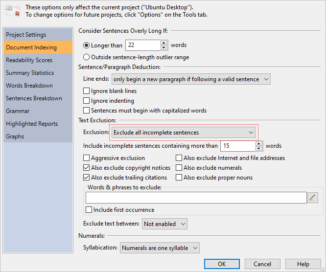

# (PART) Notes {-}

# Analysis Notes

## How Text\index{text exclusion} is Excluded\index{exclusion|see{text exclusion}} {#how-text-is-excluded}

Most experts recommend ignoring items such as chapter titles, list items, and table of contents when calculating reading levels. One reason that these items should be ignored is because they falsely lower the average sentence length (ASL). For example, chapter titles are usually just a couple of words. If you treat every section and chapter title as a regular sentence, then these short “sentences” will dramatically lower the ASL. In turn, this will falsely lower most of your test scores. The other reason to ignore these items is because they are not usually part of the main content, but rather dividers or sectional markers. These items are read, but it is the narrative content that readers may struggle with. Therefore, it is the content that should be our main focus, and titles and list items should just be considered “noise.”

These items, by default, are ignored for all newly created projects. That is, any word inside an incomplete sentence is not factored into any of the statistics or tests. Incomplete sentences are not factored into the overall sentence and paragraph counts, which in turn will prevent them from skewing the readability scores.

To toggle this behavior for an existing project, click the `r keys("Properties")` button the **Home** tab to display the **Project Properties** dialog. Next, click the **Document Indexing** icon. Here you can select either **Do not exclude any text**, **Exclude all incomplete sentences**, or **Exclude all incomplete sentences, except headings**, as illustrated below.

```{r echo=F, fig.align='center', out.width='90%'}

```

If you are excluding incomplete sentences\index{sentences!excluding incomplete sentences}, note that any non-terminated sentence longer than 15 words will still be counted as a regular sentence. If a sentence is longer than a certain length and is missing its terminating punctuation, then the missing period is likely just a mistake. To accommodate for these errors, the program will consider these sentences valid. To customize this behavior, enter a different minimum sentence length in the **Include incomplete sentences containing more than [15] words** option (pictured above).

Note that these options are also available on the [**Options**](#options-overview) dialog (on the **Tools** tab) to change this behavior for all future projects.

Although ignoring these items is generally recommended, there is one exception: [non-narrative](#fragmented-text) (i.e., structured) forms. Files such as résumés and application forms often contain many terse and incomplete sentences and very little narrative text. In these situations, you should include incomplete sentences and use tests that do not emphasize sentence length, such as [FORCAST](#forcast-test)\index{FORCAST}. When creating a [new project](#creating-standard-project), there are two ways to implicitly set these options. The first way is to select **non-narrative, fragmented text** when specifying the document structure. The other way is to select **non-narrative form** when specifying the document type. By selecting either of these, the program will use the appropriate options and tests for these types of files.

### Additional Items {-}

::: {.minipage data-latex="{\textwidth}"}
Although not traditionally mentioned in readability articles, other items may also be excluded within *Readability Studio*. These include:

- copyright notices
- trailing citations
- internet and file addresses
- specific words or phrases
:::

Refer to \@ref(document-analysis) for a detailed explanation of these options.

## How Sentences\index{sentences!counting} are Counted {#how-sentences-are-counted}

*Readability Studio* considers periods, question marks, exclamation points, and interabangs as the end of a sentence, although there are a few exceptions.

The first exception is periods that are part of an abbreviation, acronym, or initial. For example, the following is seen as only one sentence:

::: {.fancyquotes data-latex=''}
Jane B. Doe has worked at A.C.M.E., inc. for seven years.
:::

Another exception is the last sentence inside of a quote. If this sentence is followed by a lowercase word, then it will not end until the next sentence terminating punctuation is encountered. For example, the following is seen as two sentences:

::: {.fancyquotes data-latex=''}
"Where did it go? I can't find it anywhere!" he said.
:::

Because *he* is lowercase, the *!* will not be considered the end of the sentence and *he said* will be part of the proceeding sentence. However, if *He* is capitalized, then the *!* will be seen as the end of a sentence and the above will be counted as three sentences.

There is also a special rule for ellipses. If ellipses are followed by a capitalized word, then it will be considered the end of the sentence. Otherwise, it is simply seen as punctuation and does not terminate the sentence. The ellipses symbol (*…*) and dot sequences (*\.\.\.*) are both recognized.

One last special case is when a colon or semicolon is found at the end of a line. In the case of a colon, it will be seen as the end of a sentence because it is assumed that this sentence is leading into a list. For a semicolon, it will be seen as the end of a lengthy list item that should be considered a valid sentence. If a colon or semicolon is found in the middle of a sentence, then it will not end that sentence.

By default, lowercase words can be considered the start of a new sentence (with the exception mentioned above). Although it is poor grammar to not capitalize the first word of a sentence, this writing style is often found in some literature. This behavior can be toggled using the option [**Sentences must begin with capitalized words**](#options-sentence-deduction).

## Line (Sentence) Chaining\index{sentences!chaining} {#line-chaining}

Line chaining (or sentence chaining) is a sentence deduction method where lines of text are joined until a *.*, *?*, or *!* is found. In other words, multiple lines of text can be joined into a single sentence. This is normally preferred behavior when text is formatted to a specific width, such as the following:

:::: {.fancyquotes data-latex=''}
::: {.FlushLeft data-latex=''}
WARNING:

Before cleaning the blade (or performing\
any general maintenance), be sure to turn\
OFF the mower. Failure to comply may\
result in injury.
:::
::::

Although this is five lines of text, we would expect for this to be seen as three sentences. By chaining lines 2, 3, and part of 4 into one sentence (from *Before* to *mower.*), we properly see the sentences (regardless of the line breaks).

However, this can be a problem if your document contains headers, footers, and list items. Consider this example:

::: {.fancyquotes data-latex=''}
**COCOA CAKE**
 
The following ingredients are required:

- 1/2 a cup of butter
- 3/4 a cup of milk
- 1 cup of sugar
- 6 level tablespoonfuls of Baker's Cocoa
- 3 eggs
- 2 level teaspoonfuls of baking powder
- 1 teaspoonful of vanilla
- 1-1/2 or 2 cups of sifted pastry flour

Cream the butter, stir in the sugar gradually, add the unbeaten eggs, and beat all together until very creamy.
:::

In this situation, the header would be joined with the first sentence. Additionally, all the list items would be combined into one large sentence, and could even be joined with the sentence following them. This can greatly skew your sentence lengths and lead to erroneous results.

*Readability Studio* uses a more intelligent form of line chaining when deducing sentences. By default, the program will only chain lines together if all the following criteria are met:

- A line is not terminated by a *.*, *?*, *!*, or *:*
- There are no blank lines following the line
- The next line of text is not tabbed over or bulleted

In the above example, the program will detect the blank line between the header and the first sentence and not chain them together. Instead, the header will be seen as an [incomplete sentence](#how-text-is-excluded). The program will also detect how the list items are tabbed over and not chain them together. Instead, each list item will be seen as an incomplete sentence. Any line that begins with a tab or two (or more) spaces will be considered as a tabbed line. Lines that begin with hyphens, dashes, or numbers followed by a period will be considered bulleted and will also not be chained to the proceeding sentence.

As we can see, the program helps avoid incorrect line chaining. Just as important, it will chain lines correctly when it is actually necessary. Consider the following:

:::: {.fancyquotes data-latex=''}
::: {.FlushLeft data-latex=''}
WARNING:

Before cleaning the blade (or performing\
any general maintenance), be sure to turn\
OFF the mower. Failure to comply may\
result in injury.
:::
::::

The first line, *WARNING:*, will be seen as a single sentence because the line ends with a colon. Although colons are not normally treated as a sentence terminating character, an exception is made when it is encountered at the end of a line. The next line, *Before cleaning the blade (or performing,* does not end with a sentence terminating character. There are no empty lines after this line, and the next line is not bulleted or tabbed; therefore, this line will be chained to the next line. This chaining will continue until an empty line or a sentence terminating character is encountered. In this case, all these lines will be joined into one sentence:

:::: {.fancyquotes data-latex=''}
::: {.FlushLeft data-latex=''}
Before cleaning the blade (or performing\
any general maintenance), be sure to turn\
OFF the mower.
:::
::::

Note that even if a header does not precede an empty line or end with a sentence terminating character, line chaining will be intelligently avoided if the following sentence is tabbed or spaced over. The first sentence of a new paragraph is normally spaced over, so this is expected behavior. In this example, the following sentence is tabbed over and the program will know not to chain these lines:

:::: {.fancyquotes data-latex=''}
::: {.FlushLeft data-latex=''}
WARNING

&nbsp;&nbsp;&nbsp;&nbsp;&nbsp;Before cleaning the blade...
:::
::::

A caveat with line chaining is when a header is not terminated and not followed by an empty line, and the following sentence is not tabbed over. For example:

:::: {.fancyquotes data-latex=''}
::: {.FlushLeft data-latex=''}
WARNING

Before cleaning the blade...
:::
::::

In this case, these two lines will be erroneously joined into one sentence. To completely disable all possible line chaining, select the option [**Line ends always begin a new paragraph**](#options-sentence-deduction). Note that this option is only recommended if all line ends in your document represent new paragraphs. If your document contains line ends to control the width of the text, then selecting this option will cause incorrect sentence deduction.

## Controlling How Sentences are Deduced\index{sentences!controlling deduction}

How sentences are structured can vary from document to document. Because of this, *Readability Studio* offers options to control how sentences are parsed and analyzed. These features are available under the **Sentence deduction** section of the [**Document Indexing**](#document-analysis) page. To view these features, select [**Options**](#options-overview) from the **Tools** tab and then click on the **Document Indexing** icon. Under the **Sentence deduction** section, there are two options: **Ignore blank lines when determining the end of a sentence** and **Sentences must begin with capitalized words**.

`r menu(c('Tools','Options','Document Indexing','Sentence deduction'))`

The option **Sentences must begin with capitalized words** controls whether sentences must begin with capitalized words. Selecting this option will make *Readability Studio* more grammatically strict when counting sentences; however, it is recommended to leave this option unselected for “loosely written” documents.

The option **Ignore blank lines** is used for controlling how multi-line sentences with blank lines between them are seen. For example:

::: {.fancyquotes data-latex=''}
Chapter 1  

It was the best days of our lives.
:::

If **Ignore blank lines** is unselected (the default), then the above example is seen as two sentences. *Chapter 1* is seen as an [incomplete sentence](#how-text-is-excluded) because there is a blank line between it and the next sentence. Then *It was the best days of our lives.* is seen as the second sentence. This behavior is recommended for most documents because it helps remove headers and list items from the analysis.

There are special situations where you would need multi-line sentence fragments to be [chained](#line-chaining) together. For example, picture books that wrap sentences around images may cause sentences to be split into fragments with blank lines between them. Refer to \@ref(chain-sentences-example) for an example.

## How Syllables are Counted\index{syllables!counting}

Most software that counts syllables employs one of two methods. The first is a dictionary-based system that includes a list of common words and their respective syllable counts. As the software counts a document's syllables, each word is looked up in a dictionary to retrieve its syllable count. The disadvantage of this method is that if a word is not found, then the program must prompt you to enter the syllable count.

The second syllable-counting method is to use an algorithm. These algorithms generally consist of counting vowel blocks[^silentEFootnote] in a word to determine the syllable count. The advantage of this is that it will work with any word, without user interaction. The disadvantage is that these algorithms are traditionally less accurate than a dictionary approach. To be truly effective, these algorithms must consider special cases, such as:

- Situations where vowel blocks split into two syllables. For example, the *ui* in *fruit* is one syllable, but in *intuitive* it splits into two syllables.
- Situations where special consonant blocks may split into two syllables. For example, in the name *McCoy*, the prefix is really a separate syllable.

*Readability Studio* uses an algorithmic approach which takes these linguistic nuances into account.

Different algorithms should be used for different languages. The rules for vowel-blocks, silent *e*’s, and number counting can greatly vary between languages. For example, *85* would be two syllables in English (*eight five*), whereas in Spanish[^spanishSyllabizerFootnote] it would be four syllables (*o-cho cin-co*). To account for this, *Readability Studio* uses the proper syllabizer based on the [language](#project-settings) that you specify for your project.

Finally, for readability analysis, syllables should be counted on a word-by-word basis and not use synalepha\index{synalepha}. Synalepha is the blending of word sounds together often found in poetry. Thus, it is generally not suggested to analyze text which has a poetic meter.

[^silentEFootnote]: An exception for silent *e* is made for English syllabizing.
[^spanishSyllabizerFootnote]: For Spanish text, a specialized version of the Cuayáhuitl [-@{cuayahuitl}412–15] algorithm is used.

### How Numbers are Syllabized\index{syllables!numerals} {-}

Numbers are generally syllabized using one of two approaches:

- Sound out each digit of the number. For example, *87* would be three syllables (*eight se-ven*).
- Count the entire number as one syllable.

By default, *Readability Studio* counts numbers as monosyllabic words; however, this behavior can be toggled from the [**Document Indexing**](#document-analysis) options. Note that some tests may override these settings if they require a specific method. For example, [Fry](#fry-test)\index{Fry} will always sound out each numeric digit when syllabizing.

### How Symbols are Syllabized\index{syllables!symbols} {-}

::: {.minipage data-latex="{\textwidth}"}
The following symbols are syllabized as follows:

   # = 1 syllable (“pound”)  
   £ = 1 syllable (“pound” or “quid”) if at the beginning of the word  
   ± = 3 syllables (“plus mi-nus”) if at the beginning of the word  
   $ = 2 syllables (“do-llar”) if at the beginning of the word  
   € = 2 syllables (“eu-ro”) if at the beginning of the word  
   ¢ = 1 syllable (“cent”) if at the end of the word  
   % = 2 syllables (“per-cent”) if at the end of the word  
   ° = 2 syllables (“de-grees”) if at the end of the word  
   ¼ = 2 syllables (“one fourth”) if at the end of the word  
   ½ = 2 syllables (“one half”) if at the end of the word  
   ¾ = 2 syllables (“three fourths”) if at the end of the word
:::

## Repeated Word Exceptions {#repeated-word-exceptions}

Generally, repeated words are a typo; however, there are a few exceptions. For example:

::: {.fancyquotes data-latex=''}
The report is due tomorrow. I'm concerned *that that* report won't be ready in time. The last time that I spoke to our boss, she said that she *had had* it with overdue reports.
:::

::: {.minipage data-latex="{\textwidth}"}
Although awkwardly worded, the duplicate *that* and *had* are grammatically correct. To account for this, *Readability Studio* ignores certain repeated words, such as:

- ha ha
- had had
- no no
- that that
- *die die* (German article)
- *der der* (German article)
- *das das* (German article)
- *sie sie* (German pronoun)
:::

Words separated by punctuation are also ignored when deducing repeated words. For example:

::: {.fancyquotes data-latex=''}
I need a list of new features. Each new *feature, feature* by feature, is required to be documented.
:::

These will not be seen as repeated words because of the comma.

## Article Mismatching {#article-mismatching}

There are two special cases for article-mismatch detection: single letters and acronyms. For single letters, *Readability Studio* will sound out the letter when determining whether the article in front of it is correct. For example:

::: {.fancyquotes data-latex=''}
All the students did well, except for one that received *a 'F'*.
:::

In this example, *a 'F'* will be considered incorrect because the program will sound out the letter *F* as *ef*. An *ef* sound requires the article *an* to be grammatically correct, so this will be considered wrong.

Similar logic is applied to acronyms that probably would have each letter sounded out. This deduction is made if an acronym contains no vowels. For example:

::: {.fancyquotes data-latex=''}
*A SDLC* meeting should be held after the product is launched.
:::

The program will sound out the letters in *SDLC* because it has no vowels, resulting in *es dee el see*. Because of the *es* sound, the article *an* is required. Therefore, the program will mark this as an article mismatch.

Note that if an acronym contains a vowel, then the program will assume that it is pronounced as a regular word. For example:

::: {.fancyquotes data-latex=''}
Run *a FORCAST* test if your document doesn't have a regular sentence structure.
:::

Rather than treating the word *FORCAST* as if it begins with an *ef* sound, it sounds it out like *forecast*. Therefore, the article *a* is considered correct.

## Non-narrative/Fragmented Text {#fragmented-text}

Most readability formulas are designed for narrative text, where a work consists of flowing sentences and paragraphs. For these formulas, the average sentence length (ASL) is an important factor.

Items\index{sentences!excluding incomplete sentences} such as headers and list items can adversely affect the accuracy of the ASL. If they are [chained](#line-chaining) to the following sentence, then they will inflate the ASL. If they are treated as full sentences, then they will falsely lower the ASL. Because of this, most experts recommend removing these and only analyzing the narrative sections of a document.

By default, *Readability Studio* follows this advice. However, there are situations where this rule does not apply.

For files consisting mostly of short blocks of text (e.g., quizzes, flyers, or menus) instead of flowing narrative, this presents a problem. Sentence lengths will be abnormally short and skew most test results. Also, if [incomplete sentences](#how-text-is-excluded) are being excluded, then most of the document will not even be analyzed.

To avoid these issues, it is recommended to include incomplete sentences in the analysis and to only use the [FORCAST](#forcast-test)\index{FORCAST} test. When creating a [new project](#creating-standard-project), there are two ways to implicitly set these options. The first way is to select **non-narrative, fragmented text** when specifying the document structure. The other way is to select **non-narrative form** when specifying the document type.

## Joining Hyphenated Words

Some published documents format each line of text to a specific width to fit on the page. In doing so, longer words at the end of some lines may be split and hyphenated. For example:

:::: {.fancyquotes data-latex=''}
::: {.FlushLeft data-latex=''}
COBOL is an acronym for COmmon *Bus-\
iness* Oriented Language. It is commonly\
used for calculating monetary transactions\
and generating reports. For example, COBOL\
can be found in the backend of many Point-of-\
Sale systems.
:::
::::

Note how *Business* and *Point-of-Sale* are split across multiple lines.

When *Readability Studio* encounters a hyphenated word at the end of a line, it will perform the following steps:

- Both parts of the word will be joined.
- The hyphen(s) will be removed and if what remains is a known word, then that will be used. Otherwise,...
- The hyphen(s) will be kept as part of the word.

With the above example, *Bus-iness* will be recognized as *Business*. In contrast, *Point-of-Sale* will remain as a hyphenated compound word because *PointofSale* is not a known word.

## Option Changes that Require Reanalyzing the Document

When changing the options of a project (either from the ribbon or **Project Properties** dialog), most changes can be applied without the program needing to analyze the document again. For example, changing graph options or adding a test will process immediately, without the program needing to refresh the rest of the results. This is helpful when working with large documents or batch projects that may take some time to process.

There are some options that when changed will require a project to reload. These are listed below:

- Any changes made from the **Document** tab of the ribbon. This includes all options related to document analysis, spell checking, and editing the source document(s) (if documents or text are embedded in the project).
- Adding a [**Dolch**](#reviewing-dolch) section.
- Adding a custom test.

When any of the aforementioned changes are made, the project will reanalyze the source document(s) and recalculate all its results.

Note that you can always reload a project manually by clicking the `r keys("Reload")` button on the **Home** tab of the ribbon. This is useful when you are editing the source document from another program and want to refresh the results in *Readability Studio*.
