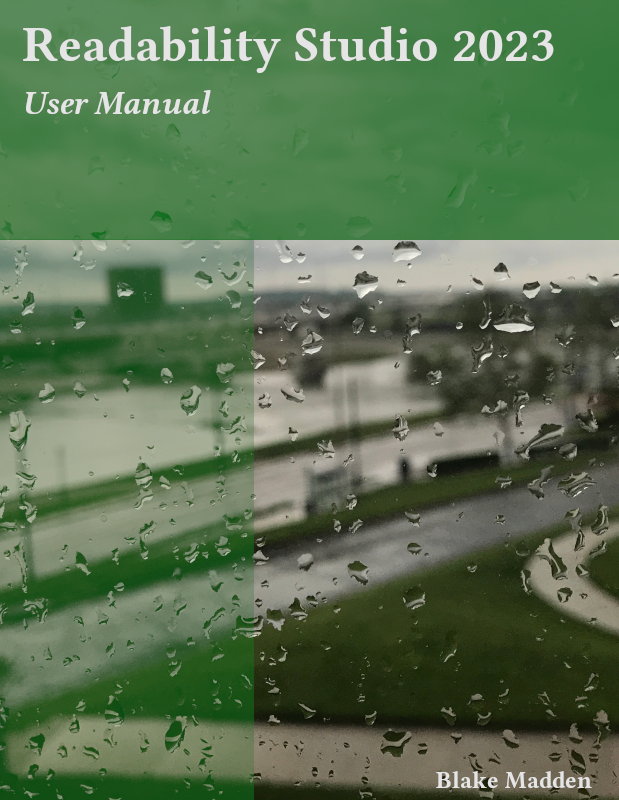

--- 
title: "Readability Studio 2023"
subtitle: "User Manual"
description: "Readability Studio 2023 Manual"
author: "Blake Madden"
site: bookdown::bookdown_site
output:
  bookdown::pdf_book:
    template: "latex/default.tex"
    includes:
      in_header: "latex/preamble.tex"
documentclass: book
lot: yes
lof: yes
date: 2023
links-as-notes: true
linestretch: 1.15
biblio-title: References
bibliography: cites.bib
biblio-style: mla
biblatexoptions: maxbibnames=3
link-citations: yes
nocite: '@*'
csl: modern-language-association.csl
cover-image: "images/NonGenerated/cover.png"
pdf-cover: "images/NonGenerated/cover.pdf"
---

```{r, include=FALSE}
source('R/appdown.r')
```

```{asis, echo=knitr::is_html_output()}
# Preface {#cover .unnumbered}

<!-- Just want this preface in the gitbook.
     PDF output will have its own copyright page after the title.-->

:::{.wrapfigure data-latex="{r}{0.5\\textwidth}" style="width: 48%;"}
{width=48%}
:::

This book is a guide to using the software product *Readability Studio*,
as well as a reference for readability formulas.
For those interested in the formulas,
refer to ch. \@ref(english-readability-tests),
ch. \@ref(spanish-readability-tests),
and ch. \@ref(german-readability-tests) for formula overviews.
For further reading, refer to ch. \@ref(bibliography) for a concise list
of articles discussing these formulas.


This book is licensed under the [Creative Commons Attribution-NonCommercial-NoDerivs 4.0 International License](https://creativecommons.org/licenses/by-nc-nd/4.0/).
```
