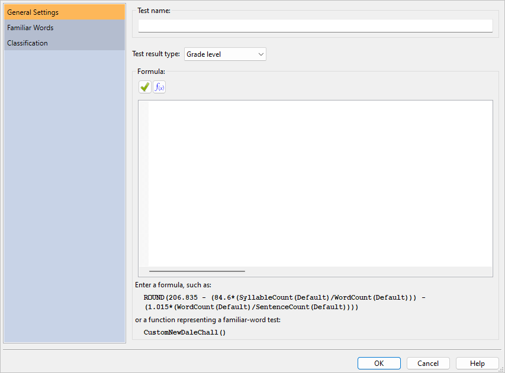
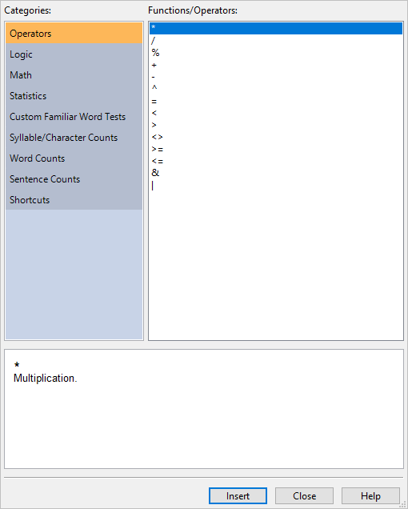
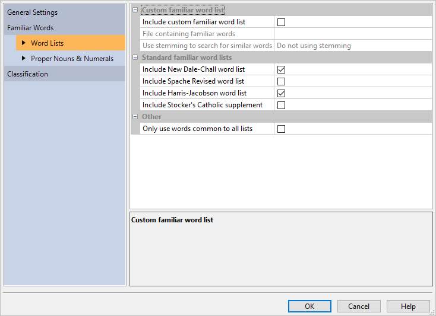
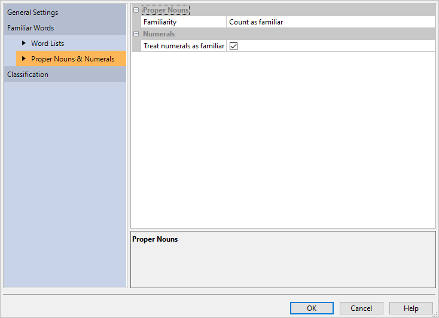
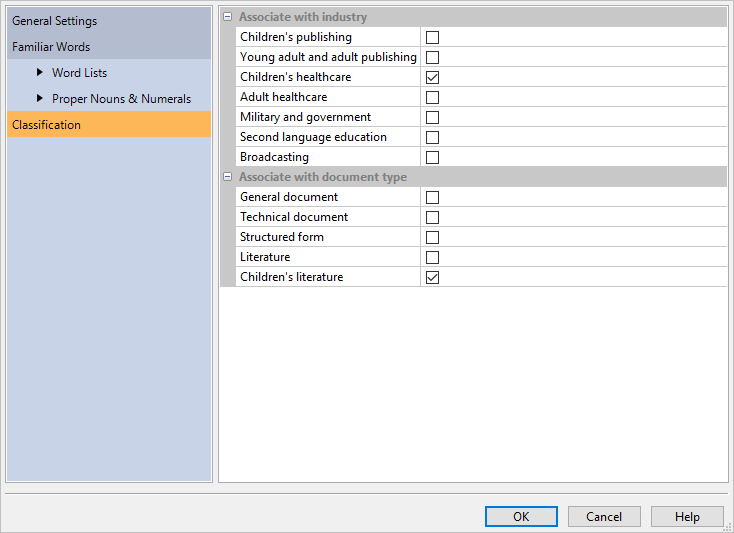
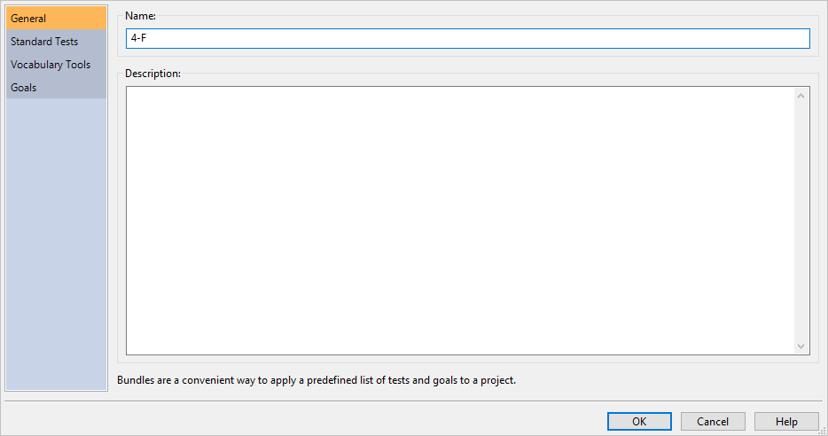

# Custom Tests & Bundles

## Creating a Custom Test {#creating-custom-test}

Along with offering standard tests, such as [New Dale-Chall](#dale-chall-test)\index{New Dale-Chall!custom test} and [Spache Revised](#spache-test)\index{Spache Revised!custom test}, *Readability Studio* also includes the ability to create your own tests. Many customizable features are offered for new tests, such as being able to select your own familiar-word list and which formula to use.

To create a custom test, go to the **Readability** tab, click the arrow beneath the `r keys("Custom Tests")` button and select **Add Test...** from the menu. At this point, the **Add Custom Test** dialog will be displayed:



In the **General Settings** section, enter a name for this test (e.g., “NDC Computer”) in the **Test name** field. This will be the name of the test as it appears in your results and on the menu.

Next, enter the test's formula in the **Formula** field. Essentially, there are two types of formulas: predefined familiar-word formulas and custom-built formulas. A predefined familiar-word formula will use a standard test's formula along with your own familiar-word criteria. This is useful for expanding a standard test (such as New Dale-Chall) by including your own word list. The available predefined formulas are:

- `CustomNewDaleChall()`: this will use the New Dale-Chall\index{New Dale-Chall!zzzzz@\igobble|seealso{\texttt{CustomNewDaleChall()}}} formula.
- `CustomSpache()`: this will use the Spache Revised\index{Spache Revised!zzzzz@\igobble|seealso{\texttt{CustomSpache()}}} formula.
- `CustomHarrisJacobson()`: this will use the Harris Jacobson\index{Harris-Jacobson Wide Range!zzzzz@\igobble|seealso{\texttt{CustomHarrisJacobson()}}} formula.

The second type of formula is a custom-built formula. For example, the formula for Lix is:

`SevenCharacterPlusWordCount() / SentenceCount()`

To create a new formula based on Lix\index{Lix} that treats 6+ character words as difficult, enter this:

`SixCharacterPlusWordCount() / SentenceCount()`

To view all available functions, click the **Functions** button. This will display a function browser on the right side of the dialog:

```{r echo=F, fig.align='center', out.width='50%'}

```

The left side of this browser shows the function categories, while the right side shows the functions from the selected category.
Beneath, a description of the selected function will be shown.
Note that double clicking a function on the right side will insert it into the formula.

Refer to \@ref(custom-test-functions) for a list of available functions.

::: {.minipage data-latex="{\textwidth}"}
After entering your formula, you will need to specify what type of test this will be from the **Test type** combobox. This will determine which column the test's score will appear in the [**Readability Scores**](#reviewing-test-scores) window. The following types of tests are available:

- Grade level
- Index value
- [Predicted cloze score](#cloze)\index{cloze!custom tests}
:::

If your test is using any of the predefined familiar-word formulas (`CustomNewDaleChall()`, `CustomSpache()`, `CustomHarrisJacobson()`) or using the functions `UnfamiliarWordCount()` or `UniqueUnfamiliarWordCount()`, then you will need to define how familiar words are detected. Expand **Familiar Words** to view two sections: [**Word Lists**](#custom-word-list) and [**Proper Nouns & Numerals**](#custom-proper-numerals).

If you want to include a list of your own familiar words, then check the option **Include custom familiar word list**. Next, enter the path to the familiar-word file in the **File containing familiar words** field. This file must be a text file and each word must be separated by a space, tab, comma, semicolon, or new line. An example file would look like this:

> `apple orange pear`

or like this:

> `apple`\
> `orange`\
> `pear`

After entering the file path, the words from the file will be shown in the familiar words grid.

Next, you can specify which type of stemming (if any) to use. Stemming compares words based on their roots and is useful for finding words that appear in different forms. This comparison is performed when words from a document are being matched against your familiar-word list. For example, let us say that you have the word *open* in your list and have English stemming selected. When you analyze a document, words such as *opened* and *opening* will be considered familiar, even if they are not explicitly in your word list.

If you are not using stemming, then it is recommended that you enter each inflected form of your words (e.g., possessive, plural) in your familiar-word list. For example, you would need *open*, *opens*, *opening*, etc. explicitly in your list to cover each form of *open*.

Along with your own word list, you can also use the New Dale-Chall, Spache, and Harris-Jacobson\index{word lists!combining} word lists. This enables you to make your word list an appendage to any of these standard tests, therefore creating your own extended version of these tests. This behavior can be toggled with the options shown below:



Standard familiar-word tests normally consider numbers and proper nouns as familiar. This is the default behavior for a custom test as well, but these can be toggled on the **Proper Nouns** and **Numbers** sections (shown below):



Finally, you can specify how this test interacts with the [**New Project**](#creating-standard-project) wizard by associating it with document types and industries. Click the **Classification** icon to display these options. Then select all the documents and industries that this test should relate to.

For example, select the **Children's literature** and **Children's healthcare** check boxes (as shown below) and click `r keys("OK")`.



Now create a new project and select **Children's healthcare** as the industry type. Once the program loads the document, your custom test will be automatically included in the results.

## Custom Test Functions {#custom-test-functions}

The following functions and operators are available for use in [custom test](#creating-custom-test) formulas.

::: {.minipage data-latex="{\textwidth}"}
| Operator | Description |
| :-- | :-- |
| \* | Multiplication. |
| / | Division. |
| % | Modulus: Divides two values and returns the remainder. |
| + | Addition. |
| \- | Subtraction. |
| ^ | Exponentiation. The number in front of ^ is the base, the number after it is the power to raise it to. |
| ** | Exponentiation. (This is an alias for ^) |
| \= | Equals. |
| < | Less than. |
| \> | Greater than. |
| <> | Not equal to. |
| \!= | Not equal to. (This is an alias for <>) |
| \>= | Greater than or equal to. |
| <= | Less than or equal to. |
| & | Logical conjunction (AND). |
| \| | Logical alternative (OR). |
| ( ) | Groups sub-expressions, overriding the order of operations. |

Table: Operators
:::

::: {.minipage data-latex="{\textwidth}"}
For operators, the order of precedence is:

| Operator | Description |
| :-- | :-- |
| ( ) | Instructions in parentheses are executed first. |
| ^   | Exponentiation. |
| \*, /, and % | Multiplication, division, and modulus. |
| \+ and - | Addition and subtraction. |
:::

For example, the following:

$$
5+5+5/2
$$

Will yield `12.5`. `5/2` is executed first, then added to the other fives. However, by using parentheses:

$$
(5+5+5)/2
$$

You can override it so that the additions happen first (resulting in `15`), followed by the division (finally yielding `7.5`). Likewise, `(2+5)^2` will yield `49` (`7` squared), while `2+5^2` will yield `27` (`5` squared, plus `2`).

::: {.minipage data-latex="{\textwidth}"}
| Function | Description |
| :-- | :-- |
| AND(Value1, Value2, ...) | Returns true if all conditions are true. |
| IF(Condition, ValueIfTrue, ValueIfFalse) | If *Condition* is true (non-zero), then *ValueIfTrue* is returned; otherwise, *ValueIfFalse* is returned. |
| NOT(Value) | Returns the logical negation of *Value.* |
| OR(Value1, Value2, ...) | Returns true if any condition is true. |

Table: Logic Functions
:::

::: {.minipage data-latex="{\textwidth}"}
| Function | Description |
| :-- | :-- |
| ABS(Number) | Absolute value of *Number*. |
| CEIL(Number) | Smallest integer not less than *Number*.<br>\linebreak `CEIL(-3.2)` = -3<br>\linebreak `CEIL(3.2)` = 4 |
| CLAMP(Number, Start, End) | Constrains *Number* within the range of *Start* and *End*. |
| EXP(Number) | Euler to the power of *Number*. |
| FAC(Number) | Returns the factorial of *Number*. The factorial of *Number* is equal to 1\*2\*3\*...\* *Number* |
| FACT(Number) | Alias for `FAC()` |
| FLOOR(Number) | Returns the largest integer not greater than *Number*.<br>\linebreak FLOOR(-3.2) = -4<br>\linebreak `FLOOR(3.2)` = 3 |
| LN(Number) | Natural logarithm of *Number* (base Euler). |
| LOG10(Number) | Common logarithm of *Number* (base 10). |
| MIN(Value1, Value2, ...) | Returns the lowest value from a specified range of values. |
| MAX(Value1, Value2, ...) | Returns the highest value from a specified range of values. |
| MOD(Number, Divisor) | Returns the remainder after *Number* is divided by *Divisor*. The result has the same sign as divisor. |
| POW(Base, Exponent) | Raises *Base* to any power. For fractional exponents, *Base* must be greater than 0. |
| POWER(Base, Exponent) | Alias for `POW()`. |
| RAND() | Generates a random floating point number within the range of 0 and 1. |
| ROUND(Number, NumDigits) | *Number* rounded to *NumDigits* decimal places.<br>\linebreak If *NumDigits* is negative, then *Number* is rounded to the left of the decimal point.<br>\linebreak(*NumDigits* is optional and defaults to zero.)<br>\linebreak `ROUND(-11.6, 0)` = 12<br>\linebreak `ROUND(-11.6)` = 12<br>\linebreak `ROUND(1.5, 0)` = 2<br>\linebreak `ROUND(1.55, 1)` = 1.6<br>\linebreak `ROUND(3.1415, 3)` = 3.142<br>\linebreak `ROUND(-50.55, -2)` = -100 |
| SIGN(Number) | Returns the sign of *Number*. Returns `1` if *Number* is positive, zero (`0`) if *Number* is `0`, and `-1` if *Number* is negative. |
| SQRT(Number) | Square root of *Number*. |
| TRUNC(Number) | Discards the fractional part of *Number*.<br>\linebreak `TRUNC(-3.2)` = -3<br>\linebreak `TRUNC(3.2)` = 3 |

Table: Math Functions
:::

::: {.minipage data-latex="{\textwidth}"}
| Function | Description |
| :-- | :-- |
| AVERAGE(value1,value2,...) | Returns the average of a specified range of values. |
| SUM(value1,value2,...) | Returns the sum of a specified range of values. |

Table: Statistical Functions
:::

::: {.minipage data-latex="{\textwidth}"}
| Function | Description |
| :-- | :-- |
| CustomHarrisJacobson()\index{CustomHarrisJacobson()@\texttt{CustomHarrisJacobson()}} | Performs a Harris-Jacobson test with a custom familiar word list. Note that this test will use the same text exclusion rules as Harris-Jacobson (overriding your system defaults). |
| CustomNewDaleChall()\index{CustomNewDaleChall()@\texttt{CustomNewDaleChall()}} | Performs a New Dale-Chall test with a custom familiar word list. Note that this test will use the same text exclusion rules as New Dale-Chall (overriding your system defaults). |
| CustomSpache()\index{CustomSpache()@\texttt{CustomSpache()}} | Performs a Spache Revised test with a custom familiar word list. |

Table: Custom Familiar Word Tests Functions
:::

::: {.minipage data-latex="{\textwidth}"}
<!--
Using the proper footnote method causes the footnotes to be numbers instead of letters,
and doesn't work in LaTeX because of the minipage.
(The minipage is to keep the footnotes under the table, and not the end of the page.)
So, to create MLA footnotes, we have to create pseudo footnotes below the table.
Also, can't use kable here because we have index tags embedded in the text.
-->

| Function | Description |
| :-- | :-- |
| CharacterCount() | Returns the number of characters (i.e., letters and numbers). This function takes an argument specifying which text exclusion method to use: `Default`, `DaleChall`^a^, or `HarrisJacobson`^b^. | 
| CharacterPlusPunctuationCount() | Returns the number of characters (i.e., letters and numbers) and punctuation. Note that sentence-ending punctuation is not included in this count. |
| IndependentClauseCount() | Returns the number of units/independent clauses\index{sentences!units}. A unit is a section of text ending with a period, exclamation, question mark, interrobang\index{interrobangs}, colon, semicolon, or dash. |
| SentenceCount()\index{sentences!in custom tests} | Returns the number of sentences. This function takes an argument specifying which text exclusion or sentence-counting method to use: `Default`, `DaleChall`, `HarrisJacobson`, or `GunningFog`^c^. |
| SyllableCount()\index{syllables!in custom tests} | Returns the number of syllables. This function takes an argument specifying which numeral syllabizing method to use: `Default`, `NumeralsFullySyllabized`, or `NumeralsAreOneSyllable`. |

Table: Document Statistics Functions

^a^ Uses the [Dale-Chall text-exclusion](#options-dale-chall) method.\
^b^ Uses the [Harris-Jacobson text-exclusion method](#options-harris-jacobson).\
^c^ Uses the [Gunning Fog](#options-gunning-fog) sentence-counting method.\
This will be either traditional sentence counting or unit counting.
:::

| Function | Description |
| :-- | :-- |
| FamiliarDaleChallWordCount() | Returns the number of familiar New Dale-Chall words. |
| FamiliarHarrisJacobsonWordCount() | Returns the number of familiar Harris-Jacobson words. |
| FamiliarSpacheWordCount() | Returns the number of familiar Spache words. |
| FamiliarWordCount() | Returns the number of familiar words (from a custom list) the document. |
| HardFogWordCount() | Returns the number of difficult Gunning Fog words. |
| MiniWordCount() | Returns the number of miniwords (refer to \@ref(eflaw-test)). |
| NumeralCount() | Returns the number of numerals\index{numerals}. |
| OneSyllableWordCount() | Returns the number of monosyllabic words. |
| ProperNounCount() | Returns the number of proper nouns.\index{proper nouns} |
| SevenCharacterPlusWordCount() | Returns the number of words consisting of seven or more characters. |
| SixCharacterPlusWordCount() | Returns the number of words consisting of six or more characters. |
| ThreeSyllablePlusWordCount() | Returns the number of words consisting of three or more syllables. This function takes an argument specifying which numeral syllabizing method to use: `Default` or `NumeralsFullySyllabized`. |
| UnfamiliarDaleChallWordCount() | Returns the number of unfamiliar New Dale-Chall words. |
| UnfamiliarHarrisJacobsonWordCount() | Returns the number of unfamiliar Harris-Jacobson words. |
| UnfamiliarSpacheWordCount() | Returns the number of unfamiliar Spache words. |
| UnfamiliarWordCount() | Returns the number of unfamiliar words (from a custom list) the document. |
| UniqueOneSyllableWordCount() | Returns the number of unique monosyllabic words. |
| UniqueSixCharacterPlusWordCount() | Returns the number of unique words consisting of six or more characters. |
| UniqueUnfamiliarDaleChallWordCount() | Returns the number of unique unfamiliar New Dale-Chall words. |
| UniqueUnfamiliarHarrisJacobsonWordCount() | Returns the number of unique unfamiliar Harris-Jacobson words. |
| UniqueUnfamiliarSpacheWordCount() | Returns the number of unique unfamiliar Spache words. |
| UniqueUnfamiliarWordCount() | Returns the number of unique unfamiliar words (from a custom list). |
| UniqueThreeSyllablePlusWordCount() | Returns the number of unique words consisting of three or more syllables. This function takes an argument specifying which numeral syllabizing method to use: `Default` or `NumeralsFullySyllabized`. |
| UniqueWordCount() | Returns the number of unique words. |
| WordCount() | Returns the number of words. This function takes an argument specifying which text exclusion method to use: `Default`, `DaleChall`, or `HarrisJacobson`. |

Table: Word Statistics Functions

::: {.notesection data-latex=""}
New Dale-Chall and Harris-Jacobson familiar word functions will take their respective test's text exclusion options into account.
:::

::: {.minipage data-latex="{\textwidth}"}
| Shortcut | Description |
| :-- | :-- |
| B | Shortcut for `SyllableCount(Default)`. |
| C | Shortcut for `ThreeSyllablePlusWordCount(Default)`. |
| D | Shortcut for `FamiliarDaleChallWordCount()`. |
| F | Shortcut for `HardFogWordCount()`. |
| L | Shortcut for `SixCharacterPlusWordCount()`. |
| M | Shortcut for `OneSyllableWordCount()`. |
| R | Shortcut for `CharacterCount(Default)`. |
| RP | Shortcut for `CharacterPlusPunctuationCount()`. |
| S | Shortcut for `SentenceCount(Default)`. |
| T | Shortcut for `MiniWordCount()`. |
| U | Shortcut for `IndependentClauseCount()`. |
| UDC | Shortcut for `UnfamiliarDaleChallWordCount()`. |
| UUS | Shortcut for `UniqueUnfamiliarSpacheWordCount()`. |
| W | Shortcut for `WordCount(Default)`. |
| X | Shortcut for `SevenCharacterPlusWordCount()`. |

Table: Shortcuts
:::

### Comments

Comments can be embedded within an expression to clarify its intent.
C/C++ style comments are supported, which provide:

- multi-line comments (text within a pair of `/*` and `*/`).
- single line comments (everything after a `//` until the end of the current line).

For example:

```{.cpp, eval=F, echo=T}
/* Returns a value between 1-3, representing the usage
   of buzz words in the document.*/
IF(// Review the % of buzz words in the document.
   // Over 15% is unacceptable
   (FamiliarWordCount()/WordCount())*100 > 15, 3 /* Unacceptable */,
   // Over 5% should be reviewed
   IF((FamiliarWordCount()/WordCount())*100 > 5, 2,
   // 5% or less is acceptable
   1 /* Acceptable */) )
```

## Custom Test Dialog {#custom-test-dialog}

### General Settings {-#custom-test-general-settings}

From the **Readability** tab, click the `r keys("Custom Test")` button and then select **Add Test...** to display the **Add Custom Test** dialog. This dialog is used to edit or create a [custom test](#creating-custom-test).

**Test name**: If creating a new test, enter its name into this field.

::: {.minipage data-latex="{\textwidth}"}
**Test type**: Select from this list the type of result this test returns. This will determine which column the test's score will appear in the [**Readability Scores**](#reviewing-test-scores) window. The following types of tests are available:

- Grade level
- Index value
- [Predicted cloze score](#cloze)
:::

### Formula {-}

`r keys('ƒx')`  Click this button to display the **Function Browser** dialog. In this dialog, you can browse the available functions and insert them into your formula. Refer to \@ref(custom-test-functions) for a list of available functions.

`r keys(checkmark())`  Click this button to validate the formula. You will be alerted if your formula contains any syntax errors.

**Formula**: Enter the test's formula into this field. As you type, a list of available functions will appear beneath the cursor. To select a function from this list, first use the arrow keys on your keyboard to navigate through the list. Once you have selected the desired function, hit the `r keys("Spacebar")` on your keyboard to insert it into your formula. You can also insert functions from the **Function Browser**.

### Word Lists {-}

#### Custom familiar word list {-#custom-word-list}

**Include custom familiar word list**: Check this option to use your own word list to determine if a word is familiar.

**File containing familiar words**: Enter the path to the familiar-word list into this field. This list must be a text file where each word is separated by a space, tab, comma, semicolon, or new line. An example file would look like this:

> `computer install program videogame`

or like this:

> `computer,install,program,videogame`

or like this:

> `computer`\
> `install`\
> `program`\
> `videogame`

**Use stemming to search for similar words**: Select from this list the stemming method (if any) to use when comparing your familiar words with the words in a document.

Stemming compares words based on their root. This is useful for finding words that appear in different forms from how they are entered in your word list. For example, let us say that you enter the word *installation* in your familiar word file. If you select English as your stemming type, then occurrences of the words *installation*, *install*, *installed*, *installs*, etc. found in your document will be considered familiar. This is because each of these words shares the same root, *install*. The benefit of this is that you do not need to enter every form of every word into your familiar word file.

If you are not stemming, then it is recommended to enter each inflected form of your words (e.g., possessive, plural) in your word list.

#### Standard familiar word lists {-}

**Include New Dale-Chall familiar word list**: Check this option to use the [New Dale-Chall](#dale-chall-test)\index{New Dale-Chall!custom test!including words with} word list (along with any other selected word lists) to determine if a word is familiar.

**Include Spache Revised familiar word list**: Check this option to use the [Spache Revised](#spache-test)\index{Spache Revised!custom test!including words with} word list (along with any other selected word lists) to determine if a word is familiar.

**Include Harris-Jacobson familiar word list**: Check this option to use the [Harris-Jacobson](#harris-jacobson)\index{Harris-Jacobson Wide Range!custom test!including words with} word list (along with any other selected word lists) to determine if a word is familiar.

**Include Stocker's Catholic supplement**: Check this option to include [Stocker's supplementary word list](#stocker-catholic-supplement)\index{Stocker's Catholic Supplement!custom test!including words with} for Catholic students (along with any other selected word lists) to determine if a word is familiar.

#### Other {-}

**Only use words common to all lists**: Check this option to consider words familiar only if they appear on your custom list *and* other selected lists.

::: {.notesection data-latex=""}
This option is only available if you are including two or more word lists.
:::

::: {.warningsection data-latex=""}
This option is only recommended for when you want to find words that appear within a union of your word list and a standard list(s) (e.g., Spache).
:::

### Proper Nouns & Numerals {-#custom-proper-numerals}

#### Proper Nouns\index{proper nouns!custom tests} {-}

:::: {.optionssection data-latex=""}
::: {.optionssectiontitle data-latex=""}
Familiarity
:::

**Count as unfamiliar**: Select this option to consider all proper nouns (that do not appear on any familiar-word list) as unfamiliar.

**Count as familiar**: Select this option to consider all proper nouns as familiar.

**Count only first occurrence of each as unfamiliar**: Select this option to consider only the first occurrence of each proper noun (that does not appear on any familiar-word list) as unfamiliar.
::::

#### Numerals\index{numerals!custom tests} {-}

**Treat numerals as familiar**: Check this to also consider numeric words as familiar.

### Classification {-}

**Associate with document type**: Select the document types that you want this test to be associated with when creating a [new project](#creating-standard-project). This will only take effect if the project wizard selects tests for you based on document type.

**Associate with industry**: Select the industries that you want this test to be associated with when creating a new project. This will only take effect if the project wizard selects tests for you based on industry or field.

## Adding a Custom-word Test {#add-custom-word-test}

From the **Readability** tab, click the `r keys("Custom Test")` button and then select **Add Custom [Test]...** to display the **Add Custom [Test]** dialog. The following tests available are: New Dale-Chall\index{New Dale-Chall!custom test}, Spache Revised\index{Spache Revised!custom test}, and Harris-Jacobson\index{Harris-Jacobson Wide Range!custom test}. This dialog is used to create a [custom word test](#creating-custom-test) and is a simplified version of the standard [**Custom Test**](#creating-custom-test) dialog.

**Test name**: Enter the name of the new test (e.g., “Harris-Jacobson (Social Studies)”) into this field.

**File containing familiar words**: Enter the path to the familiar-word list into this field. This list must be a text file where each word is separated by a space, tab, comma, semicolon, or new line. An example file would look like this:

> `computer install program videogame`

or like this:

> `computer,install,program,videogame`

or like this:

> `computer`\
> `install`\
> `program`\
> `videogame`

## Test Bundles {#test-bundles}

Test bundles enable you to organize tests into collections that you can quickly add to a project. Rather than selecting numerous tests from the menus one-by-one, you can simply select a test bundle from the menu. From there, all tests within the bundle will be added to the project.

To access the test bundles, select the **Readability** tab and click the `r keys("Bundles")` button. A menu will appear which contains all the available bundles, as well as options to add, edit, and remove them.

::: {.minipage data-latex="{\textwidth}"}
By default, the industry and document-type bundles used in the [**New Project**](#creating-standard-project) wizard will be available. This includes:

- General document
- Technical document
- Structured form
- Literature
- Children's literature
- Children's publishing
- Young adult and adult publishing
- Children's healthcare
- Adult healthcare
- Military and government
- Second language education
- Broadcasting
:::

More specific bundles based on research articles are also included, such as *Patient Consent Forms* [@{grundner}9-10] and *Kincaid's Tests for Navy-Personnel Materials*. (Some of these bundles may include goals, if recommended in the original article.)

Select any of these bundles from the menu and all the tests within it will be added to the active project. Note that when you add a bundle to a project, all other tests currently in the project will be removed. This ensures that only the tests relevant to the bundle will be in the project after it is applied.

You can also create your own bundles. To do this, select **Add...** from the **Bundles** menu to open the **Add Test Bundle** dialog:



On the **General** page of this dialog, you will first enter a name for the bundle. (This name is how it will appear in the **Bundles** menu.) Next, you will select all the tests that you wish to include in this bundle. (Tests are available on the **Standard Tests**, **Custom Tests**, and **Vocabulary Tools** pages.)

Along with selecting tests, you can also specify the range of values that a document should score within for any given test. First, on the **Goals** page, click the add button to include a new goal. Next, double click in the **Test** column to select the test. Finally, click in either the **Recommended minimum score** or **Recommended maximum score** column and enter the acceptable score range. Now, when this bundle is applied to a project, the document’s pass/fail status will be displayed in the [**Goals**](#reviewing-goals) section.

Beneath the test goals grid is another grid for creating statistics goals as well. For example, you can add a goal such as specifying the maximum average sentence length for the document.

Once you are done, click the `r keys("OK")` button to add the bundle to the menu.

After this bundle is added, select it from the menu and all the tests in the bundle will be added to the active project.
