# (PART) Examples {-}

# Getting Started

`r drop_cap('Within')` this chapter, we will step through some examples demonstrating how to analyze, review, and improve a document.
After that, we will continue with examples showing how to analyze a webpage and how to review difficult sentences.

\newpage

## Analyzing a Book {#book-example}

In this example, we will analyze a literary novel to help determine which age group it is most appropriate for (in terms of readability, not content).
The first step is to open the **New Project** wizard and choose the book. Click the `r keys("New")` button on the **Home** tab to open the **New Project** wizard.
First, select **English** as the document language (if this option is available). Then, select the option **Read text from a file or webpage**. Click the button next to the file path field to browse for it:


::: {.notesection data-latex=""}
The language option is only available in the *Language Pack* and *Professional* editions of *Readability Studio*.
:::

This will open the **Select Document to Analyze** dialog. Choose the file that you want to analyze and click the `r keys("Open")` button to accept.

You will then return to the **Document** page. Click the `r keys("Forward >")` button twice to proceed to the **Test Selection** dialog.

Because this is a literary work, select the **Recommend tests based on document type**. Then select the **Literature (young adult and adult)** option (because we believe that this book is meant for older children), as shown below:


Finally, click the `r keys("Finish")` button to begin analyzing the project.

At this point we can review the test scores of the book to help determine its reading level. Click the **Readability Scores** icon on the project sidebar.
As we can see below, this book (Charles Dickens's *A Christmas Carol*) appears to be readable for at least readers in the 10–13 age (or above) range.
This implies that it may be too difficult for younger readers due to longer sentences and/or difficult words.


To help understand why this book may be difficult for younger readers, click on the **Words Breakdown** icon on the project sidebar to display various lists of difficult words.
Select the **3+ syllable words** subitem to view the list of complex words.

Next, we will sort this list, going from highest to lowest syllable count. Click the `r keys("Sort")` button on the ribbon and select **Sort Descending** from the button's menu.
On the **Sort Columns Descending** dialog, double click on the first row in the grid and select the column **Syllable Count**.
Then double click on the row below that and select **Frequency**. These options will tell the program to sort the words from highest to lowest syllable count, and in the case of any ties to sort by frequency.
Click `r keys("OK")` to sort the list.

Now the words will be sorted by syllable count and then by frequency. As illustrated below, there are many words containing five or more syllables, which can be very difficult for most readers of any age.

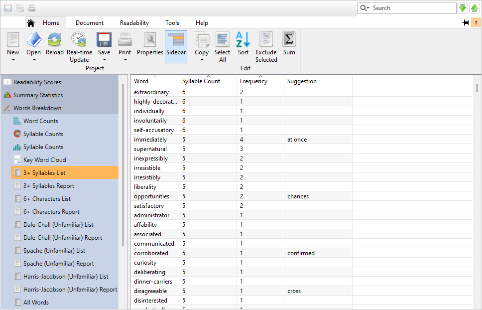

If you are an educator assigning this book to your students, you can export the more difficult words to a report. You can hand this report out to your students and ask them to define these terms before reading the book. This will help prepare them for the book and make it easier and more enjoyable to read.

To do this, click the `r keys("Save")` button on the **Home** tab and use the **Save As...** dialog to save this list to either an HTML or text file. You can also do this with any of the other difficult word lists, such as the Spache unfamiliar words list. Refer to \@ref(vocab-builder-example) for an example.

\newpage

## Improving Students' Vocabulary {#vocab-builder-example}

In this example, we will save a list of the more complex words from a book. If you are an educator, you can send this list to your students and ask them to define these words prior to reading the book. This can be a great way to prepare them for future readings, as well as helping them build their overall vocabulary.

Continuing from the [previous example](#book-example) (see \@ref(book-example)), select the top item in the hard word list. Now scroll down to the last word that has five syllables, hold down the `r keys("Shift")` (`r os_logo('windows')`) or `r keys("\\shift")` (`r os_logo('apple')`) key, and select this word. Now you will have all the words with five or more syllables selected. If there are any words that you want to add or remove from your selection, hold down the `r keys("Ctrl")` (`r os_logo('windows')`) or `r keys("\\cmd")` (`r os_logo('apple')`) key and click on them. Your word list will look like this:


Now that you have selected the words that you want to save, click the `r keys("Save")` button on the **Home** tab. From the menu that appears, select **Export 3+ Syllables List\.\.\.**.

First, you will be prompted to save as either HTML or text (refer to \@ref(export-list) for a discussion of these formats). After specifying the format, the **Save As** dialog will appear. Select where you want to save the file and click `r keys("Save")`.

\newpage

::: {.wrapfigure data-latex="{r}{0.4\\textwidth}" style="width: 38%;"}
{width=38%}
:::

Next, the [**List Export Options**](#export-list) dialog will appear. (By default, all the words will be exported.) To export just the words that you have highlighted, select the option **Export selected rows**. Also, because we are only interested in saving the **Word** column—not the **Syllable Count** or **Frequency Count** columns—enter 1 in the **Columns: from** and **to:** fields. Finally, uncheck the option **Include column headers** because we are only exporting one column.

Click `r keys("OK")` to export the word list to distribute to your students to help prepare them for their reading assignments.

::: {.notesection data-latex=""}
This example book is available by going to the **Help** tab of the ribbon, clicking the `r keys('Example Documents')` button, and selecting *A Christmas Carol*.
:::

\newpage

## Analyzing a Work in Progress

In this example, we will analyze recipes that we are working on for a middle-school home economics class. Our target audience will be seventh-eighth graders and we will use *Readability Studio* to meet their reading level.

The first step is to open the **New Project** wizard and select the recipe file. Click the `r keys("New")` button on the **Home** tab to open the **New Project** wizard.
Next, select **English** as the document language (if this option is available). Then, select the option **Read text from a file or webpage**. Click the button next to the file path field to browse for it:


::: {.notesection data-latex=""}
The language option is only available in the *Language Pack* and *Professional* editions of *Readability Studio*.
:::

This will open the **Select Document to Analyze** dialog. Choose the file that you want to analyze and click the `r keys("Open")` button to accept.

::: {.notesection data-latex=""}
The original and revised versions of this recipe are available from the **Example Documents** menu.
From the **Help** tab, click the `r keys("Example Documents")` button and then select either "Cocoa Desserts" or "Cocoa Desserts (Revised)" from the menu.
When prompted about how to open the document, select **Create a new project**.
:::

You will then return to the **Document** page. Click the `r keys("Forward >")` button to proceed to the **Document Structure** page, as shown below:

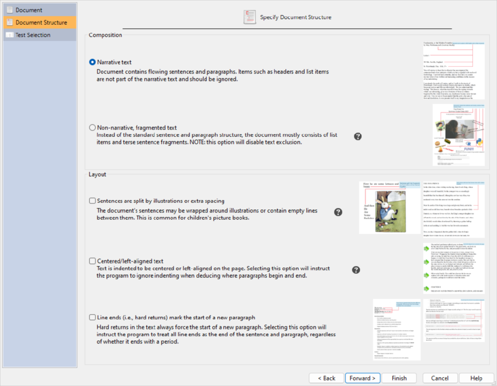

On this page, we will specify how this document is formatted. The first option, **Narrative text**, is meant for documents that consist of the standard sentence and paragraph structure. The second option, [**Non-narrative, fragmented text**](#fragmented-text), is meant for documents that contain very few sentences and mostly consist of sentence fragments. This document contains narrative text, so select **Narrative text**.

Our recipe file does not have any special formatting (e.g., text centering), so keep all options in the **Layout** section unchecked. Now that we have specified the structure of the document, click the `r keys("Forward >")` button to proceed to the **Test Selection** page, as shown below:


This file does not belong to any particular industry, but we do know that it is an instructional document. Select the **Recommend tests based on document type**:


Because this is an instructional document containing small narrative blocks, we will consider this to be a technical document. Select **Technical document or form** and click the `r keys("Finish")` button to begin analyzing the project.

If you are excluding [incomplete sentences](#how-text-is-excluded) (the default), then a warning will be displayed.
Because this file contains numerous incomplete sentences, the program will ask you if excluding them is what you truly intend.
In this case, these sentences are just list items that we should ignore, so click **Continue excluding incomplete sentences**.

At this point, we can review the test scores of the recipe to determine which reading age it is appropriate for.
Click on the **Readability Scores** icon on the project sidebar to display the scores.
As we can see below, it appears to be readable for at least readers in the upper eighth grade. This is higher than our target audience and we may need to make some improvements to this recipe to make it easier to read.

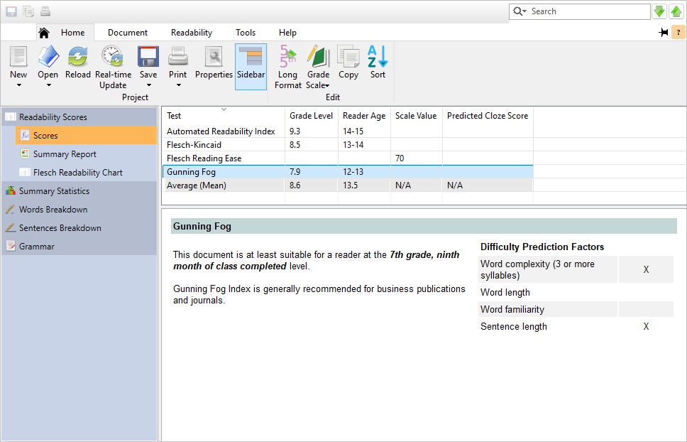

To help understand why this recipe may be difficult for younger readers, click on the **Summary Statistics** icon to review the [statistics](#reviewing-statistics) and see if the program has any advice for us.
In this section, any statistics that may be problematic will be highlighted in red, along with a warning being displayed. As we can see below, there are a lot of long sentences (with the longest being 54 words long):

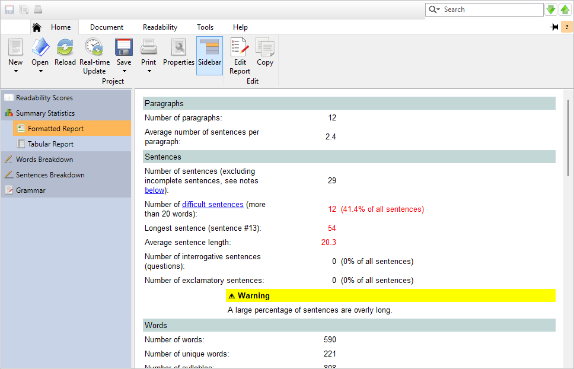

Click on the **difficult sentences** link in this section to go to the [**Long Sentences**](#reviewing-sentences-breakdown) subitem of the **Sentences Breakdown** section. This window will display a list of all the overly-long sentences in our recipes. As we can see, there are a few rather long sentences that are adversely affecting our scores.

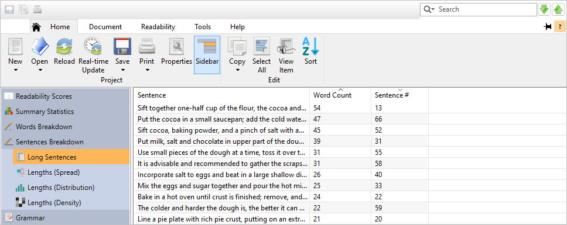

Long sentences can seem unfocused and difficult to read, and it is recommended to shorten or split them. To view any of these sentences in its original context, double-click on it in this list. The program will switch to the [**Highlighted Report**](#reviewing-standard-grammar) page with this sentence highlighted:


Now that we have found the difficult sentences, let's split them up so that they are easier to read. From the **Document** tab, click the `r keys("Edit Document")` button to open the recipes file for editing. Find one of the long sentences and review it. For example, consider this sentence:


Not only is it long, but it is a little confusing. It is unclear what was mixed with the cold milk because there are so many steps in this sentence. To make it easier to follow, split this sentence into two and reword it:


Continue this process for as many of the long sentences as you can. Sentences in the 20-word range are normally acceptable, but sentences over 30 words should be revised.

Other useful tools for shortening sentences in *Readability Studio* are the other pages in the **Grammar** section. Click on the **Grammar** icon on the project sidebar. Click on the [**Repeated Words**](#reviewing-repeated-words) page and note how the phrase *and and* is in the file (obviously a typo). Next, click on the [**Redundant Phrases**](#reviewing-redundant-phrases) page. Note how the phrase *mixed together* is redundant and the program is suggesting that it be replaced with *mixed*. A [**Wordy Items**](#reviewing-wordy-items) and [**Clichés**](#reviewing-cliches) page may also appear, but there do not seem to be any of these in this file. By fixing these items, we can shorten sentences and improve the overall document.

Although there are not many difficult words in this file, it may be worthwhile to at least review them. Click on the **Words Breakdown** icon on the project sidebar. This will display various lists of difficult words. Select the **3+ syllable words** page and click on the **Syllable Count** column header twice to [sort](#column-sorting) the words into descending order. As illustrated below, there are a few words containing four syllables, which can be difficult for most readers.


To view these words in their original context, double-click on any word in this list. The program will switch to the **3+ syllable words** page, as illustrated below:

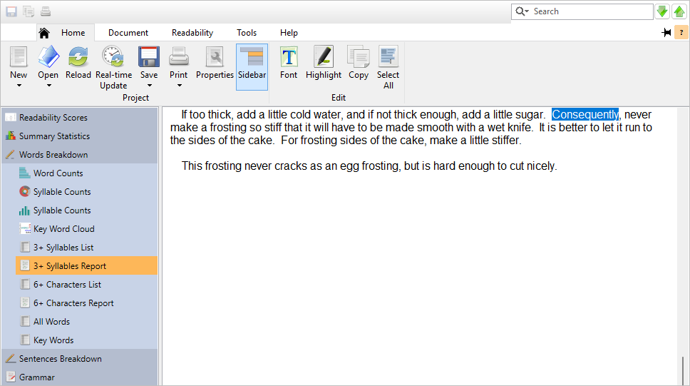

You can click on any of the other pages to view other difficult words in their original context, such as 6+ character words or unfamiliar [New Dale-Chall](#dale-chall-test) words.

To continue simplifying this recipe, we will replace some of these difficult words. Words such as *incorporate*, *consequently*, and *gradually* could also be replaced with shorter, simpler synonyms. As illustrated below, we have replaced a few words, such as substituting *incorporate* with *add* and *gradually* with *slowly*.


After we finish reworking the original document, we will want to analyze it again to see if it now meets our target audience.
Because this project is already linked to the recipe document, we can reload it (rather than starting all over with a new project).
To view this connection, click the `r keys("Properties")` button on the **Home** tab to open the **Project Properties** dialog.
Select the **Project Settings** icon and note the option **Reload the source document when opening project**:

```{r echo=F, fig.align='center', out.width='75%'}
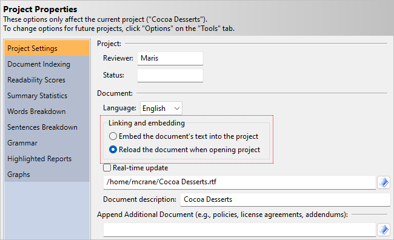
```

Also of note is the **Real-time update** checkbox. If this is checked, then the program will automatically reload the project when the document is edited.
This is discussed in a later example (see \@ref(external-editing)); for now, leave this unchecked.

Close this dialog and click the `r keys("Reload")` button on the **Home** tab.

The program will now reload the recipe document, meaning that all the improvements that we just made will be imported into the project.
As we can see below, our grade level scores now meet our target audience and this recipe will be easier and more enjoyable to read for our home economics class.

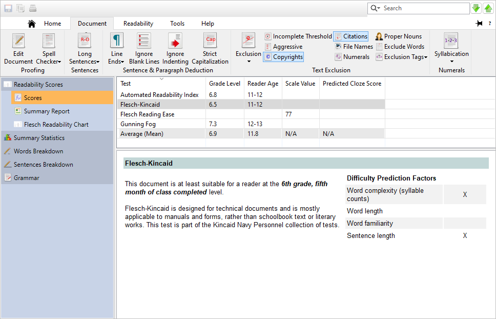

::: {.tipsection data-latex=""}
You can click the `r keys("Reload")` button at anytime to reanalyze the source document as you edit it externally.
Likewise, pressing **Real-time Update** will tell the program to reload automatically as the document is saved from another program.
Finally, whenever you open this project, it will automatically reload the source document (in this case, the recipe file).
:::

\newpage

## Analyzing a Webpage

In this example, we will create a project that reads and analyzes a webpage. Although you can save a webpage from your web browser and load the HTML file, *Readability Studio* can also directly connect to a webpage.

First, click on the `r keys("New")` button (on the **Home** tab). The **New Project** wizard dialog will appear, as shown below:


First, select **English** as the document language.

::: {.notesection data-latex=""}
The language option is only available in the *Language Pack* and *Professional* editions of *Readability Studio*.
:::

Next, open any web browser, go to the webpage, and copy its URL (i.e., address) onto the clipboard.

```{r echo=F, fig.align='center', out.width='75%'}

```

Now, go back to the project wizard and select **Read text from a file or webpage**. Paste the URL into the file-path field, as illustrated below.

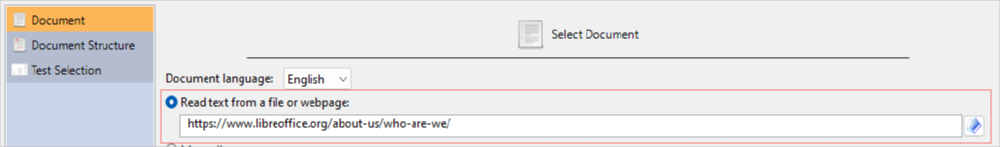

After specifying the URL, choose to analyze the page by document type and then select **Technical document**. Most webpages would fall under the category of either general or technical document.
Because this page discusses office software, we will select technical.


Next, accept the rest of the defaults on the **New Project** wizard by clicking the `r keys("Finish")` button. Once the project is finished loading, click on the **Words Breakdown** icon on the sidebar and select **3+ Syllable Words**.

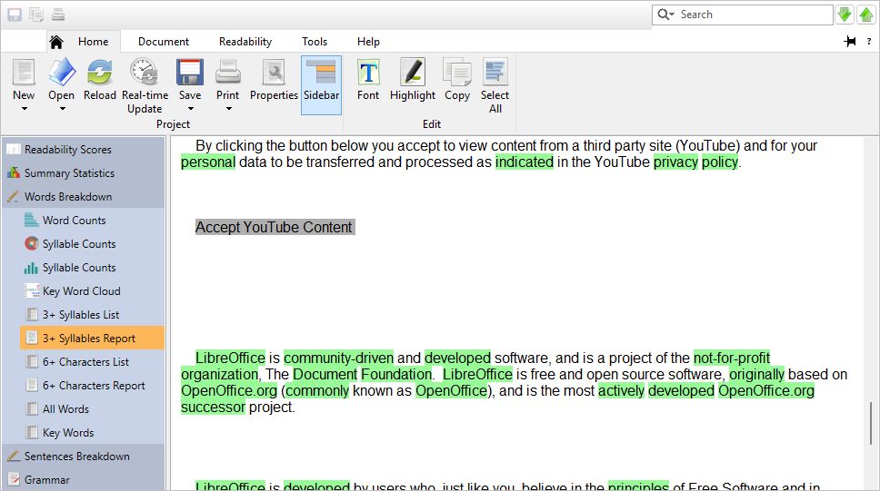

Note how some text is highlighted gray. These are [incomplete sentences](#how-text-is-excluded), and because *Readability Studio*, by default, ignores incomplete sentences, nothing highlighted gray is factored into the analysis.
That is, nothing highlighted gray here counts towards the overall sentence, paragraph, and word totals and are also not included in any readability test calculation.
Aside from non-narrative forms, it is normally recommended to ignore incomplete sentences. This is especially true for webpages, because often HTML tables and lists are used on websites to display menus—items that are not normally part of the page's narrative.

If you wish to include incomplete sentences in the analysis, click the `r keys("Properties")` button on the **Home** tab to display the **Project Properties** dialog.
Next, click the **Document Indexing** icon, and select the **Do not exclude any text** option.

```{r echo=F, fig.align='center', out.width='75%'}

```

Note that this option is also available on the [**Options**](#options-overview) dialog (from the **Tools** tab) if you wish to change this behavior for all future projects.

One last item to discuss about loading a webpage is whether you want to reanalyze it later as it changes.
By default, the project will directly link to the webpage, although you can change this to embed a snapshot of the page into the project.
To toggle this behavior, click the `r keys("Properties")` button on the **Home** tab to display the **Project Properties** dialog.
Then click the **Project Settings** icon. Here, we can see that **Reload the source document when opening project** is selected.

```{r echo=F, fig.align='center', out.width='75%'}

```

By having this option selected, you will reload the page's content whenever you reopen the project (or at anytime by pressing `r keys("F5")`). If you prefer to embed the current version of this page into the project, then select **Embed the source document's original text in the project file**. Refer to \@ref(project-settings) for more information about these options.

Note that webpages requiring authentication (i.e., requiring a user name and password) are not currently supported. To work around this, log into the webpage from any browser, save the page as a local HTML file, and then load that into a new project.

\newpage

## Searching for Overly Long Sentences\index{sentences!example of reviewing overly long} {#searching-long-sentences-example}

In this example, we will review a document for overly-long sentences. This example will demonstrate the available methods for defining an overly-long sentence. In addition, it will also demonstrate how to search for and review these sentences.

The first step is to open the example file "Features." From the **Help** tab, click the `r keys("Example Documents")` button and then select "Features" from the menu. Next, when prompted about how to open the document, select **Create a new project**.

You will then be presented with the **New Project** wizard dialog, as shown below:


Select **English** as the document language (if this option is available) and click the `r keys("Forward >")` button until you reach the **Test Selection** page, as shown below:


::: {.notesection data-latex=""}
The language option is only available in the *Language Pack* and *Professional* editions of *Readability Studio*.
:::

Select the **Recommend tests based on document type** and select the **Technical document** option, as shown below:


Click the `r keys("Finish")` button to begin analyzing the project.

If you are excluding [incomplete sentences](#how-text-is-excluded) (the default), then a warning will be displayed.
Because this file contains numerous incomplete sentences, the program will ask you if excluding them is what you truly intend.
In this case, these sentences are just list items that we should ignore, so click **Continue excluding incomplete sentences**.

Once the project is loaded, the readability scores will be presented. As we can see below, this document scores high within the collegiate range.


This document should be an easy-to-read list of software features intended for a broad range of readers. These scores are a bit too high, so now we will explore the results to understand why it is so difficult to read. Select the **Summary Statistics** icon in the project sidebar to view the document's [statistics](#reviewing-statistics).


As we can see, there are some very long sentences in this document and they are the biggest factor in our high scores. To view a list of these sentences, click the **difficult sentences** link. You can also click the **Sentences Breakdown** icon in the sidebar and select the [**Long Sentences**](#reviewing-sentences-breakdown) page.


This list can be sorted alphabetically, by word count, or by location. To view any sentence in its original context, double-click on it. This will take you to the [**Grammar**](#reviewing-standard-grammar) section. In this window, all the overly-long sentences and wordy items are highlighted and each sentence is followed by its respective word count (in parentheses).

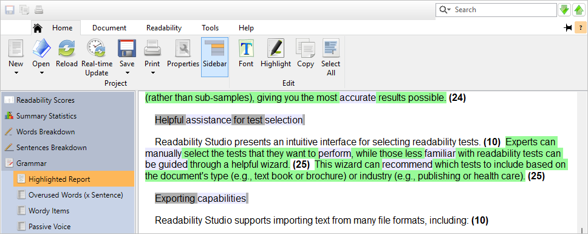

By default, the program considers sentences overly long if they contain more than 22 words. As we can see, there are a few sentences that are barely over 22 words that are not problematic. However, there are a few clustered sentences which exceed 40 words. At this point, we will want to temporarily filter out the smaller of these long sentences and search for the "worst offenders." From the **Home** tab, click the `r keys("Properties")` button and then select **Analysis**. As shown below, we have a couple of different ways to determine if a sentence is overly long:

```{r echo=F, fig.align='center', out.width='75%'}
knitr::include_graphics("images/featuressentoptions.png")
```

The first option is to define a specific word count as the long sentence boundary. Enter *25* where it says **Longer than [22] words** and click the `r keys("OK")` button. The program will now reanalyze the file, classifying any sentences longer than 25 (instead of 22) as overly long. As shown below, sentences that are between 23–25 words are no longer being considered overly long:

```{r echo=F, fig.align='center', out.width='75%'}

```

The second option is to consider sentences overly long if they are comparatively longer than the other sentences in the document. From the **Home** tab, click the `r keys("Properties")` button and then select **Analysis**. Select the option **Outside sentence-length outlier range** and click the `r keys("OK")` button. At this point, the boundary for overly-long sentences will be calculated based on the outlier range of the sentence lengths. After reanalyzing the file, note how there are only two highlighted sentences. One sentence contains 45 words and the other 48 words. These are the two "worst offenders" and should be either reworded or split into small sentences.

```{r echo=F, fig.align='center', out.width='75%'}
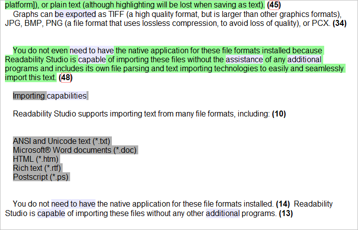
```

To see what the outlier range is, click on the **Summary Statistics** icon in the project sidebar. Here we can see that any sentence more than 43 words is considered overly long.


This option is only recommended for situations where most of the sentences are an acceptable length, but a few (very) long sentences skew the average. This option is useful for finding these extreme sentences.

\newpage

## Finding Difficult Sections {#finding-difficult-sections}

Along with searching for overly-long sentences, we should also review the distribution of longer sentences. If there are sections of a document where longer sentences seem to clump together, then these areas may be more difficult to read. These sections may need to be rewritten or restructured so that we don't have entire paragraphs that readers will struggle with.

In a previous example (\@ref(searching-long-sentences-example)), we used a box plot to review the dispersion of sentence lengths (and to find outliers). Although this is useful, these graphs aggregate their data and do not preserve their order. In other words, they lump sentence lengths together and don't show them in the order that they appear in the document. To compare the sentences' lengths in relation to where they are in the document, we will need to use a heatmap.

A heatmap is a graph which displays items as color-filled squares, where the color represents an item's value in relation to other items. To construct a heatmap, the following is performed:

- The highest and lowest values from a range of data are found.
- Two colors are selected to represent the high and low values from the data.
- A color gradient between these colors is built, representing the full range of the data.
- A square for each data point is drawn in a rectangular grid. These data point squares are drawn in the same order as they appear in the data, going from left-to-right and top-to-bottom.
- Each square is filled with the color from the gradient where the value falls. For example, if a gradient goes from white (lowest value) to black (highest value) and a data point is the highest value, then its square will be black. Likewise, mid-value points will be displayed as gray.
- Optionally, categorized data can split into separate heatmaps, where each line represents a different group. (All groups still use a common color gradient scale.)

For our purpose, sentences will be shown in the order that they appear in the document. This will enable us to not only find longer sentences, but also see where numerous difficult sentences clump together.

Let's begin by opening a mid-sized technical document. Select the **Help** tab of the ribbon, click the `r keys('Example Documents')` button, and select "Importing and Exporting Fixed-Width Data with R" from the menu. On the following prompt, tell the program to create a new project. When the **New Project Wizard** appears, select the **Document Structure** page. This example document contains lines of programming of code separated by hard returns. Because of this, we will want to force each of these lines to be a new paragraph. (Doing so will help with excluding them.) Check the option **Line ends** and click `r keys('Finish')`:


Once the project is created, select **Sentences Breakdown** on the sidebar, and click on the **Lengths (Density)** subitem. Here we will see a heatmap showing the sentences going from left-to-right, where their colors represent the length. Additionally, if the document contains 500 or less paragraphs, then the sentences will be grouped by paragraphs. In this example, the heatmap will show four columns, each containing ~25 paragraphs. These paragraphs go from top-to-bottom, then left-to-right across the columns. In each paragraph, its sentences are shown left-to-right.

```{r echo=F, fig.align='center', out.width='75%'}

```

In the above heatmap, we can see that the first half of the document contains mostly one-word sentences (most of which are medium length). In most of the second half of the document there are a few more longer sentences, although the paragraphs do remain within 1-2 sentences. In the last ten paragraphs, however, we do see longer paragraphs that also happen to contain longer sentences. In this case, we may want to review the ending section of the document.

Close this project and return to the **Help** tab of the ribbon. Click the `r keys('Example Documents')` button again and select "Instructional Disclaimer." Create a new project with the defaults and select the heatmap when the project opens.

```{r echo=F, fig.align='center', out.width='75%'}

```

In the above graph, we can see that most paragraphs begin with a short intro sentence, but are then followed by rather long sentences. (Some sentences being as high as 40 words.)  Also of interest is a paragraph containing ten sentences—which will be difficult to read through.

Finally, let's view a novel. Close this project and return to the **Help** tab of the ribbon. Click the `r keys('Example Documents')` button again and select *A Christmas Carol*. Create a new project with the defaults and select the heatmap when the project opens.

```{r echo=F, fig.align='center', out.width='75%'}

```

Because this document contains more than 500 paragraphs, grouping will not be used. Instead, the sentences will appear in a single heatmap, where the all sentences are displayed left-to-right, top-to-bottom. In the above graph, we can see that the novel's sentences range from 1-19 words in length. Also, the sentence lengths are rather evenly distributed. In other words, the longer sentences are not clumping together within any particular section.

\newpage

## Reviewing a Flyer {#reviewing-a-flyer}

In this example, we will analyze a flyer for a summer program being offered by a local software company. This flyer consists of short text boxes designed to grab the attention of young adults interested in learning computer programming. Of interest is that this document contains a few sentences, but the bulk of its content are simple text boxes.

Almost all readability formulas use sentence length as a factor. Because of this, short text blocks like these are traditionally excluded and only the full sentences are analyzed. For this document, however, we prefer to analyze everything since so much of its content are disjointed text boxes.

First, let's view the document. From the **Help** tab on the ribbon, click the `r keys('Example Documents')` button, and select "Summer Code Camp." Next, you will be prompted to either create a new project or view the document; select **View document**. Once the flyer is opened, note how it mostly contains simple text boxes:

```{r echo=F, fig.align='center', out.width='75%'}

```

Rather than excluding these and only analyzing the few remaining sentences, we will analyze everything. Also, we will only use a test that is designed to not rely on sentence lengths.

Close this document and return to *Readability Studio*. Click the `r keys('Example Documents')` button and again select "Summer Code Camp." Next, select **Create a new project**. When the **New Project Wizard** appears, select the **Document Structure** page and select **Non-narrative, fragmented text**:


::: {.notesection data-latex=""}
Going to the **Test Selection** page, selecting **Recommended test selection based on document type**, and selecting **Non-narrative form** will have the same effect.
:::

Finally, click the `r keys('Finish')` button to create the project. When the project appears, note that only the [FORCAST](#forcast-test) test was performed because it does not use sentence lengths. Also, viewing any highlighted report will show that all text was included in the analysis.

We will have a somewhat high FORCAST score, so we will want to review the lengthy words and see if we can make any improvements.

An interesting aspect of this flyer is that it has two audiences: children and their parents. The eye-catching text boxes in the upper half of the flyer is targeted for children, while the lower half requires parental involvement. With this in mind, we will review both halves of the flyer from these perspectives.

Select **Words Breakdown** on the sidebar and then select **3+ Syllables Report**. Here we can see some phrases that could be simplified:

```{r echo=F, fig.align='center', out.width='75%'}

```

For example, we could remove *Proudly presented* or replace it with *Offered*. Scrolling down further:

```{r echo=F, fig.align='center', out.width='75%'}

```

The highlighted line above could be rewritten to something like *New to programming? No Problem!*.

Scrolling to the bottom, we can review the second half of this flyer. The content here is meant for parents and their children to fill out together.

```{r echo=F, fig.align='center', out.width='75%'}

```

Although there are some longer words here, the responsible adult intended to sign this should be able to understand the content.

Refer to \@ref(high-level-review-of-disclaimer) and \@ref(addendum-example) for a continuation of this example where the flyer is revised and has an addendum added to it.

\newpage

## High-level Review of a Disclaimer {#high-level-review-of-disclaimer}

In this example, we will perform a quick review of the concepts, word complexity, and paragraph complexity of a disclaimer.

Continuing from the "Reviewing a Flyer" example (refer to \@ref(reviewing-a-flyer)), our fictitious software company has been purchased by a private equity firm.
After the purchase, this firm has decided to make some changes to the Summer Code Camp program.
In particular, they have created a disclaimer that parents must agree to before their children can participate.
In a later example, we will explore in more detail the difficult aspects of this disclaimer.
For now, however, we will first create summary graphs to give us an idea of what we are dealing with.

From the **Help** tab on the ribbon, click the `r keys('Example Documents')` button, and select "Instructional Disclaimer."
Next, select **Create a new project**. When the **New Project Wizard** appears, leave the defaults and click `r keys('Finish')`.

First, let's review the concepts of this document to get a broad idea of what it is about. Click **Words Breakdown** on the sidebar and then select **Key Word Cloud**.
This word cloud shows the document's words, after they have been combined (via stemming) and common words (e.g., articles) have been removed.
The size of the words are relative to their frequencies. As an example, the words "Company" and "Customer" appear much more frequently than any other word:

```{r echo=F, fig.align='center', out.width='75%'}

```

From this, we can glean that this document is about a customer and company relationship. Looking further, we may notice other words such as "claims," "responsibilities," "legal," and "liable."
From here, we could deduce that this may be a legally-binding agreement (and a bit adversarial).

Next, click **Syllable Counts** on the sidebar (the one with the histogram icon). In these histograms, we want to see a right-tailed distribution, where the bin sizes go down as you go from one-syllable words to more complex ones.
Although that is the pattern we see here, it has an alarming number of complex words — approximately a third of the document.

```{r echo=F, fig.align='center', out.width='75%'}
knitr::include_graphics("images/ExampleDifficultSyllablesHistogram.png")
```

To draw attention to these groups of words, press the `r keys('Showcase Complexity')` on the ribbon. Now the cumulative bar group and labels will only be shown for these bars:

```{r echo=F, fig.align='center', out.width='75%'}

```

To better visualize how much of this document is complex, click the **Syllable Counts** on the sidebar (the one with the pie icon).
Here we can see how much of the document consists of complex words by looking at the outer ring.
We can further see a breakdown of these complex words in the inner ring, where almost a quarter of the document is three-syllable words:

```{r echo=F, fig.align='center', out.width='75%'}

```

Note that because we previously pressed `r keys('Showcase Complexity')`, the simple-word slices are translucent and their labels are hidden.

Finally, let's review a visual layout of the sentence lengths. Click **Sentences Breakdown** on the sidebar and then select **Lengths (Density)**.
Going from top-to-bottom, this graphic displays a row for each paragraph. Across each row is a box for each sentence in the respective paragraph.
For each box, its length is shown as number at its center. Also, the darker the box, the longer its length is compared to the rest of the sentences in the document.
In this example, we can see that the sixth paragraph has ten sentences in it:

```{r echo=F, fig.align='center', out.width='75%'}

```

There are also a few lengthy sentences in this paragraph, judging from the numbers and dark colors across the row.

Refer to \@ref(addendum-example) for a continuation of this example. There, this document will be explored in further detail and used as an addendum to the original flyer from \@ref(reviewing-a-flyer).
