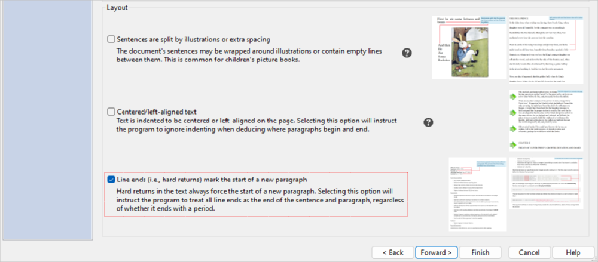
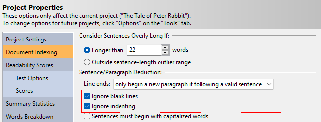
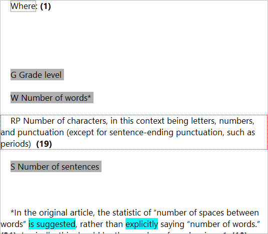
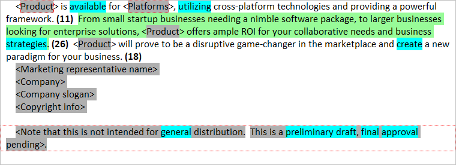
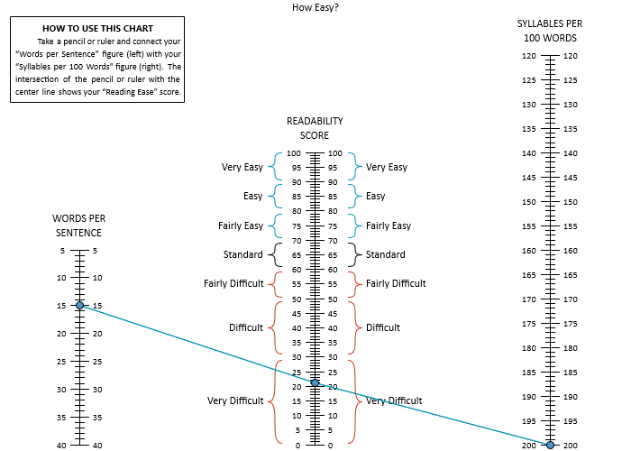
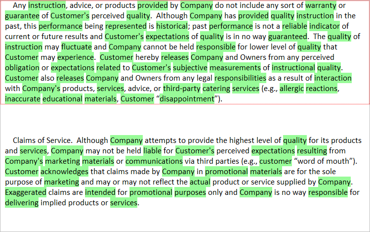

# Advanced Examples

`r drop_cap('Now')` that we have covered the basics of the program, we will discuss import options, text exclusion, and including addendums.
After that, we will continue with showing how to create test bundles.

\newpage

## Preserving Hard Returns

In this example, we will import a document which contains short lines of text that are separated by hard returns. These lines of text are not separated by blank lines, and are neither indented nor start with bullet points (the way list items often appear). The default for the program is to chain text lines such as this into a single sentence. In the case of this document, however, we will want to treat each line as a separate paragraph.

First, let us view the document. From the **Help** tab on the ribbon, click the `r keys('Example Documents')` button, and select "Job Posting." Next, you will be prompted to either create a new project or view the document; select **View document**. Once the document is opened, note the text in the upper left corner. Here we have short descriptions about a job posting that we will want to preserve as separate lines when we import:

```{r echo=F, fig.align='center', out.width='75%'}

```

Close this document and return to *Readability Studio*. Click the `r keys('Example Documents')` button and again select "Job Posting." Next, select **Create a new project**. When the **New Project Wizard** appears, select the **Document Structure** page and check **Line ends (i.e., hard returns) mark the start of a new paragraph**:



Finally, click the `r keys('Finish')` button to create the project. When the project appears, select **Grammar** on the sidebar and select **Highlighted Report**. Note how the job descriptors at the top have been preserved as separate lines:

```{r echo=F, fig.align='center', out.width='75%'}
knitr::include_graphics("images/job-posting-highlighted-text.png")
```

Because these are terse, unterminated lines of text, they will also be excluded from our analyses.

At this point, we can add tests and begin reviewing this (rather dubious) job posting.

\newpage

## Sentences Broken by Blank Lines {#chain-sentences-example}

In this example, we will import a picture book which has unusual sentence formatting. In the document we will be looking at, some of the sentences are broken apart by hard returns and blank lines so that they can wrap around images.

From the **Help** tab, click the `r keys("Example Documents")` button and then select *The Tale of Peter Rabbit*. When prompted about what to do with the file, select **View document**. As shown below, we can see a sentence that is partially on top of an image, and the rest of it is split across multiple lines to fit next to the image.

```{r echo=F, fig.align='center', out.width='75%'}

```

Close this document and return the **Help** tab. Click the `r keys("Example Documents")` button and again select *The Tale of Peter Rabbit*. This time, select **Create a new project**. From the [project wizard](#creating-standard-project), select the **Document Structure** page and note the option **Sentences are split**. Selecting this will instruct the program to ignore hard returns and blank lines and combine these fragments into full sentences:


For this example, though, let’s leave this unchecked to see what happens. Next, select the **Test Selection** page and select **Children's literature**. Click `r keys("Finish")` to create the project.

When the project appears, click on the **Words Breakdown** icon on the project sidebar and select **3+ Syllable Report**. Note how some sentences have been split into incomplete fragments (as it appeared in the book):


To correct this, we will change how sentences are deduced for this project. Click the `r keys("Properties")` button on the **Home** tab and then select **Document Indexing**.
First, ensure that **Line ends** is set to **only begin a new paragraph if following a valid sentence** (this should be the default).
Then check the options **Ignore blank lines** and **Ignore indenting** and click `r keys("OK")` to accept. (Note that we also selected **Ignore indenting** because this file contains some indented text.)

```{r echo=F, fig.align='center', out.width='75%'}

```

At this point, the project will be reanalyzed and these sentence fragments will be chained together:

```{r echo=F, fig.align='center', out.width='75%'}

```

\newpage

## Excluding Text\index{text exclusion!example} {#excluding-text-from-analysis}

When reviewing a document, it is usually preferable to ignore certain items, such as headers and citations (refer to \@ref(how-text-is-excluded) for more information). In this example, we will discuss the various methods for excluding these items.

The first step is to open the example file "Danielson-Bryan." From the **Help** tab, click the `r keys("Example Documents")` button and then select "Danielson-Bryan" from the menu.
(When prompted about how to open the document, select **Create a new project**.) When the **New Project** wizard appears, leave the defaults and click `r keys("Finish")`.
A warning about an incomplete sentence being included because of its length will appear.

For now click `r keys("Close")`; we will review this sentence later in this example.

Once the project is loaded, on the **Home** tab click the `r keys("Properties")` button under the **Project** section. On the **Properties** dialog, click **Analysis** on the sidebar and select **Document Indexing**. Uncheck all the options shown below and click `r keys("OK")`:

```{r echo=F, fig.align='center', out.width='75%'}

```

Next, click **Grammar** on the project's sidebar and then click **Highlighted Report**. In this window, any text that is being excluded will be highlighted gray. For example, note that the header *Danielson-Bryan 1 Test* is excluded, as shown below:

```{r echo=F, fig.align='center', out.width='75%'}

```

Scroll midway down the document and note how another header, an equation, and a table are also excluded. However, a couple of items in this block are being included that shouldn't be:

```{r echo=F, fig.align='center', out.width='75%'}

```

The first is the sentence *Where:.* Sentences that end with a semicolon and are followed by a list will normally be considered valid. In this case though, we will want to exclude this sentence too. Open the **Properties** dialog again, click **Analysis** and select **Document Indexing**. Check the option **Aggressively deduce lists**, as shown below:

```{r echo=F, fig.align='center', out.width='75%'}

```

Checking this option will exclude\index{sentences!aggressively excluding} any valid sentence (containing less than 10 words) that is inside of a block of incomplete sentences. Click `r keys("OK")` and note how *Where:* is now excluded:

```{r echo=F, fig.align='center', out.width='75%'}

```

The next item to note is the sentence *Number of characters\.\.\.*. This is really an item in a table that is missing a period, so we should be excluding it. However, currently it is being included because it contains more than 15 words. To adjust this, go back to the **Document Indexing** options for this project. Change the value for **Include incomplete sentences containing more than [15] words** to a higher value (e.g., 20) and click `r keys("OK")`:

```{r echo=F, fig.align='center', out.width='75%'}
knitr::include_graphics("images/ExclusionExampleIncompLengthValue.png")
```

Note how the *Number of characters\.\.\.* sentence is now excluded:

```{r echo=F, fig.align='center', out.width='75%'}

```

Now scroll to the bottom of the report window and note the copyright notice:

```{r echo=F, fig.align='center', out.width='75%'}

```

Go to the **Document Indexing** options, check **Also exclude copyright notices**, and click `r keys("OK")`:

```{r echo=F, fig.align='center', out.width='75%'}

```

Now this copyright notice will be excluded from the analysis:

```{r echo=F, fig.align='center', out.width='75%'}

```

Along with incomplete sentences, specific types of words can also be excluded. For example, at the bottom of this window note the hyperlink *http://www.jstor.org/*. To exclude this, go to the **Document Indexing** options, check **Also exclude Internet and file addresses**, and click `r keys("OK")`:

```{r echo=F, fig.align='center', out.width='75%'}

```

Note how *http://www.jstor.org/* is now excluded:

```{r echo=F, fig.align='center', out.width='75%'}

```

Other items, such as proper nouns\index{proper nouns!excluding} and numbers\index{numerals!excluding} can also be excluded. Go to the **Document Indexing** options, check **Also exclude numerals** and **Also exclude proper nouns**, and click `r keys("OK")`. Then scroll to the top of the report window. First note how numbers, such as the page citation and computer series, are now excluded:

```{r echo=F, fig.align='center', out.width='75%'}

```

Also note how proper nouns, such as *Danielson-Bryan* and *UNIVAC*, are now excluded:

```{r echo=F, fig.align='center', out.width='75%'}

```

You can also exclude specific words and phrases. From the **Document Indexing** options, click the edit button in the **Words & phrases to exclude** section:

```{r echo=F, fig.align='center', out.width='75%'}

```

In the **Edit Phrase List** dialog, either double click the grid or click the add item button to begin adding words or phrases to exclude. In one line enter *punctuation*, and in another line enter *sentence length*:

```{r echo=F, fig.align='center', out.width='50%'}

```

Click `r keys("OK")` and all instances of *punctuation* and *sentence length* are now excluded:

```{r echo=F, fig.align='center', out.width='75%'}

```

Separate instances of *sentence* and *length* will still be included, they will only be excluded if they appear together to form the phrase *sentence length*. Refer to \@ref(document-analysis) for more on how custom word/phrase exclusion works.

Along with editing the word list from the **Properties** dialog, you can also add words directly from the results. Select **Words Breakdown** on the sidebar and select any list under this section (e.g., **3+ Syllable List**). In this list window, select any words that you wish to exclude and click **Exclude Selected** on the **Home** tab of the ribbon:


The selected words will be added to your exclusion list and the project will then be updated.

Note that when excluding individual words, these words are treated as if they are not in the document at all. This means that excluding words will affect the sentences that they appear in. For example, by excluding *Danielson-Bryan*, *1*, and *206*, the first sentence will have a word count of 20 instead of 23.

Another section of text that could be excluded is the citation at the bottom. Go to the **Document Indexing** options, check **Also exclude trailing citations** and click `r keys("OK")`. Scroll to the bottom of the document and note how everything below the header *Citations* is now excluded:

```{r echo=F, fig.align='center', out.width='75%'}

```

At this point, all that remains in the analysis is the actual prose—all "noise" from the document has been filtered out.

::: {.tipsection data-latex=""}
All the options discussed here are also available on the **Document** tab of the ribbon.
:::

\newpage

## Excluding Placeholders\index{text exclusion!blocks within placeholders} and Blocks of Text {#excluding-placeholders}

Continuing from the [previous example](#excluding-text-from-analysis), we will now discuss how to exclude specific blocks of text.

The first step is to open the example file "Press Release." From the **Help** tab, click the `r keys("Example Documents")` button and then select "Press Release" from the menu. (When prompted about how to open the document, select **Create a new project**.) When the **New Project** wizard appears, leave the defaults and click `r keys("Finish")`.

Once the project is loaded, click **Grammar** on the project's sidebar and then click **Highlighted Report**. In this window, any text that is being excluded will be highlighted gray. For example, an indented list is being excluded, as shown below:

```{r echo=F, fig.align='center', out.width='75%'}

```

However, note that are a few placeholders in this file, such as *\<Product\>*:

```{r echo=F, fig.align='center', out.width='75%'}

```

We will want to exclude these items because they will not be in the final draft. However, because these are valid words and sentences (i.e., they are not headers, list items, etc.), then the [standard exclusion features](#options-text-exclusion) will not remove them. Also, using a list of exclusion words may be too aggressive. For example, adding *product* to an exclusion list will remove the *\<Product\>*, but it will also exclude any other instance of *product*. Also, the last paragraph is valid, but because it is just a comment we will want to exclude this also. For these situations, will we need to use tagged-block exclusion.

Open the **Properties** dialog and select **Document Indexing** (`r menu(c("Home", "Properties", "Document Indexing"))`). Set the option **Exclude text between** to **\< and \>**, as shown below:

```{r echo=F, fig.align='center', out.width='75%'}

```

Selecting this option will exclude text in between pairs of angle brackets. Click `r keys("OK")` and note how the placeholders and final paragraph are now excluded:

```{r echo=F, fig.align='center', out.width='75%'}

```

::: {.tipsection data-latex=""}
All the options discussed here are also offered on the **Document** tab of the ribbon.
:::

\newpage

## Including an Addendum {#addendum-example}

Continuing from the "Reviewing a Flyer" (\@ref(reviewing-a-flyer)) and "High-level Review of a Disclaimer" (\@ref(high-level-review-of-disclaimer)) examples, our fictitious private equity firm now plans to append a disclaimer to the flyer.

Along with policy changes to the program, they have redesigned the program's flyer to appear more professional. Let's first take a look at the updated flyer.
From the **Help** tab on the ribbon, click the `r keys('Example Documents')` button, and select "YA Enterprise Software Symposium." Next, you will be prompted to either create a new project or view the document; select **View document**. Once the document is opened, note how the flyer’s short text boxes have been replaced by full sentences:

```{r echo=F, fig.align='center', out.width='75%'}

```

This means that when we import this document, we will specify that it is a narrative document and apply text exclusion. (This is in contrast to the earlier flyer, where we specified it as non-narrative, fragmented text.)

Close this document and return to **Readability Studio**. Click the `r keys('Example Documents')` button and again select "YA Enterprise Software Symposium."
Next, select **Create a new project**. When the **New Project Wizard** appears, select the **Document Structure** page and select **Narrative text**:


Next, select the **Test Selection** page and select **Manually select tests**. In the grid below, check **Flesch Reading Ease**:


Finally, click the `r keys('Finish')` button to create the project. When the project appears, select **Flesch Reading Ease** under the **Scores** section in the sidebar.

```{r echo=F, fig.align='center', out.width='75%'}
knitr::include_graphics("images/addendum-flesch1.png")
```

Note that this new flyer is difficult, so let’s review it. Click **Words Breakdown** on the sidebar and then select **3+ Syllables Report**. As we scroll through this window, note the highlighted difficult words:

```{r echo=F, fig.show = 'hold', out.width='50%'}


```

As we can see, this document could use some improving. Before we can do that, though, the new owners of our software company have also requested that a disclaimer be appended to all sign-up forms such as this.
Rather than running a separate analysis on this disclaimer, we would like to append this document to our flyer and analyze them together.
To do this, go to the **Home** tab of the ribbon and select **Properties**. On the **Properties** dialog, select **Project Settings** on the sidebar.
Next, under the **Append Additional Document** section, click the folder button and navigate to the *examples* folder from where *Readability Studio* is installed. Select the file "Instructional Disclaimer.odt":

```{r echo=F, fig.align='center', out.width='75%'}

```

::: {.tipsection data-latex=""}
You can also enter *@[EXAMPLESDIR]/Instructional Disclaimer.odt* into the **Append Additional Document** field and the program will find the file in the examples folder for you.
:::

Click `r keys('OK')` to accept. When the project finishes reloading, select **Flesch Reading Ease** under the **Scores** section again.

```{r echo=F, fig.align='center', out.width='75%'}

```

Note how the document is now very difficult. Click **Words Breakdown** on the sidebar and then select **3+ Syllables Report**. As we scroll to where our disclaimer was appended, note the numerous difficult words:

```{r echo=F, fig.align='center', out.width='75%'}

```

Next, click **Grammar** on the sidebar and then select **Highlighted Report**. Scrolling to the disclaimer portion of the document, note the numerous, meandering sentences:

```{r echo=F, fig.align='center', out.width='75%'}

```

At this point, we will have quite of a bit of improvements to make to both the flyer and disclaimer. (And parents may want to start looking for a different summer camp.)

\newpage

## Creating a Test Bundle

[Test bundles](#test-bundles) are a convenient way to add multiple tests to a project at once. In this example, we will create a test bundle named "4F" which includes the [Fry](#fry-test), [FORCAST](#forcast-test), [Fog](#gunning-fog-test), and [Flesch-Kincaid](#flesch-kincaid-test) tests. The first step is to select the **Readability** tab, click the `r keys("Bundles")` button, and select **Add...** from the menu. This will open the **Add Test Bundle** dialog:


Enter the name "4F" into the **Bundle Name** text field. Next, select the **Standard Tests** page and check the Fry, FORCAST, Fog, and Flesch-Kincaid tests, as shown below:


Click the `r keys("OK")` button to accept.

To use the bundle, first open any project. Next, select the **Readability** tab, click the `r keys("Bundles")` button, and select **4F** from the menu. Now the program will replace all tests within the project with the tests from the "4F" bundle.
