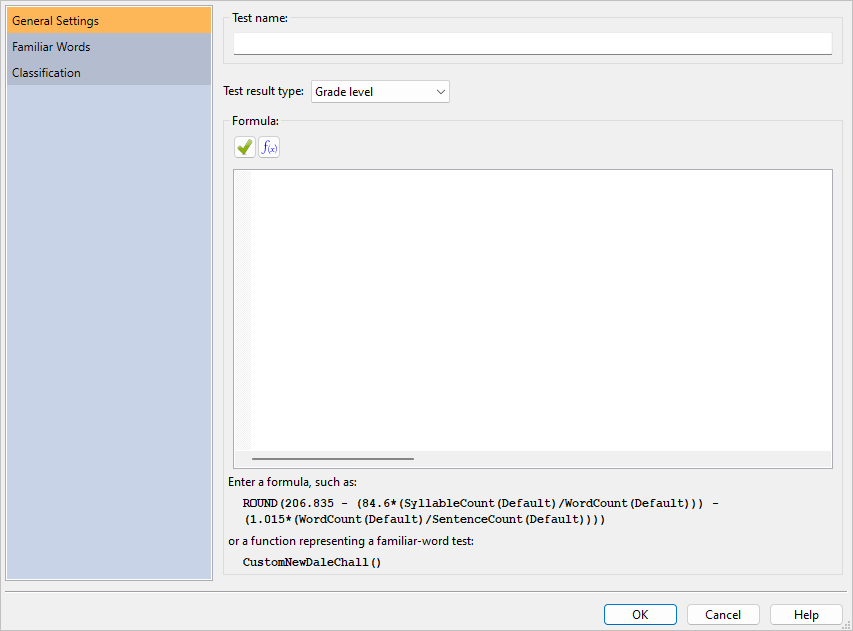
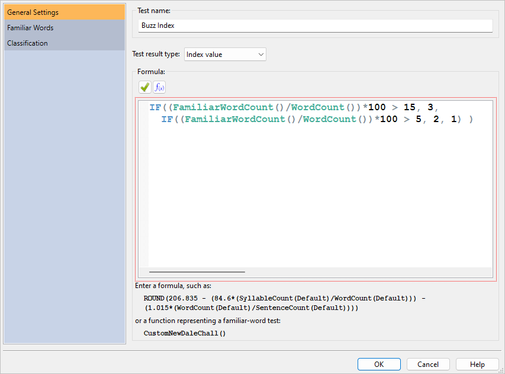
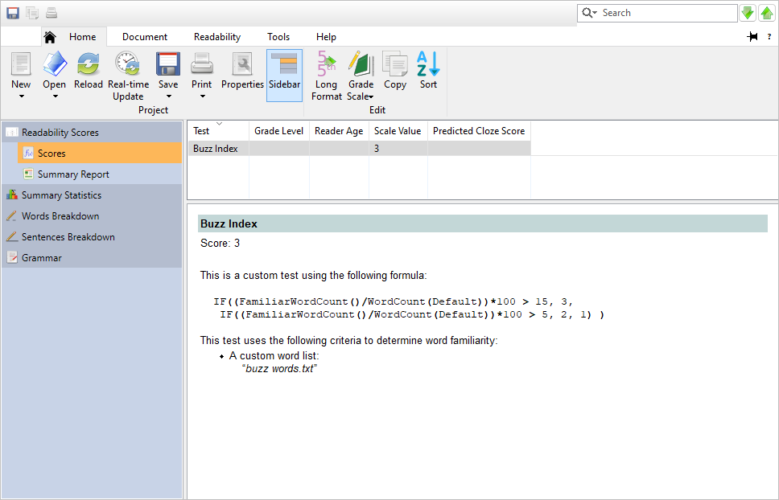

# Creating Custom Tests

`r drop_cap('With')` custom tests, you can create enhanced versions of existing tests like New Dale-Chall that include your own word list.
You can also create entirely new tests with your own formulas, and design them to return either grade-level, predicted cloze, or index scores.

In this chapter, we will step through examples showing how to create these types of tests.

\newpage

## Creating a Modified Flesch\index{Flesch Reading Ease!custom test!example|(} Test {#creating-custom-flesch-test}

In this example, we will create a custom test. Custom tests are useful for either creating an entirely new formula or a new one based on an existing formula.

For this example, we will use the [Flesch](#flesch-test) formula for our basis. We will take the standard Flesch formula and substitute its sentence count factor with independent clause count. This will effectively create a formula which does not penalize documents for containing numerous compound sentences.

The first step to creating a new test is to click the `r keys("Custom Tests")` button on the **Readability** tab and select **Add Test Based on...** from the menu. This will present a dialog containing formula-based tests; select **Flesch Reading Ease** and click `r keys("OK")`.

Because this test will use independent clauses, change the name to "Flesch (IC)":

```{r echo=F, fig.align='center', out.width='100%'}

```

Next, we will change the formula. The formula for Flesch is defined as:

$$
I = 206.835 - (84.6*(B/W)) - (1.015*(W/S))
$$

Where:

+:----+:----------------------------------+
| I   | Flesch index score                |
+-----+-----------------------------------+
| W   | Number of words                   |
+-----+-----------------------------------+
| B   | Number of syllables               |
+-----+-----------------------------------+
| S   | Number of sentences               |
+-----+-----------------------------------+

Formulas can either be typed into the **Formula** field, or you can use the [**Function Browser**](#creating-custom-test). For example:

```{r, eval=F, echo=T}
206.835 - (84.6*(SyllableCount()/WordCount())) -  
    (1.015*(WordCount()/SentenceCount()))
```

There are shortcuts available for various functions, so this formula can also be simplified to this:

```{r, eval=F, echo=T}
206.835 - (84.6*(B/W)) - (1.015*(W/S))
```

By default, all formula results will be returned with floating-point precision. For this particular formula, we will prefer to simply round the result. To do this, we will add the [`ROUND`](#custom-test-functions) function to our formula (with `0` as the precision width):

```{r, eval=F, echo=T}
ROUND(206.835 - (84.6*(B/W)) - (1.015*(W/S)), 0)
```

This formula will yield the same results as the Flesch test. For this example, we will have our new test count independent clauses instead of sentences. To do this, change `SentenceCount()` (or `S`) to `IndependentClauseCount()` (or `U`). For example:

```{r, eval=F, echo=T}
ROUND(206.835 - (84.6*(B/W)) - (1.015*(W/U)), 0)
```

Or like this:

```{r, eval=F, echo=T}
ROUND(206.835 - (84.6*(SyllableCount()/WordCount())) -  
    (1.015*(WordCount()/IndependentClauseCount())), 0)
```

The final step is to specify the type of test that this is. Flesch Reading Ease is an index test, so verify that the test type is set to **Index value**. This will instruct the program to place the result into the **Scale Value** column (see below).

Once finished, the dialog will look like this:

```{r echo=F, fig.align='center', out.width='100%'}

```

Click the `r keys("OK")` button and our new test will be added to the system.

To add this test to any project, first select the **Readability** tab. Next, click the `r keys("Custom Tests")` button and then select **Flesch (IC)** from the menu. Select the **Readability Scores** icon on the project pane and note that Flesch (IC) has been added to the project's results:


\index{Flesch Reading Ease!custom test!example|)}

\newpage

## Creating an Unclamped Flesch-Kincaid {#custom-test-no-clamping}

As described in \@ref(grade-level-clamping), regression-based tests are clamped to the reasonable limit of 19^th^ grade (i.e., PhD). If you wish to override this, however, you can create a copy of a test and not set an upper limit for its score.

In this example, we will create a custom Flesch-Kincaid test and leave its formula unrestricted, allowing for scores such as 27 (i.e., 27^th^ grade).

First, select the **Readability** tab of the ribbon. Next, click the `r keys('Custom')` button and select **Add Custom Test Based on...**.
Select **Flesch-Kincaid** from the list, which will create a custom test based on Flesch-Kincaid. When the **Edit Custom Test** dialog appears, enter the name "Flesch-Kincaid (unclamped)":

```{r echo=F, fig.align='center', out.width='100%'}

```

We will leave the formula as-is, so click `r keys('OK')` to accept.

From here, we can add this test via the **New Project Wizard** by selecting **Manually select tests** and selecting it in the **Custom tests** group box. We can also add it to an existing project from the `r keys('Custom')` button on the **Readability** tab.

When adding this test to documents with extreme sentence lengths or difficult-word counts, we may see Flesch-Kincaid (unclamped) scores going beyond 19.

::: {.tipsection data-latex=""}
If you do want to clamp a test to a given range, wrap it in a `CLAMP` function call. For example, `CLAMP(formula, 0, 4)` will clamp the result of *formula* within 0–4 (i.e., Kindergarten to 4^th^ grade).
:::

\newpage

## Creating a Custom New Dale-Chall\index{New Dale-Chall!custom test!example|(} Test

In this example, we will create a custom [New Dale-Chall](#dale-chall-test) test specifically designed for recipes for a group of young students. Although the standard New Dale-Chall list is quite extensive, we may wish to append some words that we know are familiar to our kitchen-savvy students.

The first step is to create a list of baking-specific words that our readers are familiar with that are not already on the standard New Dale-Chall list. This can be any text file where the words are separated by spaces, tabs, commas, or semicolons. For this example, we will use this list:

`beaten, custard, eclair, éclair, flaky, glaze, glace, glossy, grate, meringue, pastry, pinch, platter, prepare, recipe, saucepan, sift, skewer, teaspoon, teaspoonful, thicken, tumbler, unbeaten, vanilla, whisk, scrape, tablespoon, tablespoonful`

The next step is to create a custom test and connect our word list to it. For a custom New Dale-Chall, the simplest way is to click the `r keys("Custom Tests")` button on the **Readability** tab and select **Add Custom "New Dale-Chall"...** from the menu. This will present the [Add Custom Word Test](#add-custom-word-test) dialog. From this dialog, we would enter the name of the new test (e.g., "New Dale-Chall (Baking)") and file path to our word list, and then the program would add this test. However, for this example we will use the more advanced **Add Custom Test** dialog.

Click the `r keys("Custom Tests")` button on the **Readability** tab and select **Add...** from the menu. This will present the [**Add Custom Test**](#custom-test-general-settings) dialog, as shown below:

```{r echo=F, fig.align='center', out.width='100%'}

```

Because this will be a New Dale-Chall test meant for baking, we will enter the name "New Dale-Chall (Baking)":

```{r echo=F, fig.align='center', out.width='100%'}

```

Next, we will enter the formula. The formula for a custom New Dale-Chall test\index{CustomNewDaleChall()@\texttt{CustomNewDaleChall()}!example} is:

```{r, eval=F, echo=T}
CustomNewDaleChall()
```

This formula will instruct the program to use the standard New Dale-Chall formula with our familiar-word criteria, which we will define later.

The next step is to specify the type of test that this is into the **Test type** field. By default, new tests will be defined as grade-level tests, which means that the result will be truncated to be within the 0 (Kindergarten) to 19 (doctorate) range. New Dale-Chall is a grade-level test, so we will leave this option set to the default.

Once finished, the dialog will look like this:

```{r echo=F, fig.align='center', out.width='100%'}

```

Now we will need to define what a familiar word is, so click the **Familiar Words** icon. Because we will be appending our own words to the test, check the option **Include custom familiar word list**. Next, enter the file path to the custom-word file in the **File containing familiar words** field. You can also click the button next to this field to select and edit your word list file:

```{r echo=F, fig.align='center', out.width='100%'}

```

Once the file has been selected, the words from that file will be loaded.

There are two ways that our custom words can be compared to words in the recipe that we will be analyzing. The first is to simply compare words between our list and the recipe exactly as they appear. This is accomplished by setting **Use stemming to search for similar words** to **Do not use stemming**. The advantage of this is that we will have precise control over which variations of our words will be counted as familiar. For example, we could add *glaze* and *glazes* to our list and only these variations of *glaze* would be counted as familiar. This way, other variations (e.g., *glazy*) will remain unfamiliar. The disadvantage of this method is that we must explicitly add every variation of *glaze* to our list that we want to be familiar. For larger lists, this can be tedious and error prone.

The other option is to use stemming. Stemming will compare the roots of the words between our list and our recipe, rather than the words themselves. For example, say that we have **English** stemming selected and the word *glaze* is on our list. In this case, *glaze* will be stemmed to *glaze*. As our recipe file is analyzed, words such as *glazed*, *glazes*, and *glazing* will also be stemmed to *glaze*. Because these words all share the same root as a word from our list, they will all be counted as familiar. The advantage of this approach is that we do not need to add every possible variation of every word on our list. The disadvantage is that we will lose precise control over which word variations should be familiar or not.

To keep our word list simple, we will use English stemming. Select **English** as the stemmer.

Next, we will define which other word lists will be included in our test. Because this is a New Dale-Chall test, check the option **Include New Dale-Chall word list**:

```{r echo=F, fig.align='center', out.width='100%'}

```

The remaining logic that we must define is how to count proper\index{proper nouns!custom tests} nouns and numerals\index{numerals!custom tests}. Select the **Proper Nouns & Numerals** page:

```{r echo=F, fig.align='center', out.width='100%'}
knitr::include_graphics("images/CustomTestTreat.png")
```

For this example, we will treat all proper nouns and numerals as familiar. This is the default, so leave these options unchanged.

Click the `r keys("OK")` button and our new test will be added to the system.
At this point, the formula and all our settings will be validated.
Because our [proper-noun options](#readability-test-options) differ from the standard New Dale-Chall test, the program will prompt to confirm this.
We are intending to treat all proper nouns as familiar and do not wish to use the same settings as New Dale-Chall, so click **Do not adjust**.
Our new test, New Dale-Chall (Baking), has been added to the program.

To add this test to any project, first select the **Readability** tab. Next, click the `r keys("Custom Tests")` button and then select **New Dale-Chall (Baking)**. Select the **Readability Scores** icon on the project pane and note that New Dale-Chall (Baking) has been added to the project's results:


Note how the result for our custom test is lower than the standard New Dale-Chall test. This is because our test is using an expanded list of known words and will consider fewer words unfamiliar than the New Dale-Chall test will.

Now that the test has been added, we can review some of its output. Click on the **Words Breakdown** icon on the project pane. As shown below, there are numerous unfamiliar New Dale-Chall words in this recipe:


However, because our custom test is including some extra words not on the New Dale-Chall list, our test will have less unfamiliar words. Select the **New Dale-Chall (Baking)** subitem to review the unfamiliar words from the recipe relative to our custom test:


Note how there are far fewer unfamiliar New Dale-Chall (Baking) words when compared to the standard New Dale-Chall output.

We can also review these words in their original context. Click on the **Highlighted Reports** icon on the project pane, and then select the **New Dale-Chall (Baking)** page. Here we can see exactly where all the unfamiliar New Dale-Chall (Baking) words are in our recipe.


At this point, we have a couple of options. The first is to replace some of these unfamiliar words so that our students can better understand the recipe. If the reading level of this recipe was higher, this would be recommended. However, because this recipe already has a low reading level and contains few unfamiliar words, this may not be necessary.

The other option is to export these unfamiliar words and use that output to review these new words with our students. Not only will this ease the students' comprehension of the recipe, but it will serve as a helpful [vocabulary-building exercise](#vocab-builder-example).

::: {.tipsection data-latex=""}
The recipe used in this example is available from the **Example Documents** menu. From the **Help** tab, click the `r keys("Example Documents")` button, and then select "Chocolate Eclairs." When prompted about how to open the document, select **Create a new project**.
:::

\index{New Dale-Chall!custom test!example|)}

\newpage

## Creating a Custom Index Test

In this example, we will create a test designed for classifying a document within a custom scale. We will make a list of "buzzwords" that are commonly overused in marketing documents, then create a test to see how much a given document uses them. Also, rather than calculating the conventional grade-level or predicted [cloze](#cloze) score, our test will return a value using our own scale.

The first step is to create a list of "buzzwords." This can be any text file where the words are separated by spaces, tabs, commas, or semicolons. For this example, we will use this list:

`agile, collaborate, cross-platform, disrupt, empower, enterprise, framework, game-change, groundbreaking, holistic, impact, infrastructure, innovate, integrate, lean, leverage, marketplace, next-generation, nimble, paradigm, platform, powerful, proactive, revolution, ROI, seamless, solution, startup, strategy, streamline, suite, sustainable, synergy, technology, utilize, value-add, visibility, workflow`

The next step is to create a custom test and connect our word list to it. Click the `r keys("Custom Tests")` button on the **Readability** tab and select **Add...** from the menu. This will present the [**Add Custom Test**](#custom-test-general-settings) dialog, as shown below:

```{r echo=F, fig.align='center', out.width='100%'}

```

Enter "Buzz Index" as the test name:

```{r echo=F, fig.align='center', out.width='100%'}

```

Because this test will use our own special type of scoring, set **Test type** to **Index value**:

```{r echo=F, fig.align='center', out.width='100%'}

```

Next, we will enter the formula. Enter the following into the **Formula** field:

```{r, eval=F, echo=T}
IF((FamiliarWordCount()/WordCount())*100 > 15, 3,  
   IF((FamiliarWordCount()/WordCount())*100 > 5, 2, 1) )
```

```{r echo=F, fig.align='center', out.width='100%'}

```

Basically, this formula classifies a file based on its percentage of buzz words. First, it calculates this percentage in this line:

```{r, eval=F, echo=T}
(FamiliarWordCount()/WordCount())*100
```

`FamiliarWordCount()` represents the number of words in the document that are found from our buzzword list. Then this count is divided by the total number of words in the document (`WordCount()`). This will yield a floating precision value (e.g., *.17*), so we multiply that by 100 to change it to an integer (e.g., *17*).

After getting the buzzword percentage, we will then classify the file within a scale of 1–3. Three means that there is an unacceptably high percentage of buzzwords, two means a high percentage, and one means an acceptable percentage. To do this classification, we will use the ternary function `IF`.

The first parameter of `IF` is the expression to evaluate (in this case, the buzzword percentage).
The second parameter is the value to return if the expression is true.
The third parameter is what to return if the expression is false.
In our formula, the first `IF` statement checks if the percentage is more than 15%—if it is, then it returns level 3.
If the percentage is less than 15, then the third parameter (i.e., the second `IF`) is executed.
This second `IF` statement verifies whether the buzzword percentage is more than 5%—if it is, then it returns level 2.
If the percentage is less than 5, then the formula finally returns level 1.

Now we will need to define the words to search for in our document, so click the **Familiar Words** icon.
Because we will be using our own words, check the option **Include custom familiar word list**.
Next, enter the file path to the custom-word file in the **File containing familiar words** field.
You can also click the button next to this field to select and edit your word list file:

```{r echo=F, fig.align='center', out.width='100%'}

```

Once the file has been selected, the words from that file will be loaded.

There are two ways that our custom words can be compared to words in the press release that we will be analyzing. The first is to simply compare words between our list and the recipe exactly as they appear. This is accomplished by setting **Use stemming to search for similar words** to **Do not use stemming**. The advantage of this is that we will have precise control over which variations of our words will be counted as familiar. For example, we could add *glaze* and *glazes* to our list and only these variations of *glaze* would be counted as familiar. This way, other variations (e.g., *innovates*) will remain unfamiliar. The disadvantage of this method is that we must explicitly add every variation of *innovate* to our list that we want to be familiar. For larger lists, this can be tedious and error prone.

The other option is to use stemming. Stemming will compare the roots of the words between our list and our recipe, rather than the words themselves. For example, say that we have **English** stemming selected and the word *innovate* is on our list. In this case, *innovate* will be stemmed to *innovate*. As our file is analyzed, words such as *innovates*, *innovated*, and *innovating* will also be stemmed to *innovate*. Because these words all share the same root as a word from our list, they will all be counted as familiar. The advantage of this approach is that we do not need to add every possible variation of every word on our list. The disadvantage is that we will lose precise control over which word variations should be familiar or not.

To keep our word list simple, we will use English stemming. Select **English** as the stemmer:

```{r echo=F, fig.align='center', out.width='100%'}

```

We will not be using any other words for our test, so leave the other word lists unchecked.

The remaining logic that we must define is how to handle proper nouns\index{proper nouns!custom tests} and numerals. Select the **Proper Nouns & Numerals** page:

```{r echo=F, fig.align='center', out.width='100%'}
knitr::include_graphics("images/CustomTestTreat.png")
```

For this test, we are only looking for words explicitly from our list. This means that we will need to ignore proper nouns and numbers. Set **Proper Nouns/Familiarity** to **Count as unfamiliar** and uncheck **Treat numerals as familiar**:

```{r echo=F, fig.align='center', out.width='100%'}

```

Click the `r keys("OK")` button and our new test will be added to the system.

To add this test to any project, first select the **Readability** tab. Next, click the `r keys("Custom Tests")` button and then select **Buzz Index**. Select the **Readability Scores** icon on the project pane and note that Buzz Index has been added to the project's results:

To demonstrate this, click the **Help** tab of the ribbon. Then, click the `r keys("Examples")` button and select **Press Release** from the menu.
Choose the defaults in the standard [**New Project**](#creating-standard-project) wizard to create a new project from this document.

Once the file is processed, click the **Highlighted Reports** icon on the sidebar to view the document.
After doing a quick reading of this press release, there may be some concern about the author's enthusiasm for marketing speak.
To confirm this, select the **Readability** tab on the ribbon, click **Custom Tests** and select **Buzz Index**.
Next, click the **Readability Scores** icon on the sidebar and select **Scores** underneath that. As we had feared, the document is scoring at the unacceptable level of 3:

```{r echo=F, fig.align='center', out.width='100%'}

```

At this point, we will ask the author to revise this document until the score is at a more acceptable level. Because we are using a familiar-word test's logic in reverse for this test, we are actually interested in lowering the number of familiar (not unfamiliar) words from the document. To show which familiar (i.e., buzzwords) are being used, select the **Highlighted Reports** icon on the sidebar and select **Buzz Index (unfamiliar)** beneath that. The words that are *not* highlighted are the buzzwords that the author will need to limit. To export this window, click the **Home** tab of the ribbon, click the `r keys("Save")` button, and select **Export Highlighted Buzz Index (unfamiliar)**. The author can then use this output to see which sections need revising in this press release.
